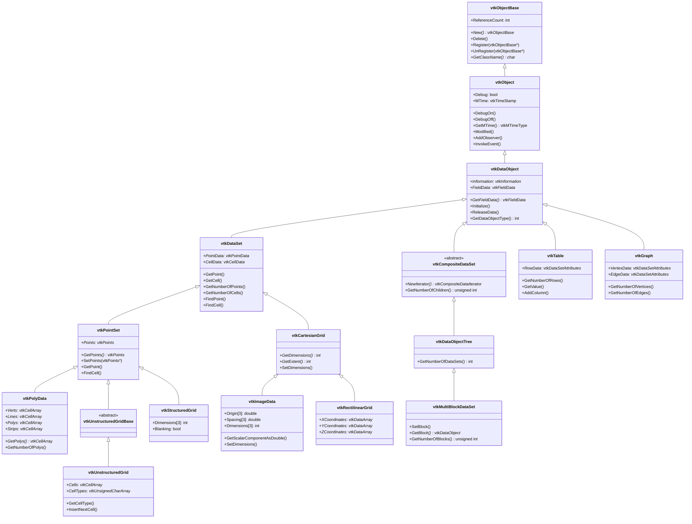
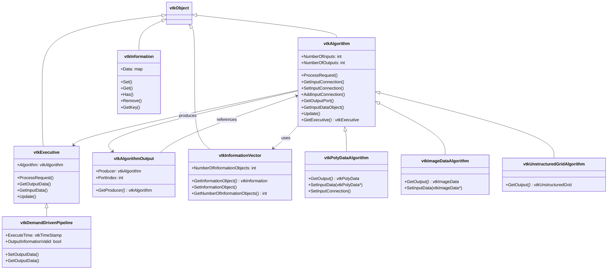
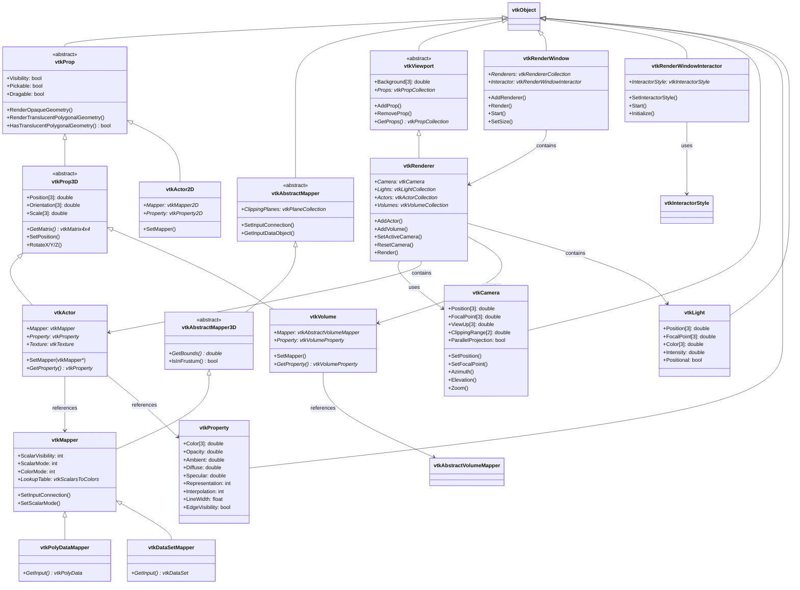
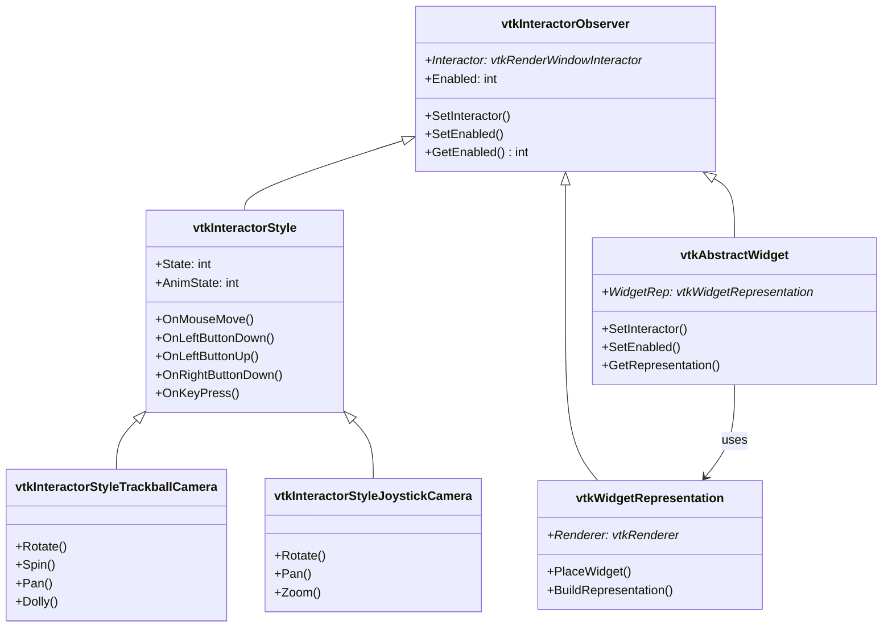
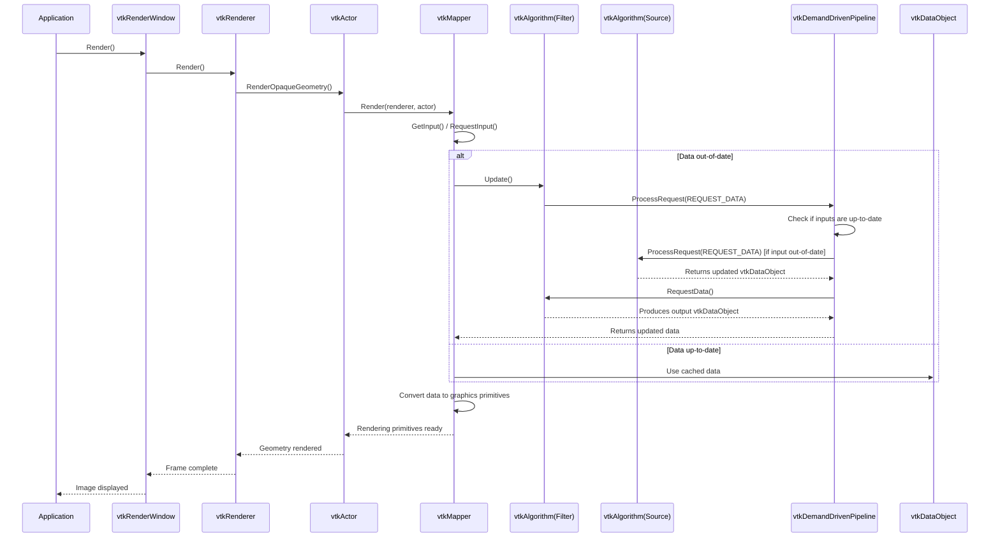
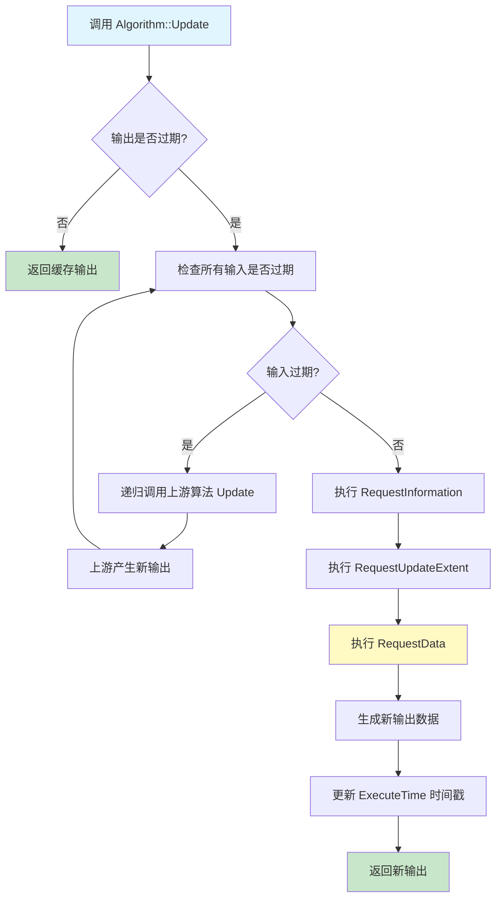
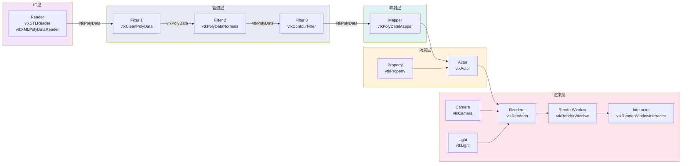
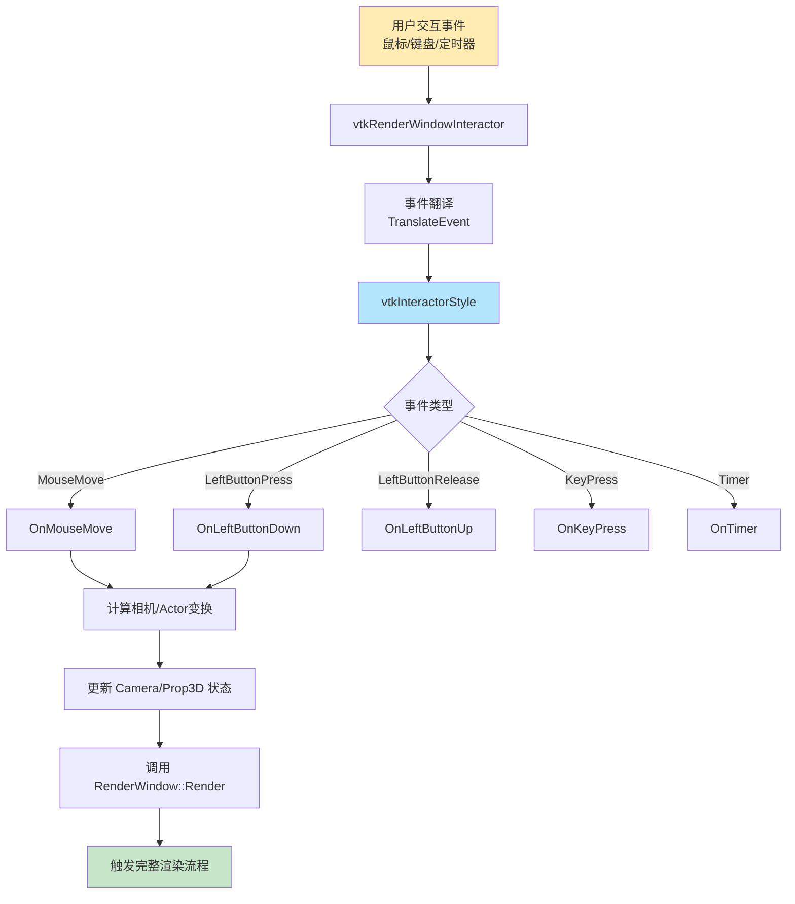
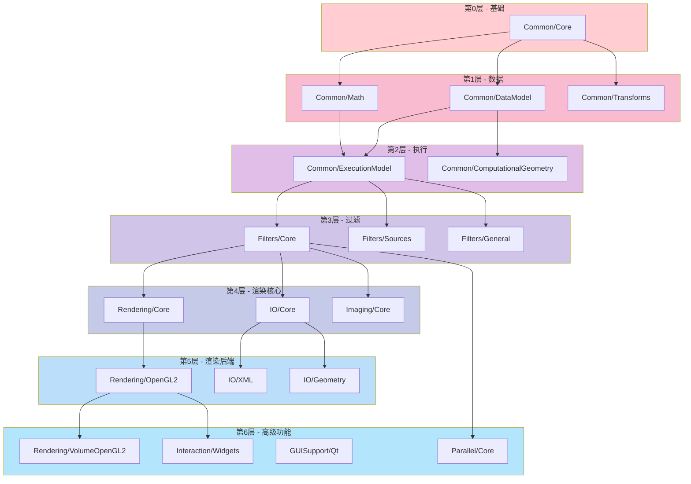

# VTK 项目架构分析

## 1. 项目概述

**VTK (The Visualization Toolkit)** 是一个开源的、跨平台的软件系统，用于3D计算机图形学、图像处理和科学可视化。VTK采用C++编写，并提供Python、Java等语言的包装接口。

- **项目名称**: VTK
- **版本**: 9.7+
- **构建系统**: CMake
- **模块数量**: 200+ 个独立模块
- **核心语言**: C++ (附带 Python/Java 绑定)

---

## 2. 模块体系架构

VTK 采用**分层模块化架构**，每个模块通过 `vtk.module` 文件声明依赖关系和所属类别。模块按照功能域划分为以下顶级类别：

### 2.1 模块分类总览

| 类别 | 子模块数 | 核心职责 |
|------|---------|---------|
| **Common** | 6 | 基础对象系统、数据模型、执行模型、数学库 |
| **Filters** | 35+ | 数据处理与过滤算法 |
| **Rendering** | 40+ | 图形渲染、GPU加速、VR/XR |
| **IO** | 55+ | 文件格式读写、数据库连接 |
| **Imaging** | 11 | 图像处理算法 |
| **Interaction** | 3 | 交互样式与控件 |
| **Parallel** | 4 | 并行计算支持 (MPI, DIY) |
| **Infovis** | 4 | 信息可视化 |
| **Geovis** | 2 | 地理空间可视化 |
| **Domains** | 4 | 特定领域扩展 (化学、显微) |
| **GUISupport** | 4 | GUI框架集成 (Qt, MFC) |
| **Utilities** | 8+ | 工具库、Python解释器等 |
| **ThirdParty** | 多个 | 第三方依赖库 |

### 2.2 Common 模块组 (基础层)

| 模块 | 职责 |
|------|------|
| **Common/Core** | 对象基类(vtkObjectBase/vtkObject)、引用计数、事件系统、智能指针、数据数组 |
| **Common/DataModel** | 数据对象模型(vtkDataObject/vtkDataSet/vtkPolyData等)、单元类型、定位器 |
| **Common/ExecutionModel** | 管道执行模型(vtkAlgorithm/vtkExecutive/vtkDemandDrivenPipeline) |
| **Common/Math** | 线性代数、矩阵运算 |
| **Common/Transforms** | 几何变换(平移、旋转、仿射) |
| **Common/ComputationalGeometry** | 参数化曲面、样条曲线 |
| **Common/Archive** | 归档/压缩支持 |
| **Common/System** | 系统相关工具 |

### 2.3 Filters 模块组 (算法层)

| 模块 | 核心功能 | 关键类示例 |
|------|---------|-----------|
| **Filters/Core** | 基础过滤：等值面、裁剪、阈值、法线 | vtkContourFilter, vtkCutter, vtkThreshold, vtkMarchingCubes |
| **Filters/General** | 通用处理：变换、探查、积分 | vtkTransformFilter, vtkProbeFilter |
| **Filters/Sources** | 几何源：球体、圆锥、圆柱等基本体 | vtkSphereSource, vtkConeSource, vtkCylinderSource |
| **Filters/Geometry** | 几何提取：表面提取、边界提取 | vtkGeometryFilter, vtkDataSetSurfaceFilter |
| **Filters/Extraction** | 数据提取：子集提取、选择提取 | vtkExtractGrid, vtkExtractSelection |
| **Filters/FlowPaths** | 流场：流线、粒子追踪 | vtkStreamTracer, vtkParticleTracer |
| **Filters/Modeling** | 建模：细分、碰撞检测、挤出 | vtkLoopSubdivisionFilter, vtkLinearExtrusionFilter |
| **Filters/Meshing** | 网格：Delaunay三角化、网格修复 | vtkDelaunay2D/3D |
| **Filters/Statistics** | 统计分析：描述统计、相关性 | vtkDescriptiveStatistics |
| **Filters/Parallel*** | 并行版本过滤器 | vtkPDistributedDataFilter |
| **Filters/HyperTree** | 超树网格过滤 | vtkHyperTreeGridContour |

### 2.4 Rendering 模块组 (渲染层)

| 模块 | 核心功能 |
|------|---------|
| **Rendering/Core** | 渲染引擎核心：vtkRenderer, vtkRenderWindow, vtkActor, vtkMapper, vtkCamera |
| **Rendering/OpenGL2** | OpenGL2 后端实现：着色器管理、VBO/IBO、帧缓冲 |
| **Rendering/Volume** | 体积渲染：光线投射、纹理映射 |
| **Rendering/VolumeOpenGL2** | GPU加速体积渲染 |
| **Rendering/Context2D** | 2D上下文绘图：图表绘制基础 |
| **Rendering/Annotation** | 标注：标量条、坐标轴、文本标注 |
| **Rendering/LOD** | 层次细节渲染 |
| **Rendering/RayTracing** | 光线追踪后端 (OSPRay/ANARI) |
| **Rendering/ANARI** | ANARE 渲染后端 |
| **Rendering/WebGPU** | WebGPU 实验性后端 |
| **Rendering/LICOpenGL2** | 线积分卷积 (LIC) 可视化 |
| **Rendering/VR** | 虚拟现实支持 |
| **Rendering/OpenVR/OpenXR** | VR设备集成 |
| **Rendering/FreeType** | 字体渲染 |
| **Rendering/Label** | 标签渲染 |
| **Rendering/Image** | 图像渲染 |

### 2.5 IO 模块组 (输入输出层)

| 模块 | 支持格式 |
|------|---------|
| **IO/Core** | 基础IO抽象、压缩编解码 |
| **IO/XML** | VTK XML格式 (.vtp, .vtu, .vti等) |
| **IO/Legacy** | VTK传统格式 (.vtk) |
| **IO/Geometry** | STL, OBJ, PLY, GLTF, OpenFOAM等 |
| **IO/Image** | PNG, JPEG, TIFF, BMP等图像格式 |
| **IO/Exodus** | Exodus II (有限元) |
| **IO/EnSight** | EnSight格式 |
| **IO/NetCDF** | NetCDF气候/科学数据 |
| **IO/HDF** | HDF5格式 |
| **IO/CGNS** | CGNS CFD数据 |
| **IO/Parallel*** | 并行IO变体 |
| **IO/SQL** | SQL数据库 (SQLite, MySQL, PostgreSQL) |
| **IO/Export** | 场景导出 (VRML, X3D, GLTF, POV-Ray, SVG) |
| **IO/Import** | 场景导入 (3DS, GLTF, OBJ, VRML) |
| **IO/ADIOS2** | ADIOS2高性能IO |

---

## 3. 核心功能详细说明

### 3.1 对象系统

VTK 的对象系统是其架构的基石，提供了：
- **引用计数内存管理**: 所有VTK对象通过 `New()` 创建、`Delete()` 销毁，基于引用计数自动回收
- **运行时类型识别**: 通过 `vtkTypeMacro` 宏支持 `IsA()`, `SafeDownCast()` 等类型查询
- **对象工厂模式**: `vtkObjectFactory` 支持运行时替换实现类
- **事件/回调机制**: `vtkCommand` + 观察者模式，支持事件订阅与分发
- **修改时间追踪**: `vtkTimeStamp` + `MTime` 机制，实现增量更新

### 3.2 数据模型

VTK 的数据模型定义了可视化数据的组织方式：

- **vtkDataObject**: 所有数据对象的抽象基类，包含 `vtkFieldData` (字段数据)
- **vtkDataSet**: 具有几何拓扑结构的数据集，包含点数据和单元数据
- **vtkPointSet**: 显式点坐标的数据集，内建定位器加速空间查询
- **vtkCompositeDataSet**: 复合数据集（多块/AMR层次结构）

**六种核心网格类型**:
1. **vtkPolyData** - 多边形数据（顶点、线、多边形、三角带）
2. **vtkUnstructuredGrid** - 非结构化网格（任意单元混合）
3. **vtkImageData** - 规则影像/体积数据
4. **vtkRectilinearGrid** - 半规则网格（变间距笛卡尔）
5. **vtkStructuredGrid** - 结构化网格（任意拓扑规则）
6. **vtkHyperTreeGrid** - 超树网格（自适应细化）

**复合数据类型**:
- **vtkMultiBlockDataSet** - 多块数据集
- **vtkMultiPieceDataSet** - 多片数据集
- **vtkUniformGridAMR** - 自适应网格细化

**非几何数据类型**:
- **vtkTable** - 表格数据
- **vtkGraph** - 图数据（有向/无向）
- **vtkTree** - 树数据

### 3.3 管道架构 (Pipeline Architecture)

VTK 的管道采用**需求驱动** (Demand-Driven) 执行模型：

- **vtkAlgorithm**: 所有算法的基类（Source/Filter/Sink），定义输入/输出端口
- **vtkExecutive**: 管道执行控制器，管理数据流向
- **vtkDemandDrivenPipeline**: 默认执行器，仅在输出过期时才执行
- **vtkInformation**: 元数据传递机制，承载管道请求和响应信息

**管道连接**:
```
Source → Filter → ... → Mapper → Actor → Renderer → RenderWindow
```

### 3.4 渲染系统

VTK 的渲染系统采用**场景图**模式：

- **vtkRenderWindow**: 渲染窗口，管理一个或多个 Renderer
- **vtkRenderer**: 渲染器，管理场景中的 Actor、Light、Camera
- **vtkActor/vtkVolume**: 场景实体，关联 Mapper 和 Property
- **vtkMapper**: 数据到图形基元的映射，连接管道输出与渲染输入
- **vtkProperty**: 渲染属性（颜色、光照、线宽等）
- **vtkCamera**: 相机控制（位置、焦点、投影方式）
- **vtkLight**: 光源

**渲染后端**:
- **OpenGL2** (默认): 现代OpenGL渲染，支持着色器、PBR、SSAO等
- **OSPRay/ANARI**: 光线追踪渲染后端
- **WebGPU**: 实验性GPU渲染后端

### 3.5 交互系统

- **vtkRenderWindowInteractor**: 窗口交互器，捕获用户输入事件
- **vtkInteractorStyle**: 交互样式（轨道球、操纵杆、地形等）
- **vtkAbstractWidget**: 抽象控件基类
- **vtkWidgetRepresentation**: 控件视觉表示

### 3.6 并行计算

- **vtkMultiProcessController**: 多进程控制器 (MPI)
- **vtkSocketController**: Socket通信
- **vtkDIYUtilities**: DIY并行基础设施
- **Parallel Filters**: 并行版过滤器 (P前缀，如 vtkPStreamTracer)

---

## 4. 类图

### 4.1 核心对象层次结构



### 4.2 管道架构类图



### 4.3 渲染系统类图



### 4.4 交互控件类图



---

## 5. 时序/流程图

### 5.1 VTK 管道执行流程



### 5.2 需求驱动管道更新机制



### 5.3 典型可视化应用流程



### 5.4 VTK 事件处理流程



### 5.5 数据读取与渲染完整流程

```mermaid
sequenceDiagram
    participant User
    participant Reader as vtkXMLPolyDataReader
    participant Filter as vtkShrinkFilter
    participant Mapper as vtkPolyDataMapper
    participant Actor as vtkActor
    participant Renderer as vtkRenderer
    participant Window as vtkRenderWindow
    participant Interactor as vtkRenderWindowInteractor

    User->>Reader: SetFileName("data.vtp")
    User->>Reader: Update()
    Reader->>Reader: 解析XML文件
    Reader-->>Reader: 生成 vtkPolyData 输出

    User->>Filter: SetInputConnection(Reader->GetOutputPort())
    User->>Filter: SetShrinkFactor(0.8)
    User->>Mapper: SetInputConnection(Filter->GetOutputPort())
    User->>Mapper: SetScalarModeToUsePointData()

    User->>Actor: SetMapper(Mapper)
    User->>Actor: GetProperty()->SetColor(1,0,0)
    User->>Renderer: AddActor(Actor)
    User->>Renderer: SetBackground(0.1, 0.2, 0.4)
    User->>Renderer: ResetCamera()

    User->>Window: AddRenderer(Renderer)
    User->>Window: SetSize(800, 600)
    User->>Interactor: SetRenderWindow(Window)
    User->>Interactor: Initialize()
    User->>Interactor: Start()

    loop 渲染循环
        Interactor->>Window: Render()
        Window->>Renderer: Render()
        Renderer->>Actor: Render()
        Actor->>Mapper: Render()
        Mapper->>Filter: Update() [按需]
        Filter->>Reader: Update() [按需]
        Reader-->>Filter: vtkPolyData
        Filter-->>Mapper: vtkPolyData (shrinked)
        Mapper-->>Actor: OpenGL primitives
    end
```

### 5.6 模块依赖关系流程



---

## 6. 架构设计模式总结

### 6.1 核心设计模式

| 模式 | 应用位置 | 说明 |
|------|---------|------|
| **对象工厂** | vtkObjectFactory | 运行时可替换类的实现，支持自动注册和覆盖 |
| **观察者/命令** | vtkObject + vtkCommand | 事件系统：AddObserver/InvokeEvent，实现松耦合通知 |
| **管道/过滤器** | vtkAlgorithm → vtkExecutive | 数据流管道，算法与执行策略分离 |
| **需求驱动** | vtkDemandDrivenPipeline | 惰性求值，仅当输出过期时才执行 |
| **策略模式** | vtkFindCellStrategy, vtkHyperTreeGridCellSizeStrategy | 可插拔算法策略 |
| **装饰器/委托** | vtkCompositePolyDataMapperDelegator | 批量渲染委托 |
| **迭代器** | vtkCompositeDataIterator, vtkCellIterator | 统一遍历接口 |

### 6.2 关键架构特点

1. **算法与执行分离**: `vtkAlgorithm` 负责数据处理逻辑，`vtkExecutive` 负责执行控制，使得同一算法可配不同执行策略

2. **类型安全的智能指针**: `vtkSmartPointer<T>` 自动管理引用计数，避免内存泄漏

3. **信息对象驱动的元数据**: `vtkInformation` 以键值对形式在管道中传递元数据和请求，实现灵活的管道协商

4. **多后端渲染**: 通过抽象层和工厂模式，支持 OpenGL2、OSPRay、ANARI、WebGPU 等多种渲染后端

5. **模块化构建**: 通过 `vtk.module` 声明式定义模块依赖，支持按需编译和最小依赖集

6. **隐式数组**: 通过 `vtkImplicitArray` 及其 Backend 机制，支持零拷贝的计算数组（如仿射数组、常量数组），降低内存占用

---

## 7. 思考与检索过程

### 7.1 分析方法

1. **项目结构探索**: 从根目录开始，通过 `LS` 和 `Glob` 工具识别顶层模块结构，发现 VTK 源码直接位于 `/workspace/` 下的功能目录中（如 `Common/`, `Filters/`, `Rendering/` 等）

2. **模块定义分析**: 通过搜索所有 `vtk.module` 文件，发现超过 200 个模块，涵盖 Common、Filters、Rendering、IO、Imaging、Interaction、Parallel、Infovis、Geovis、Domains、GUISupport 等大类

3. **核心头文件精读**: 逐个读取关键基类的头文件（vtkObjectBase.h, vtkObject.h, vtkDataObject.h, vtkDataSet.h, vtkAlgorithm.h, vtkExecutive.h, vtkActor.h, vtkMapper.h, vtkRenderer.h 等），提取继承关系和核心接口

4. **架构模式识别**: 通过分析类的组合关系和交互方式，识别出管道-过滤器、需求驱动、观察者、对象工厂等核心设计模式

5. **依赖层级推导**: 根据 `vtk.module` 中的依赖声明和类的 include 关系，推导出模块的分层依赖结构（从 Common/Core 到高级功能模块共6层）

### 7.2 关键发现

- VTK 的核心架构围绕**数据-管道-渲染**三大支柱构建
- `vtkDataObject` 是所有数据的抽象基类，`vtkDataSet` 是有几何拓扑结构数据的基类
- 管道架构的核心是 `vtkAlgorithm` (算法) 与 `vtkExecutive` (执行器) 的分离
- 渲染场景遵循 `Mapper → Actor → Renderer → RenderWindow` 的层次结构
- `vtkProp` 是场景中所有可渲染实体的抽象基类，`vtkActor` (表面渲染) 和 `vtkVolume` (体积渲染) 是其两大具体子类
