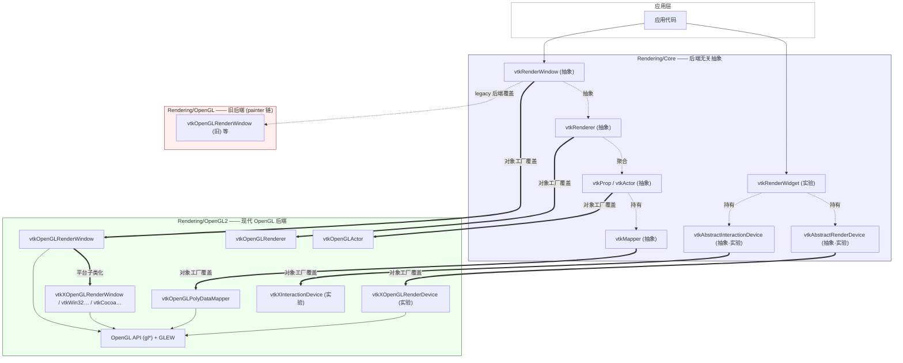
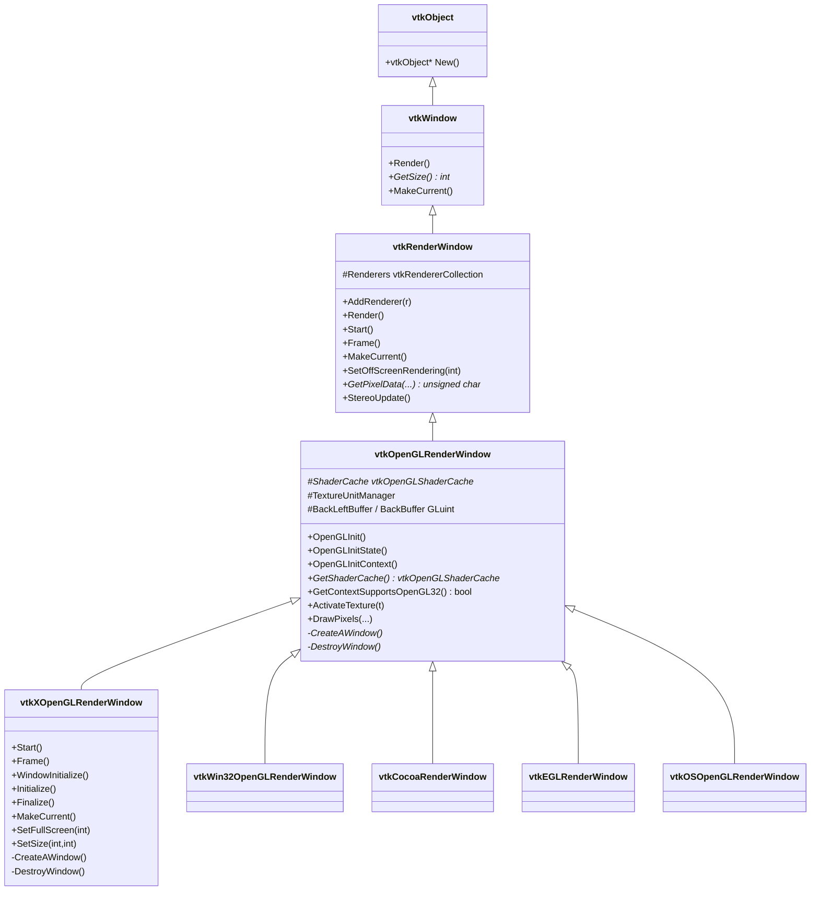
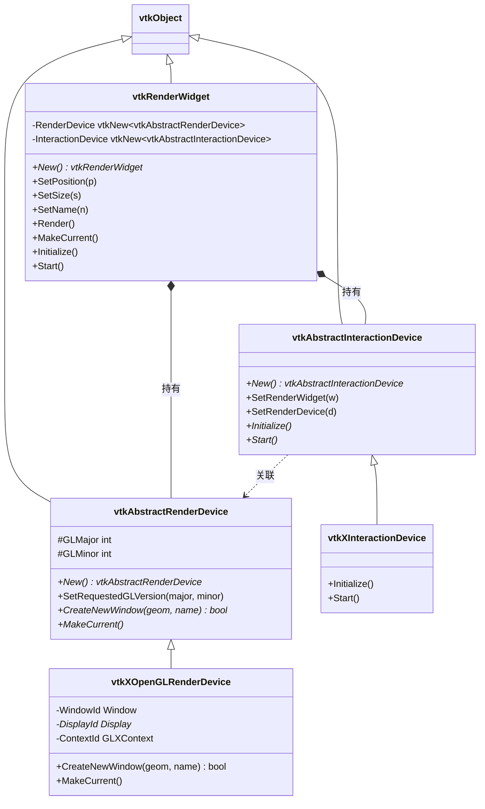
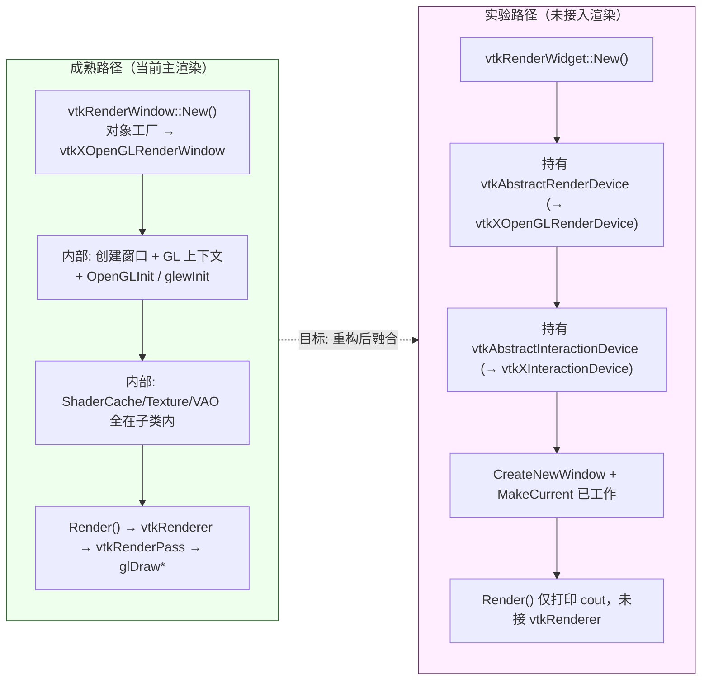
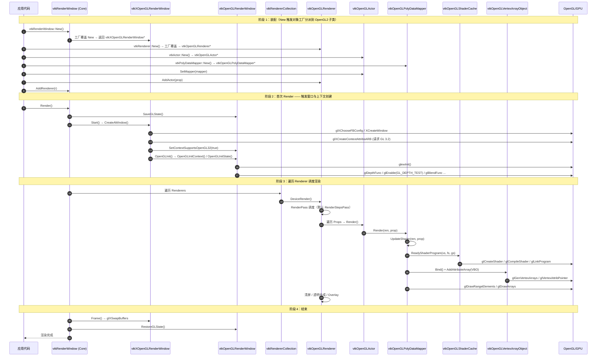
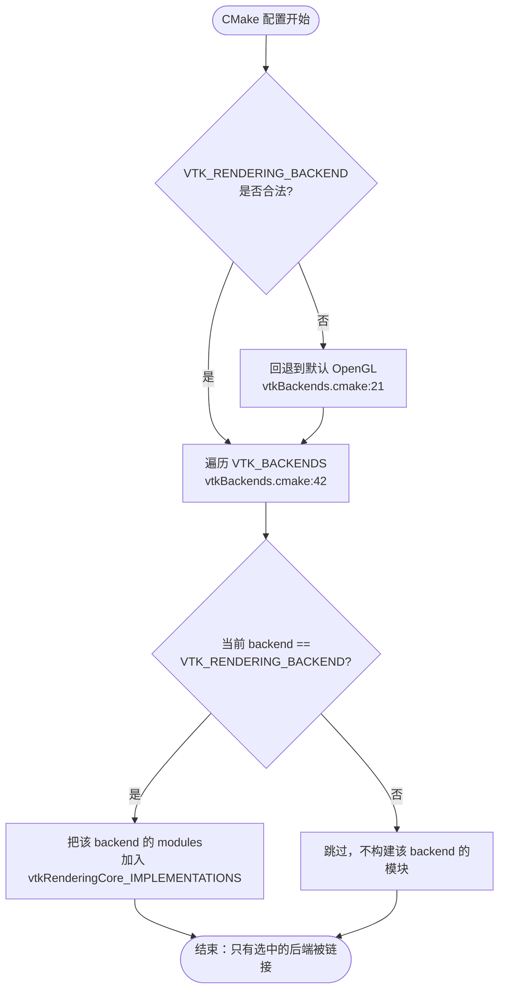
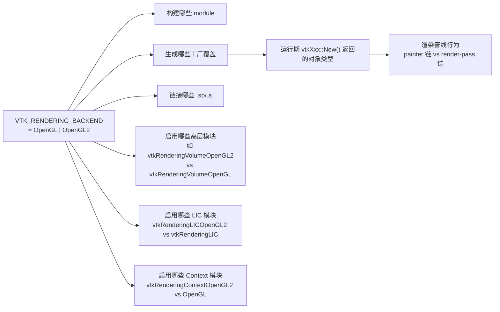
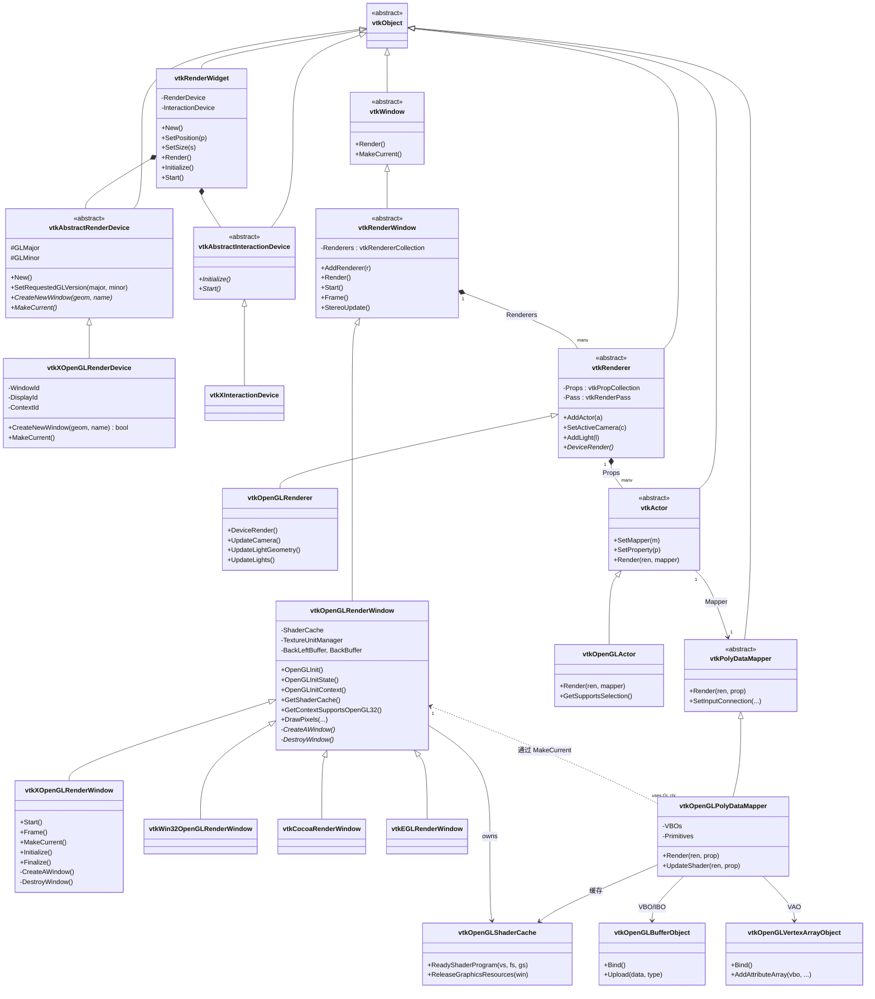

# VTK 图形 API 对接与封装设计分析报告

> 分析对象：`/workspace/` 下的 VTK (Visualization Toolkit) 源码
> 核心问题：
> 1. VTK 如何与图形 API 对接？只有 OpenGL2 吗？
> 2. 最新 OpenGL 版本支持？Vulkan 1 是否支持？
> 3. VTK 对图形 API 的封装设计是怎样的？上层如何与封装层交互？
> 绘图方式：Mermaid diagrams

---

## 0. 结论速览（TL;DR）

| 问题 | 结论 |
|------|------|
| 当前支持哪些图形 API 后端？ | **只有 OpenGL 系列**：旧版 `OpenGL`（painter 链）与新版 `OpenGL2`（render-pass 链），二者**互斥**，编译时通过 `VTK_RENDERING_BACKEND` 选其一 |
| 是否只有 OpenGL2？ | 在"现代后端"意义上**是**。`OpenGL2` 是当前主推/默认的现代后端；`OpenGL` 是兼容旧硬件/驱动的遗留后端 |
| Vulkan 1 是否支持？ | **不支持**。在整个 `Rendering/` 与 `CMake/` 树中**没有任何** Vulkan/vulkan 相关源文件、模块、CMake 选项 |
| 最新 OpenGL 版本？ | 主路径请求 **OpenGL 3.2** Core Profile；实验性 `vtkXOpenGLRenderDevice` 进一步请求 **OpenGL 4.4**；运行期通过 GLEW 检测 `GLEW_VERSION_3_2`，缺失则降级到 OpenGL 2.1 兼容模式 |
| 封装设计要点 | **双层抽象**：①成熟路径——`vtkRenderWindow` 直接子类化（按 OS/窗口系统分派）；②实验路径——`vtkAbstractRenderDevice` + `vtkRenderWidget`（仍在开发，仅 X 实现且未接入主渲染流程） |
| 上层如何与封装层交互？ | 上层（`vtkRenderer`/`vtkProp`/`vtkMapper`）**只依赖** `Rendering/Core` 中的抽象基类，通过**对象工厂**在运行时拿到具体 OpenGL2 实现；上层代码不直接调用任何 `gl*` 函数 |

---

## 1. 检索/分析过程

按"全局扫描 → 关键文件精读 → 交叉校验 → 综合成文"四段式推进：

1. **后端清单枚举**：用 `Glob` 列出 `Rendering/*/module.cmake`，得到 25 个渲染子模块；逐个 `Grep` `BACKEND` 关键字，确认只有 `Rendering/OpenGL` 与 `Rendering/OpenGL2` 两个模块声明了 `BACKEND`，且分别 `IMPLEMENTS vtkRenderingCore`。
2. **Vulkan 排查**：在 `Rendering/` 与 `CMake/` 全树 `Grep` `Vulkan|vulkan`，**零命中**；进一步 `Glob` `**/vtk*Vulkan*`，**无文件**。证伪"VTK 已支持 Vulkan"的猜测。
3. **OpenGL 版本追踪**：精读 `vtkOpenGLRenderWindow.cxx::OpenGLInitContext`（行 400-461）与 `vtkXOpenGLRenderWindow.cxx`（行 540-624）、`vtkXOpenGLRenderDevice.cxx`（行 248-388），梳理上下文创建、GLEW 初始化、版本检测、降级策略。
4. **封装层剖析**：精读 `Rendering/Core/vtkAbstractRenderDevice.{h,cxx}`、`vtkRenderWidget.{h,cxx}`、`vtkAbstractInteractionDevice.{h,cxx}`；对照 `Rendering/OpenGL2/vtkOpenGLRenderWindow.{h,cxx}`、`vtkXOpenGLRenderWindow.{h,cxx}`、`vtkXOpenGLRenderDevice.{h,cxx}`，识别"成熟路径"与"实验路径"两条独立链路。
5. **后端选择机制**：精读 `CMake/vtkBackends.cmake`、两个后端的 `module.cmake`、`Rendering/OpenGL2/CMakeLists.txt` 中的 `vtk_module_overrides` / `vtk_add_override`，厘清"编译期互斥 + 运行期对象工厂覆盖"的两段式机制。
6. **上层交互验证**：在 `vtkOpenGLPolyDataMapper.cxx`、`vtkOpenGLRenderer.cxx` 中 `Grep` `glDraw`、`MakeCurrent`、`GetRenderWindow`，确认上层只通过 `vtkRenderWindow*` 与 `vtkOpenGL*` 子类间接接触 GL，没有裸 `gl*` 调用穿过 Core 层。

---

## 2. 后端清单与互斥机制

### 2.1 模块声明（module.cmake）

两个后端模块在 `module.cmake` 中均使用 `IMPLEMENTS` + `BACKEND` 关键字：

**`Rendering/OpenGL2/module.cmake`**：
```cmake
vtk_module(vtkRenderingOpenGL2
  DEPENDS
    vtkCommonExecutionModel
  IMPLEMENTS
    vtkRenderingCore          # 声明"我是 vtkRenderingCore 的一个实现"
  BACKEND
    OpenGL2                   # 声明"我属于 OpenGL2 后端"
  PRIVATE_DEPENDS
    vtkImagingHybrid
    vtkglew                   # 通过 GLEW 加载 GL 扩展
    vtksys
  ...
)
```

**`Rendering/OpenGL/module.cmake`**：
```cmake
vtk_module(vtkRenderingOpenGL
  IMPLEMENTS
    vtkRenderingCore
  BACKEND
    OpenGL                    # 旧后端，painter 链风格
  ...
)
```

> 关键设计：`IMPLEMENTS` 表示该模块提供某个 Core 模块的具体实现；`BACKEND` 是**互斥标签**——同一 `IMPLEMENTS` 下只能启用一个 `BACKEND`。

### 2.2 编译期互斥（CMake/vtkBackends.cmake）

`CMake/vtkBackends.cmake` 的核心逻辑：

```cmake
# 1) 校验 VTK_RENDERING_BACKEND 是否在 VTK_BACKENDS 列表内
set (_options ${VTK_BACKENDS} "None")
list (FIND _options "${VTK_RENDERING_BACKEND}"  _index)
if (${_index} EQUAL -1)
  # 非法值则强制回退到默认（OpenGL）
  if(NOT DEFINED VTK_RENDERING_BACKEND_DEFAULT)
    set(VTK_RENDERING_BACKEND_DEFAULT "OpenGL")
  endif()
  set(VTK_RENDERING_BACKEND "${VTK_RENDERING_BACKEND_DEFAULT}" CACHE STRING
      "Choose the rendering backend." FORCE)
endif()

# 2) 只为选中的后端启用其 IMPLEMENTS 实现
foreach(backend ${VTK_BACKENDS})
  if(${backend} STREQUAL "${VTK_RENDERING_BACKEND}")
    foreach(module ${VTK_BACKEND_${backend}_MODULES})
      list(APPEND ${${module}_IMPLEMENTS}_IMPLEMENTATIONS ${module})
    endforeach()
  endif()
endforeach()
```

要点：
- `VTK_BACKENDS` 由各 `module.cmake` 的 `BACKEND` 关键字自动聚合，当前为 `OpenGL;OpenGL2`。
- `VTK_RENDERING_BACKEND` 是一个 CACHE 变量，三选一（`OpenGL` / `OpenGL2` / `None`），**全局唯一**。
- 未选中后端的模块不会被加入 `${vtkRenderingCore}_IMPLEMENTATIONS`，从而不会被构建/链接——这是"互斥"的实现方式，而非用 `if/else` 在源码层硬切。

### 2.3 后端对比

| 维度 | OpenGL（旧） | OpenGL2（新） |
|------|--------------|---------------|
| 模块路径 | `Rendering/OpenGL` | `Rendering/OpenGL2` |
| 风格 | **Painter 链**（`vtkDefaultPainter` 编排多个 `vtkPainter`） | **Render Pass 链**（`vtkRenderStepsPass` 编排多个 `vtkRenderPass`） |
| 着色器 | `vtkShader2` / `vtkShaderProgram2` + `vtkUniformVariables` | `vtkShader` / `vtkShaderProgram` + `vtkOpenGLShaderCache` |
| 缓冲对象 | `vtkPixelBufferObject`、`vtkFrameBufferObject(2)` | 新增 `vtkOpenGLBufferObject` 体系（VBO/IBO/VAO），`vtkOpenGLVertexBufferObject` |
| 默认状态 | **是**（默认 `OpenGL`） | 否（需显式 `VTK_RENDERING_BACKEND=OpenGL2`） |
| 状态 | 维护模式，逐步淘汰 | 主推 |
| 平台覆盖 | X/Win32/Cocoa/Carbon/OSMesa | X/Win32/Cocoa/EGL/Android/iOS/OSMesa |

> 注：当前 VTK 源码默认值仍是 `OpenGL`，但所有现代特性（深度剥离、SSAO、LIC、GPU volume）都只在 `OpenGL2` 中实现并持续演进。

---

## 3. OpenGL 版本支持详解

### 3.1 两条版本基线

VTK 在不同代码路径中请求不同的 GL 上下文版本：

**主路径**——`vtkXOpenGLRenderWindow::CreateAWindow`（行 546-577）：
```cpp
// try for 32 context
if (this->Internal->FBConfig)
  {
  glXCreateContextAttribsARBProc glXCreateContextAttribsARB = 0;
  glXCreateContextAttribsARB = (glXCreateContextAttribsARBProc)
    glXGetProcAddressARB( (const GLubyte *) "glXCreateContextAttribsARB" );

  int context_attribs[] =
    {
    GLX_CONTEXT_MAJOR_VERSION_ARB, 3,
    GLX_CONTEXT_MINOR_VERSION_ARB, 2,
    0
    };

  if (glXCreateContextAttribsARB)
    {
    this->Internal->ContextId =
      glXCreateContextAttribsARB(this->DisplayId,
        this->Internal->FBConfig[0], 0, GL_TRUE, context_attribs);
    XSync(this->DisplayId, False);
    if (this->Internal->ContextId)
      {
      this->SetContextSupportsOpenGL32(true);   // 标记为 GL 3.2+ 路径
      }
    }
  }
// old failsafe —— 失败则回退到旧式 glXCreateContext（GL 2.x 兼容）
if (this->Internal->ContextId == NULL)
  {
  this->Internal->ContextId =
    glXCreateContext(this->DisplayId, v, 0, GL_TRUE);
  }
```

**实验路径**——`vtkXOpenGLRenderDevice::CreateNewWindow`（行 276-288）：
```cpp
int attributes[] =
  {
  GLX_CONTEXT_MAJOR_VERSION_ARB, 4,
  GLX_CONTEXT_MINOR_VERSION_ARB, 4,
  None
  };
this->Internal->ContextId = glXCreateContextAttribsARB(this->DisplayId,
                                                       this->Internal->FBConfig,
                                                       0, True, attributes);
```
并在创建后用 GLEW 强校验：
```cpp
if (!GLEW_VERSION_2_1) { vtkErrorMacro("GL 2.1 not supported ..."); return false; }
if (!GLEW_VERSION_3_0) { vtkErrorMacro("GL 3.0 not supported ..."); return false; }
if (!GLEW_VERSION_4_0) { vtkErrorMacro("GL 4.4 not supported ..."); return false; }
```

### 3.2 运行期版本检测与降级

`vtkOpenGLRenderWindow::OpenGLInitContext`（行 400-461）在每次新上下文创建后执行：

```cpp
void vtkOpenGLRenderWindow::OpenGLInitContext()
{
  this->ContextCreationTime.Modified();
  if (!this->Initialized)
    {
    GLenum result = glewInit();
    if (result != GLEW_OK) { vtkErrorMacro("GLEW could not be initialized."); return; }

    if (!GLEW_VERSION_3_2)
      {
      if (!GLEW_VERSION_2_1)
        {
        vtkErrorMacro("GL version 2.1 is not supported by your graphics driver.");
        return;                                   // 硬底线：GL 2.1
        }
      vtkWarningMacro(
        "VTK is designed to work with OpenGL version 3.2 but it appears "
        "it has been given a context that does not support 3.2. VTK will "
        "run in a compatibility mode designed to work with OpenGL 2.1 but "
        "some features may not work.");            // 软降级：3.2 → 2.1
      }
    else
      {
      this->SetContextSupportsOpenGL32(true);      // 标记 3.2+ 路径
      }
    this->Initialized = true;
    ...
    }
}
```

后续 `GetDepthBufferSize`、`GetColorBufferSizes` 等会根据 `GetContextSupportsOpenGL32()` 选择 `glGetFramebufferAttachmentParameteriv`（3.2+）或 `glGetIntegerv`（旧式）。

### 3.3 版本支持矩阵

| GL 版本 | 主路径 | 实验路径 | 备注 |
|---------|--------|----------|------|
| < 2.1 | ✗（硬失败） | ✗（硬失败） | 最低硬底线 |
| 2.1 | ✓（降级模式，部分功能不可用） | ✗ | 主路径会发 `vtkWarningMacro` |
| 3.0–3.1 | ✓（同 2.1 降级） | ✗（实验路径要求 4.0+） | |
| 3.2 | ✓（设计目标版本，`ContextSupportsOpenGL32=true`） | ✗ | 主路径的首选上下文 |
| 4.0–4.3 | ✓ | ✗（实验路径要求 4.0+ 但代码写 4.4） | |
| 4.4+ | ✓ | ✓ | 实验路径才完整工作 |

> "最新 OpenGL"在本版本 VTK 中**没有显式上限**——只要驱动提供 4.5/4.6 上下文，主路径也能创建成功（因为 `glXCreateContextAttribsARB` 请求的是"至少 3.2"）。但 VTK **代码层面**最高主动请求到 4.4，且只用在实验性的 `vtkXOpenGLRenderDevice` 中。

### 3.4 Vulkan 结论

- `Grep "Vulkan|vulkan"` 在 `/workspace/Rendering/` 与 `/workspace/CMake/` 全树**零命中**。
- `Glob "**/vtk*Vulkan*"` **无任何文件**。
- `vtkBackends.cmake` 的 `VTK_BACKENDS` 列表中**没有** `Vulkan` 项。
- 结论：**本版本 VTK 完全不支持 Vulkan**。Vulkan 后端是 VTK 社区后续版本（VTK 9.x 之后，外部项目 vtk-vulkan / rsync 探索）的课题，与当前源码无关。

---

## 4. 图形 API 封装设计

VTK 当前的图形 API 封装存在**两条并存**的设计链路：成熟路径与实验路径。

### 4.1 设计总览（双层抽象）



> 图例：实线粗箭头 `==>` 表示"对象工厂覆盖"（运行期分派）；实线细箭头 `-->` 表示"直接调用 GL"；虚线 `-.->` 表示"持有/聚合/抽象"。

### 4.2 成熟路径：`vtkRenderWindow` 直接子类化（主路径）

这是 VTK 实际渲染所走的路径。**核心思想**：把"窗口系统 + GL 上下文"这一对底层资源**完全封装在 `vtkRenderWindow` 的子类内部**，对上层只暴露抽象 `vtkRenderWindow` 接口。

#### 4.2.1 类层次



#### 4.2.2 职责切分

| 层级 | 类 | 职责 | 是否含 `gl*` 调用 |
|------|------|------|----------------|
| 平台无关 GL 层 | `vtkOpenGLRenderWindow` | GLEW 初始化、Shader 缓存、纹理单元管理、缓冲名查询、状态保存/恢复、像素读写 | 是（通过 GLEW） |
| 平台窗口层 | `vtkXOpenGLRenderWindow` 等 | 创建 OS 窗口、创建 GL 上下文（`glXCreateContextAttribsARB`）、`MakeCurrent`、`SwapBuffers`、事件循环 | 是（仅 GLX/WGL/CGL/EGL 平台绑定） |
| 抽象层 | `vtkRenderWindow` / `vtkWindow` | 后端无关接口：`Render()`、`Frame()`、`MakeCurrent()`、`GetSize()` | 否 |

#### 4.2.3 上层如何拿到 GL 子类实例：对象工厂覆盖

上层代码这样写：
```cpp
vtkSmartPointer<vtkRenderWindow> renWin = vtkSmartPointer<vtkRenderWindow>::New();
renWin->AddRenderer(ren1);
renWin->Render();
```

`vtkRenderWindow::New()` 实际上不会真的返回基类实例——它内部调用了 `vtkObjectFactory` 的覆盖机制（`Rendering/OpenGL2/CMakeLists.txt:215-216`）：
```cmake
list(APPEND vtk_module_overrides "vtkRenderWindow")
set(vtk_module_vtkRenderWindow_override "vtkXOpenGLRenderWindow")   # X 平台
```
对应平台还会覆盖为 `vtkWin32OpenGLRenderWindow`、`vtkCocoaRenderWindow`、`vtkEGLRenderWindow`、`vtkOSOpenGLRenderWindow` 等。

CMake 在构建期生成工厂注册代码，运行期 `vtkRenderWindow::New()` 会返回 `vtkXOpenGLRenderWindow*`（向上转型为基类指针），上层完全无感知。

#### 4.2.4 同样的覆盖机制贯穿整个上层栈

`Rendering/OpenGL2/CMakeLists.txt:179-203` 注册了一整套覆盖：
```cmake
set(opengl_overrides
  Actor
  Camera
  LabeledContourMapper
  HardwareSelector
  ImageMapper
  ImageSliceMapper
  Glyph3DMapper
  Light
  PointGaussianMapper
  PolyDataMapper
  PolyDataMapper2D
  Property
  Renderer
  Texture
  )
foreach(_override ${opengl_overrides})
  vtk_add_override(vtk${_override} vtkOpenGL${_override})
endforeach()
```

这意味着上层对 `vtkRenderer::New()`、`vtkActor::New()`、`vtkPolyDataMapper::New()`、`vtkCamera::New()`、`vtkLight::New()`、`vtkTexture::New()` 的调用，运行期都会返回 `vtkOpenGL*` 子类。**这就是上层与封装层交互的核心机制**。

### 4.3 实验路径：`vtkAbstractRenderDevice` + `vtkRenderWidget`（未完成）

这是 VTK 试图把"窗口/上下文创建"从 `vtkRenderWindow` 中进一步抽离出来的探索，目前**仍在开发中**，未接入主渲染流程。

#### 4.3.1 抽象层定义

`Rendering/Core/vtkAbstractRenderDevice.h`：
```cpp
class VTKRENDERINGCORE_EXPORT vtkAbstractRenderDevice : public vtkObject
{
public:
  static vtkAbstractRenderDevice* New();   // 通过对象工厂返回子类
  void SetRequestedGLVersion(int major, int minor);
  virtual bool CreateNewWindow(const vtkRecti &geometry, const std::string &name) = 0;
  virtual void MakeCurrent() = 0;
protected:
  int GLMajor;   // 默认 2
  int GLMinor;   // 默认 1
};
```

实现只有 X 平台一份（`vtkXOpenGLRenderDevice.cxx`），CMake 注册（`Rendering/OpenGL2/CMakeLists.txt:166-167`）：
```cmake
list(APPEND vtk_module_overrides "vtkAbstractRenderDevice")
set(vtk_module_vtkAbstractRenderDevice_override "vtkXOpenGLRenderDevice")
```

#### 4.3.2 vtkRenderWidget 串起 RenderDevice + InteractionDevice

`Rendering/Core/vtkRenderWidget.h`：
```cpp
class vtkRenderWidget : public vtkObject
{
protected:
  vtkNew<vtkAbstractInteractionDevice> InteractionDevice;
  vtkNew<vtkAbstractRenderDevice> RenderDevice;
};
```

`vtkRenderWidget.cxx::Initialize`（行 71-83）：
```cpp
void vtkRenderWidget::Initialize()
{
  this->InteractionDevice->SetRenderWidget(this);
  this->InteractionDevice->SetRenderDevice(this->RenderDevice.Get());
  this->RenderDevice->CreateNewWindow(vtkRecti(...), this->Name);   // 创建 OS 窗口 + GL 上下文
  this->InteractionDevice->Initialize();
}
```

`vtkRenderWidget::Render()` 当前实现仅有一行调试输出（行 59-63）：
```cpp
void vtkRenderWidget::Render()
{
  assert(this->RenderDevice.Get() != NULL);
  cout << "Render called!!!" << endl;     // ← 仍未接入真正的渲染
}
```

> 这一行 `cout` 是判断"实验路径未完成"的决定性证据：抽象层架子已搭好，但 `RenderWidget` 还没有把 `vtkRenderWindow` / `vtkRenderer` 接进来。

#### 4.3.3 实验路径类图



### 4.4 两条路径的关系



**判断**：实验路径的最终目标显然是把"窗口/上下文"彻底从 `vtkRenderWindow` 剥离出来（这样未来加入 Vulkan 后端只需新增 `vtkVulkanRenderDevice` 而不必动 `vtkRenderWindow` 体系），但**当前版本尚未完成**，应用层应继续使用成熟路径。

---

## 5. 上层与封装层的交互

### 5.1 交互总览（端到端时序）



### 5.2 关键交互点详解

#### 5.2.1 上层只看抽象基类，工厂负责分派

上层 API 形如：
```cpp
vtkNew<vtkRenderWindow> renWin;
vtkNew<vtkRenderer> ren;
vtkNew<vtkActor> actor;
vtkNew<vtkPolyDataMapper> mapper;

mapper->SetInputConnection(...);
actor->SetMapper(mapper);
ren->AddActor(actor);
renWin->AddRenderer(ren);
renWin->Render();
```

整段代码**没有任何 OpenGL 痕迹**，但运行期实际对象类型全部是 `vtkOpenGL*`。这就是"封装层"的运行期形态——**不是显式的"图形 API 接口"，而是"对象工厂覆盖 + 多态虚函数"**。

#### 5.2.2 GL 调用的封装点

GL 调用集中在以下几个"封装点"内，不外泄到上层：

| 封装点 | 位置 | 调用的 GL 类别 |
|--------|------|----------------|
| `vtkOpenGLRenderWindow` | `vtkOpenGLRenderWindow.cxx` | 状态查询（`glGet*`）、像素读写（`glReadPixels`/`DrawPixels`）、纹理单元管理 |
| 平台 `vtk*OpenGLRenderWindow` 子类 | `vtkXOpenGLRenderWindow.cxx` 等 | 上下文创建、`MakeCurrent`、`SwapBuffers`、扩展查询 |
| `vtkOpenGLShaderCache` / `vtkShaderProgram` | `vtkOpenGLShaderCache.cxx` | Shader 编译/链接/Uniform 上传 |
| `vtkOpenGLBufferObject` 家族 | VBO/IBO | `glGenBuffers`/`glBufferData`/`glBufferSubData` |
| `vtkOpenGLVertexArrayObject` | VAO | `glGenVertexArrays`/`glVertexAttribPointer` |
| `vtkTextureObject` | 纹理 | `glGenTextures`/`glTexImage2D`/`glBindTexture` |
| `vtkFrameBufferObject` / `vtkFrameBufferObject2` / `vtkRenderbuffer` | FBO/RBO | `glGenFramebuffers`/`glFramebufferTexture2D` |
| `vtkOpenGLPolyDataMapper` | 顶点装配 + DrawCall | `glDrawRangeElements`/`glDrawElementsInstanced` |
| `vtkOpenGLRenderer` / `vtkOpenGLCamera` / `vtkOpenGLLight` | 渲染调度 | 矩阵/光源上传，光照全在 shader 中完成 |

> 验证：在 `Rendering/Core/` 下 `Grep "\\bgl[A-Z]"` 几乎无命中（仅头文件前置声明）；所有 `gl*` 调用都在 `Rendering/OpenGL2/` 与 `Rendering/OpenGL/` 中。

#### 5.2.3 状态边界：`MakeCurrent` 与上下文时间戳

`vtkOpenGLRenderWindow` 维护一个 `ContextCreationTime`（`vtkTimeStamp`）。当 OS 重建上下文（如窗口销毁重建），子类会调用 `OpenGLInit()` 重置 GLEW 与 GL 状态，并 `Modified()` 时间戳。所有持有 GPU 资源的对象（Shader/VAO/VBO/Texture/FBO）通过 `vtkObject::GetMTime()` 比较感知上下文变化，从而在下次渲染时重建资源——这是封装层向"上层 GPU 资源对象"传递上下文生命周期的关键通道。

### 5.3 抽象与实现的对应表

| Core 抽象（Rendering/Core） | OpenGL2 实现（Rendering/OpenGL2） | 上层调用方式 |
|------|------|------|
| `vtkRenderWindow` | `vtkOpenGLRenderWindow` → 平台子类 | `vtkRenderWindow::New()` |
| `vtkRenderer` | `vtkOpenGLRenderer` | `vtkRenderer::New()` |
| `vtkActor` / `vtkProp3D` | `vtkOpenGLActor` | `vtkActor::New()` |
| `vtkVolume` | `vtkOpenGLGPUVolumeRayCastMapper`（在 VolumeOpenGL2） | `vtkVolume::New()` + mapper |
| `vtkCamera` | `vtkOpenGLCamera` | `vtkCamera::New()` |
| `vtkLight` | `vtkOpenGLLight` | `vtkLight::New()` |
| `vtkProperty` | `vtkOpenGLProperty` | `actor->GetProperty()` |
| `vtkTexture` | `vtkOpenGLTexture` | `actor->SetTexture()` |
| `vtkMapper` / `vtkPolyDataMapper` | `vtkOpenGLPolyDataMapper` | `vtkPolyDataMapper::New()` |
| `vtkHardwareSelector` | `vtkOpenGLHardwareSelector` | `vtkRenderer::GetSelector()` |
| `vtkAbstractRenderDevice`（实验） | `vtkXOpenGLRenderDevice`（仅 X） | `vtkAbstractRenderDevice::New()` |
| `vtkAbstractInteractionDevice`（实验） | `vtkXInteractionDevice`（仅 X） | `vtkAbstractInteractionDevice::New()` |

---

## 6. 后端选择与初始化流程图

### 6.1 编译期：选择唯一后端



### 6.2 运行期：对象工厂分派 + GL 上下文创建

```mermaid
flowchart TD
    A([vtkRenderWindow::New]) --> B{对象工厂注册表<br/>是否有 vtkRenderWindow 覆盖?}
    B -->|是| C["实例化 vtkXOpenGLRenderWindow<br/>(或 Win32/Cocoa/EGL/OSMesa 对应类)"]
    B -->|否| D["实例化基类 vtkRenderWindow<br/>(无 GL 能力)"]
    C --> E([返回基类指针])
    D --> E

    E --> F([应用调用 Render])
    F --> G["vtkOpenGLRenderWindow::Render<br/>SaveGLState()"]
    G --> H["Superclass::Render → 遍历 Renderers"]
    H --> I{窗口是否已初始化?}
    I -->|否| J["Start() → CreateAWindow()"]
    J --> K[glXChooseFBConfig]
    K --> L["glXCreateContextAttribsARB<br/>请求 GL 3.2 Core"]
    L --> M{上下文创建成功?}
    M -->|是| N[SetContextSupportsOpenGL32(true)]
    M -->|否| O["glXCreateContext 旧式 API<br/>降级到 GL 2.x"]
    N --> P["OpenGLInit()<br/>glewInit + OpenGLInitState"]
    O --> P
    P --> Q[MakeCurrent + 渲染]
    I -->|是| Q
    Q --> R([完成])
```

### 6.3 后端切换的影响范围

切换 `VTK_RENDERING_BACKEND` 会影响：



---

## 7. 综合类图（封装层 + 上层）



---

## 8. 设计要点总结

1. **后端只有 OpenGL 系列，互斥二选一**：`OpenGL`（旧 painter 链）与 `OpenGL2`（新 render-pass 链），通过 `module.cmake` 的 `IMPLEMENTS` + `BACKEND` 关键字 + `vtkBackends.cmake` 的 `VTK_RENDERING_BACKEND` 变量实现编译期互斥。
2. **Vulkan 完全不支持**：源码树中零 Vulkan 痕迹，`VTK_BACKENDS` 列表无 Vulkan 项。
3. **OpenGL 版本**：主路径请求 GL 3.2 Core Profile；运行期通过 GLEW 检测 `GLEW_VERSION_3_2`，缺失则降级到 GL 2.1 兼容模式并发出警告；GL 2.1 以下硬失败。实验性 `vtkXOpenGLRenderDevice` 进一步请求 GL 4.4，但仅 X 平台、未接入主渲染。
4. **封装层本质 = 对象工厂覆盖 + 多态虚函数**，而非显式的"IGraphicsContext"接口。上层 `Rendering/Core` 中所有抽象基类（`vtkRenderWindow`、`vtkRenderer`、`vtkActor`、`vtkMapper`、`vtkCamera`、`vtkLight`、`vtkTexture`、`vtkProperty`、`vtkHardwareSelector`）在运行期通过对象工厂被替换为 `vtkOpenGL*` 子类。
5. **GL 调用集中点**：上下文创建/`MakeCurrent`/`SwapBuffers` 在平台 `vtk*OpenGLRenderWindow` 子类；GLEW 初始化/状态查询/像素读写/Shader 缓存在 `vtkOpenGLRenderWindow`；GPU 资源（VBO/IBO/VAO/Texture/FBO）各自有封装类；DrawCall 在 `vtkOpenGLPolyDataMapper`。Core 层无任何 `gl*` 调用。
6. **平台差异在窗口层消化**：X/Win32/Cocoa/EGL/OSMesa/Android/iOS 各有一个 `vtkOpenGLRenderWindow` 子类，差异仅限于"如何创建窗口与 GL 上下文"。CMake 在 `Rendering/OpenGL2/CMakeLists.txt` 中按平台条件注册对应的工厂覆盖。
7. **实验性二次抽象**：`vtkAbstractRenderDevice` + `vtkRenderWidget` 试图把"窗口/上下文"从 `vtkRenderWindow` 进一步剥离，目前 `vtkRenderWidget::Render()` 仍只是 `cout << "Render called!!!"`，**未接入 `vtkRenderer`**。这条路径预留了未来接入 Vulkan 的架构空间，但当前不可用于实际渲染。
8. **上下文生命周期通知**：`vtkOpenGLRenderWindow` 用 `ContextCreationTime`（`vtkTimeStamp`）向所有持有 GPU 资源的对象广播上下文重建，资源对象据此在下次 `Render` 时重建 GL 资源——这是封装层向上传达"GL 上下文失效"的关键机制。
9. **状态边界**：`vtkOpenGLRenderWindow::Render()` 在 `Superclass::Render()` 前后调用 `SaveGLState()` / `RestoreGLState()`，避免 VTK 内部 GL 状态变更外泄（特别是与 `vtkExternalOpenGLRenderWindow` 这类外部 GL 上下文共享场景）。

---

## 9. 关键文件路径参考表

| 主题 | 文件 |
|------|------|
| 后端互斥逻辑 | `CMake/vtkBackends.cmake` |
| OpenGL2 模块声明 | `Rendering/OpenGL2/module.cmake` |
| OpenGL（旧）模块声明 | `Rendering/OpenGL/module.cmake` |
| OpenGL2 工厂覆盖注册 | `Rendering/OpenGL2/CMakeLists.txt` (行 179-246) |
| 抽象窗口基类 | `Rendering/Core/vtkRenderWindow.h` |
| GL 后端窗口基类 | `Rendering/OpenGL2/vtkOpenGLRenderWindow.h` |
| GL 上下文初始化（GLEW/3.2 检测） | `Rendering/OpenGL2/vtkOpenGLRenderWindow.cxx` (行 341-461) |
| X 平台窗口与上下文创建 | `Rendering/OpenGL2/vtkXOpenGLRenderWindow.cxx` (行 540-624) |
| 实验性抽象设备基类 | `Rendering/Core/vtkAbstractRenderDevice.h` |
| 实验性 X 设备实现（请求 GL 4.4） | `Rendering/OpenGL2/vtkXOpenGLRenderDevice.cxx` (行 276-388) |
| 实验性 RenderWidget（未接入渲染） | `Rendering/Core/vtkRenderWidget.cxx` |
| 实验性交互设备基类 | `Rendering/Core/vtkAbstractInteractionDevice.h` |
| 渲染调度（OpenGL2） | `Rendering/OpenGL2/vtkOpenGLRenderer.cxx` |
| DrawCall 与 Shader 装配 | `Rendering/OpenGL2/vtkOpenGLPolyDataMapper.cxx` |
| Shader 缓存 | `Rendering/OpenGL2/vtkOpenGLShaderCache.cxx` |

---

## 10. 结语

VTK 的图形 API 封装是一个**以"对象工厂覆盖 + 多态虚函数"为核心、以"模块系统 BACKEND 互斥"为外部约束**的工程化设计。在当前源码版本中：

- 实际可用后端**只有 OpenGL 系列**，且 `OpenGL2` 是事实上的现代主推路径；
- OpenGL 版本主路径锁在 **3.2 Core**（运行期降级到 2.1），实验路径试探到 **4.4**；
- **完全没有 Vulkan 支持**，包括模块声明、CMake 选项、源码文件均无相关痕迹；
- 上层与封装层的交互通过 `vtkRenderWindow::New()` 等工厂调用**隐式分派**到 `vtkOpenGL*` 子类完成，Core 层零 GL 痕迹；
- 实验性的 `vtkAbstractRenderDevice` + `vtkRenderWidget` 已搭建架构骨架，但 `Render()` 未接入 `vtkRenderer`，可视为"为未来多后端（含 Vulkan）预留的二次抽象层"，当前不可用于实际渲染。

若未来要在本版本基础上引入 Vulkan 后端，最小可行的扩展点是：新增 `Rendering/Vulkan` 模块声明 `BACKEND Vulkan`，实现 `vtkVulkanRenderWindow` / `vtkVulkanPolyDataMapper` 等覆盖类，并在 `vtkBackends.cmake` 中将 `Vulkan` 纳入 `VTK_BACKENDS` 列表——但这是新功能开发，远超当前源码已支持范围。
