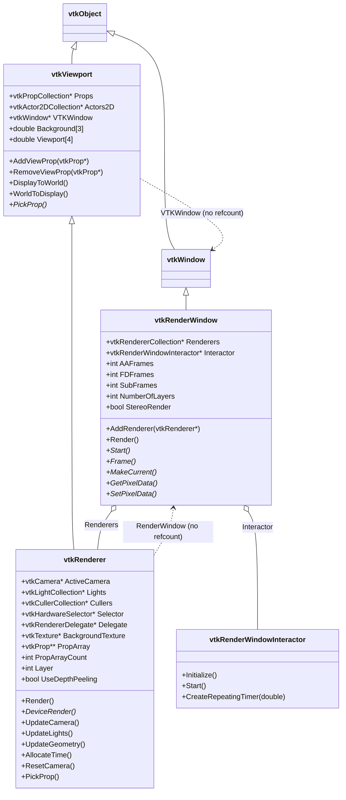
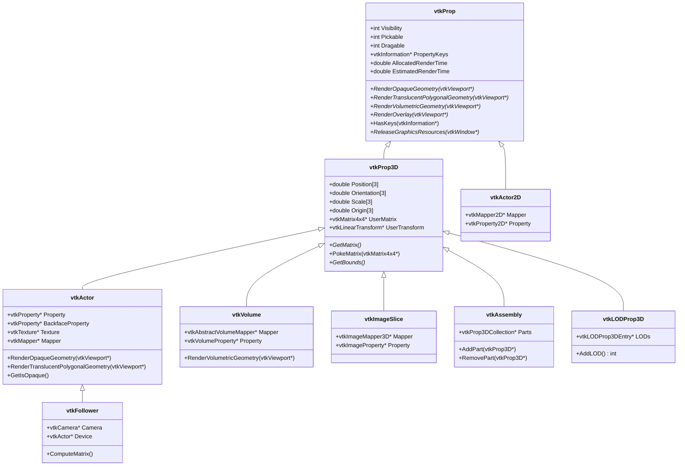
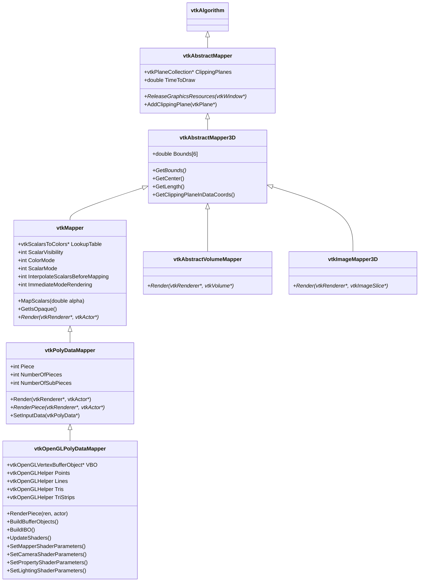
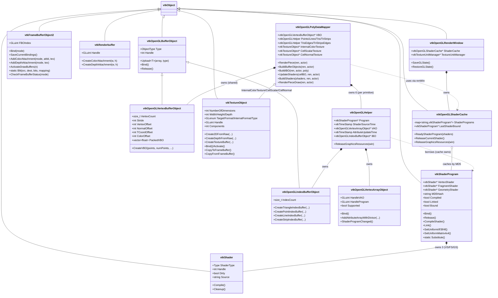
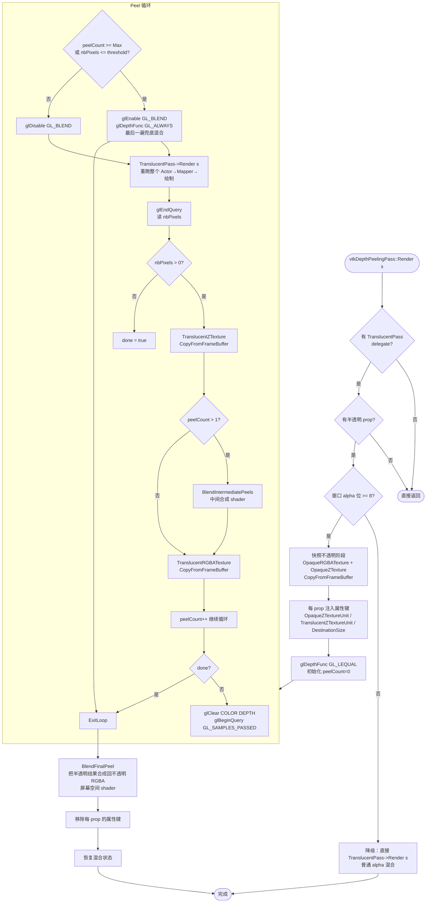
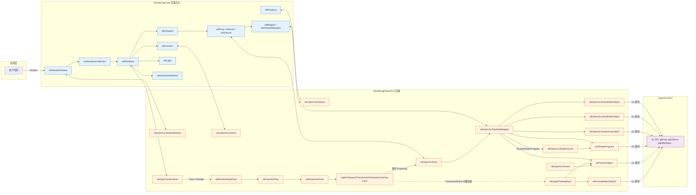

# VTK 渲染架构分析报告

> 分析对象：`/workspace/` 下的 VTK (Visualization Toolkit) 源码
> 重点：现代 **OpenGL2** 后端的渲染 Pass 组织方式、渲染管线流程、核心类设计
> 绘图方式：Mermaid diagrams

---

## 0. 检索/分析过程

为完成本次分析，按"先扫描结构、再并行检索、最后综合输出"的三段式流程推进：

1. **目录扫描**：用 `LS` 列出 `/workspace` 顶层，识别出这是 VTK 源码树（含 `Rendering/`、`Imaging/`、`Interaction/`、`Parallel/` 等）。再用 `Glob` 在 `Rendering/` 下定位所有 `vtkRender*.h`，确认存在两个后端：`Rendering/OpenGL`（旧 painter 链）与 `Rendering/OpenGL2`（现代 render-pass 链）。
2. **聚焦范围决策**：根据问题（"渲染 passes 如何组织"），锁定 `Rendering/OpenGL2` 后端为分析对象，因为它直接对应"render pass"概念；旧 OpenGL 后端的 painter 链作为对照仅简单提及。
3. **并行子代理检索**：派出 4 个 `search` 子代理并行深读源码，分工为
   - **核心类**：`Rendering/Core` 下的 `vtkRenderWindow`、`vtkRenderer`、`vtkViewport`、Prop 体系、Mapper 体系、`vtkCamera`、`vtkLight`、`vtkProperty`、`vtkHardwareSelector`、`vtkRendererDelegate`。
   - **Pass 架构**：`Rendering/OpenGL2` 下 `vtkRenderPass`、`vtkRenderState`、`vtkRenderStepsPass`、`vtkCameraPass`、`vtkLightsPass`、`vtkDefaultPass` 及四个子 Pass、`vtkSequencePass`、`vtkRenderPassCollection`、图像处理 Pass（深度剥离、高斯模糊、Sobel）、清理 Pass。
   - **管线流程追踪**：从 `vtkRenderWindow::Render()` 一路追到 `glDrawRangeElements`，覆盖窗口、Renderer、Pass 链、Actor、Mapper、ShaderCache。
   - **GPU 资源架构**：`vtkShader`/`vtkShaderProgram`/`vtkOpenGLShaderCache`、`vtkOpenGLBufferObject` 体系（VBO/IBO）、`vtkOpenGLVertexArrayObject`、`vtkTextureObject`、`vtkFrameBufferObject(2)`、`vtkRenderbuffer`、`vtkOpenGLPolyDataMapper`、`vtkOpenGLHelper`、`vtkOpenGLTexture`、`vtkOpenGL{Actor,Property,Camera,Light}`。
4. **关键发现校验**：子代理回传信息后交叉校验。例如确认了三个易被误解的事实：
   - `vtkOpenGLRenderer::DeviceRender()` 中 `Pass` 默认为 `NULL`，RenderStepsPass **不是**自动安装，需要应用层 `SetPass()` 装配，否则走扁平路径。
   - `vtkDepthPeelingPass` **直接继承** `vtkRenderPass`，而非 `vtkImageProcessingPass`。
   - `vtkOpenGLLight::Render` 是空函数——所有光照都在着色器里完成，没有固定管线光照。
5. **综合成文**：将四份检索报告合并去重，按"总览 → 核心类 → Pass 架构 → GPU 资源 → 管线流程 → 类图 → 时序/流程图"顺序组织，全部引用具体文件路径与行号。

---

## 1. 项目结构总览

VTK 的渲染相关代码位于 `/workspace/Rendering/`，按职责分层：

```
Rendering/
├── Core/                # 后端无关的抽象层（所有 vtkObject 派生类）
│   ├── vtkRenderWindow.{h,cxx}      # 顶层渲染窗口
│   ├── vtkRenderer.{h,cxx}          # 单视图渲染器
│   ├── vtkViewport.{h,cxx}          # 视口抽象基类
│   ├── vtkProp.{h,cxx} / vtkProp3D  # 场景实体抽象
│   ├── vtkActor.{h,cxx}             # 多边形几何 actor
│   ├── vtkVolume.{h,cxx}            # 体绘制 prop
│   ├── vtkCamera.{h,cxx}            # 虚拟相机
│   ├── vtkLight.{h,cxx}             # 虚拟光源
│   ├── vtkProperty.{h,cxx}          # 表面材质
│   ├── vtkMapper.{h,cxx}            # 数据→图元映射抽象
│   ├── vtkHardwareSelector.{h,cxx}  # 颜色缓冲拾取
│   └── vtkRendererDelegate.{h,cxx}  # 自定义渲染钩子
│
├── OpenGL2/             # 现代 OpenGL 2+/3+ 后端（render-pass 风格）
│   ├── vtkRenderPass.{h,cxx}        # Pass 抽象基类 ★
│   ├── vtkRenderState.{h,cxx}       # Pass 间传递的状态
│   ├── vtkRenderStepsPass.{h,cxx}   # 标准管线编排者 ★
│   ├── vtkCameraPass.{h,cxx}        # 相机/视口设置
│   ├── vtkLightsPass.{h,cxx}        # 光源设置
│   ├── vtkOpaquePass.{h,cxx}        # 不透明 pass
│   ├── vtkTranslucentPass.{h,cxx}   # 半透明 pass
│   ├── vtkVolumetricPass.{h,cxx}    # 体绘制 pass
│   ├── vtkOverlayPass.{h,cxx}       # 覆盖层（2D）pass
│   ├── vtkDefaultPass.{h,cxx}       # Per-prop 迭代基类
│   ├── vtkSequencePass.{h,cxx}      # 顺序链
│   ├── vtkDepthPeelingPass.{h,cxx}  # 深度剥离（OIT）
│   ├── vtkGaussianBlurPass.{h,cxx}  # 高斯模糊后处理
│   ├── vtkSobelGradientMagnitudePass.{h,cxx}
│   ├── vtkOpenGLRenderWindow.{h,cxx}
│   ├── vtkOpenGLRenderer.{h,cxx}    # 后端 Renderer
│   ├── vtkOpenGLPolyDataMapper.{h,cxx}  # 核心 mapper ★
│   ├── vtkOpenGLActor.{h,cxx}
│   ├── vtkOpenGLCamera.{h,cxx}
│   ├── vtkOpenGLLight.{h,cxx}
│   ├── vtkOpenGLProperty.{h,cxx}
│   ├── vtkShader.{h,cxx} / vtkShaderProgram.{h,cxx}
│   ├── vtkOpenGLShaderCache.{h,cxx} # 着色器缓存
│   ├── vtkOpenGLBufferObject.{h,cxx}        # VBO/IBO 基类
│   ├── vtkOpenGLVertexBufferObject.{h,cxx}
│   ├── vtkOpenGLIndexBufferObject.{h,cxx}
│   ├── vtkOpenGLVertexArrayObject.{h,cxx}
│   ├── vtkTextureObject.{h,cxx}
│   ├── vtkFrameBufferObject.{h,cxx} / vtkFrameBufferObject2.{h,cxx}
│   ├── vtkRenderbuffer.{h,cxx}
│   ├── vtkOpenGLHelper.{h,cxx}      # VAO+IBO+Program 组合
│   └── glsl/                        # GLSL 模板与片元
│
├── OpenGL/              # 旧 OpenGL 1.x 后端（painter 链，本文不作主线分析）
├── Annotation/, Context2D/, Image/, LIC/, LOD/, …  # 高层模块
└── Volume/              # 体绘制相关
```

**架构分层思想**：

- **`Rendering/Core`** 是完全后端无关的抽象层，所有触达 GL 状态的方法都是**纯虚函数**（`DeviceRender`、`Start`、`Frame`、`MakeCurrent`、`vtkCamera::Render`、`vtkLight::Render`、`vtkProperty::Render`、`vtkMapper::Render`），由具体后端实现。
- **`Rendering/OpenGL2`** 通过 VTK 的**对象工厂模式**（`vtkObjectFactory` + 模块级 `IMPLEMENTS vtkRenderingCore`/`BACKEND OpenGL2`，见 [module.cmake](file:///workspace/Rendering/OpenGL2/module.cmake)）自动将 `vtkActor::New()` 等替换为 `vtkOpenGLActor` 等。应用代码调用 `VTK_MODULE_INIT(vtkRenderingOpenGL2)` 即完成工厂注册。

---

## 2. 核心类详解（Rendering/Core）

### 2.1 vtkRenderWindow — 顶层渲染容器

**文件**：[/workspace/Rendering/Core/vtkRenderWindow.h](file:///workspace/Rendering/Core/vtkRenderWindow.h)、[vtkRenderWindow.cxx](file:///workspace/Rendering/Core/vtkRenderWindow.cxx)

继承自 `vtkWindow`（[vtkRenderWindow.h:77](file:///workspace/Rendering/Core/vtkRenderWindow.h)）。抽象类，提供"渲染目标窗口"的抽象。

**职责**：
- 持有 `vtkRendererCollection *Renderers`（[.h:564](file:///workspace/Rendering/Core/vtkRenderWindow.h)），通过 `AddRenderer`/`RemoveRenderer` 管理。
- 顶层 `Render()` 入口（[.cxx:283](file:///workspace/Rendering/Core/vtkRenderWindow.cxx)）：处理重入保护、AA/FD/SubFrames 累积、立体渲染分发、帧拷贝。
- 维护与 `vtkRenderWindowInteractor` 的双向关系（弱引用循环在 `UnRegister` 中断开，[.cxx:1403-1420](file:///workspace/Rendering/Core/vtkRenderWindow.cxx)）。
- 声明后端必须实现的纯虚函数：`Start()`、`Finalize()`、`Frame()`、`MakeCurrent()`、`GetPixelData()`、`SetPixelData()`、`GetZbufferData()` 等。

**顶层 Render 流程**（[.cxx:283-482](file:///workspace/Rendering/Core/vtkRenderWindow.cxx)）：

```
vtkRenderWindow::Render()
  ├─ 重入/中止保护
  ├─ 默认尺寸 300x300（如未设置）
  ├─ 触发 StartEvent
  ├─ 分配 AccumulationBuffer（AA/FD/SubFrames 时）
  ├─ DoAARender()                       [.cxx:486]
  │    └─ DoFDRender()                  [.cxx:622]
  │         └─ DoStereoRender()         [.cxx:744]
  │              ├─ Start()             [后端纯虚]
  │              ├─ StereoUpdate()
  │              ├─ 左眼：Renderers->Render()
  │              ├─ StereoMidpoint()
  │              ├─ 右眼：Renderers->Render()
  │              └─ StereoRenderComplete()   # CPU 合成左右眼像素
  ├─ CopyResultFrame()                  [.cxx:1379]
  │    └─ Frame()                       [后端纯虚，交换缓冲]
  └─ 触发 EndEvent
```

`vtkRendererCollection::Render()`（[.cxx:24](file:///workspace/Rendering/Core/vtkRendererCollection.cxx)）按 **layer** 分组、自底向上逐个调用 `vtkRenderer::Render()`——这是窗口级到渲染器级的唯一入口。

### 2.2 vtkViewport → vtkRenderer — 视口与渲染器

**文件**：[/workspace/Rendering/Core/vtkViewport.h](file:///workspace/Rendering/Core/vtkViewport.h)、[vtkRenderer.h](file:///workspace/Rendering/Core/vtkRenderer.h)

继承链：`vtkObject → vtkViewport → vtkRenderer → vtkOpenGLRenderer`。

**vtkViewport 抽象基类**（[.h:41](file:///workspace/Rendering/Core/vtkViewport.h)）：
- 持有 `vtkPropCollection *Props`（[.h:298](file:///workspace/Rendering/Core/vtkViewport.h)）——场景中所有 prop 的主列表。
- 维护背景色 `Background[3]`/`Background2[3]`、视口矩形 `Viewport[4]`、宽高比等。
- 实现完整的坐标变换链：`LocalDisplay ↔ Display ↔ NormalizedDisplay ↔ Viewport ↔ NormalizedViewport ↔ View ↔ World`。
- 拾取契约：声明 `PickProp()` 纯虚，由 `vtkRenderer` 实现。

**vtkRenderer**（[.h:52](file:///workspace/Rendering/Core/vtkRenderer.h)）单视图渲染器：
- **持有**（[.h:525-533](file:///workspace/Rendering/Core/vtkRenderer.h)）：
  - `vtkCamera *ActiveCamera`（引用计数拥有）
  - `vtkLightCollection *Lights` + 一个 `vtkLight *CreatedLight`（自动头灯）
  - `vtkCullerCollection *Cullers`（构造时预置一个 `vtkFrustumCoverageCuller`，[.cxx:101-104](file:///workspace/Rendering/Core/vtkRenderer.cxx)）
  - `vtkRenderWindow *RenderWindow`（**反向指针，不引用计数**，避免循环）
  - `vtkHardwareSelector *Selector`（硬件拾取时设置）
  - `vtkRendererDelegate *Delegate`（自定义渲染钩子）
  - `vtkTexture *BackgroundTexture`（纹理背景）
- **Render() 入口**（[.cxx:165-346](file:///workspace/Rendering/Core/vtkRenderer.cxx)）：
  1. 若 `Delegate` 已设置且 `Used`，则 `Delegate->Render(this)` 直接返回（[.cxx:167-171](file:///workspace/Rendering/Core/vtkRenderer.cxx)）——外部接管渲染的扩展点。
  2. BackingStore 快速路径（如缓存有效直接 blit）。
  3. 构建 `PropArray`（可见 prop 列表），[.cxx:259-277](file:///workspace/Rendering/Core/vtkRenderer.cxx)。
  4. `AllocateTime()`：让 culler 重排数组、剔除视锥外 prop、按预算分配 `AllocatedRenderTime`（[.cxx:452-517](file:///workspace/Rendering/Core/vtkRenderer.cxx)）。
  5. **`DeviceRender()`**（纯虚，[.h:239](file:///workspace/Rendering/Core/vtkRenderer.h)）——后端入口。
  6. 中止处理、BackingStore 捕获、计时。

- **`UpdateGeometry()`**（[.cxx:521-594](file:///workspace/Rendering/Core/vtkRenderer.cxx)）四阶段几何渲染循环：
  1. 若 `Selector` 已设置：`Selector->Render(this, PropArray, count)` 接管（[.cxx:532-542](file:///workspace/Rendering/Core/vtkRenderer.cxx)）。
  2. 否则顺序遍历 `PropArray`：
     - `RenderOpaqueGeometry(this)`
     - `DeviceRenderTranslucentPolygonalGeometry()`（深度剥离的钩子）
     - `RenderVolumetricGeometry(this)`
     - `RenderOverlay(this)`

### 2.3 Prop 体系 — 场景实体

**继承树**（[vtkProp.h](file:///workspace/Rendering/Core/vtkProp.h)）：

```
vtkObject
└── vtkProp                          # 抽象基类
    ├── vtkProp3D                    # 带 3D 变换的 prop
    │     ├── vtkActor               # 多边形几何 actor ★
    │     │     └── vtkFollower      # 始终面向相机的广告牌
    │     ├── vtkVolume              # 体绘制 prop
    │     ├── vtkImageSlice          # 图像切片 prop
    │     ├── vtkAssembly            # 层级分组
    │     ├── vtkLODProp3D           # LOD prop
    │     └── vtkProp3DFollower
    ├── vtkActor2D                   # 2D 注释
    └── vtkPropAssembly
```

**vtkProp**（[.h](file:///workspace/Rendering/Core/vtkProp.h)）抽象基类，定义：
- 状态标志：`Visibility`、`Pickable`、`Dragable`、`UseBounds`。
- **四个渲染方法**（[.h:186-193](file:///workspace/Rendering/Core/vtkProp.h)）：`RenderOpaqueGeometry`、`RenderTranslucentPolygonalGeometry`、`RenderVolumetricGeometry`、`RenderOverlay`，均返回渲染的 prop 数。带 `RenderFiltered*` 变体支持按 `PropertyKeys` 过滤。
- `HasTranslucentPolygonalGeometry()` 询问。
- LOD/时间预算：`EstimatedRenderTime`、`AllocatedRenderTime`、`RenderTimeMultiplier`、`RestoreEstimatedRenderTime()`。
- `ReleaseGraphicsResources(vtkWindow*)`——资源生命周期钩子。
- `PropertyKeys`（`vtkInformation*`）：render-pass 元数据（如阴影投射者标记、深度剥离纹理单元），用 `HasKeys()` 过滤。

**vtkProp3D**（[vtkProp3D.h:40](file:///workspace/Rendering/Core/vtkProp3D.h)）：增加 `Origin`、`Position`、`Orientation`、`Scale`、`UserTransform`、`UserMatrix`，以及缓存的 `Matrix`。组合矩阵公式：`[x y z 1] = [x y z 1] Translate(-origin) Scale(scale) Rot(y) Rot(x) Rot(z) Trans(origin) Trans(position)`。

**vtkActor**（[vtkActor.h:42](file:///workspace/Rendering/Core/vtkActor.h)）：经典多边形 actor，组合：
- `vtkProperty *Property` + `BackfaceProperty`（表面材质）
- `vtkTexture *Texture`
- `vtkMapper *Mapper`（数据源）

`RenderOpaqueGeometry()` 流程（[vtkActor.cxx:139](file:///workspace/Rendering/Core/vtkActor.cxx)）：
1. 检查 Mapper 存在
2. 渲染 `Property`、`BackfaceProperty`、`Texture`
3. 调用 `this->Render(ren, this->Mapper)`——后端在 `vtkOpenGLActor::Render` 中真正调用 `mapper->Render(ren, this)`
4. `Property->PostRender`、`Texture->PostRender`

### 2.4 Mapper 体系 — 数据到图元的桥梁

**继承树**：

```
vtkAlgorithm
└── vtkAbstractMapper                # 数据→图形接口（含 clipping plane）
    └── vtkAbstractMapper3D          # 3D mapper 接口（GetBounds 纯虚）
          ├── vtkMapper              # 多边形表面 mapper（含 LUT、scalar 着色）
          │     └── vtkPolyDataMapper        # vtkPolyData 输入
          │           └── vtkOpenGLPolyDataMapper  (OpenGL2 后端) ★
          ├── vtkAbstractVolumeMapper        # 体绘制 mapper
          └── vtkImageMapper3D               # 图像 mapper
```

**核心契约**：每种 prop 类型对应一种 mapper 的 `Render` 签名：
- `vtkMapper::Render(vtkRenderer*, vtkActor*)` 纯虚（[vtkMapper.h:99](file:///workspace/Rendering/Core/vtkMapper.h)）
- `vtkAbstractVolumeMapper::Render(vtkRenderer*, vtkVolume*)` 纯虚
- `vtkImageMapper3D::Render(vtkRenderer*, vtkImageSlice*)` 纯虚

**vtkMapper**（[vtkMapper.h:81](file:///workspace/Rendering/Core/vtkMapper.h)）提供的核心能力：
- 颜色查找表：`SetLookupTable`、`MapScalars(alpha)` 产生 RGBA 数组。
- Scalar 着色控制：`ScalarVisibility`、`ColorMode`、`ScalarMode`、`InterpolateScalarsBeforeMapping`。
- Coincident topology 解决方案（静态 `SetResolveCoincidentTopology`）。
- `GetIsOpaque()` 询问、`CanUseTextureMapForColoring()` 决策。

**数据流**：prop 持有 mapper → renderer 调用 prop 的 render 方法 → prop 调用 `mapper->Render(renderer, this)` → mapper 经 `vtkAlgorithm` 基类拉取管线数据、查表生成颜色、发出后端绘制调用。

### 2.5 vtkCamera — 虚拟相机

**文件**：[vtkCamera.h:40](file:///workspace/Rendering/Core/vtkCamera.h)。`vtkObject` 派生，由 `vtkRenderer` 引用计数拥有。

**状态**：`Position`/`FocalPoint`/`ViewUp`、`ParallelProjection`、`ViewAngle`/`ParallelScale`、`ClippingRange[2]`、`Thickness`、`WindowCenter`、`ObliqueAngles`、`ViewShear`、`EyeAngle`/`Stereo`/`LeftEye`、`FocalDisk`（FD 抖动用）、`ModelTransformMatrix`、off-axis 投影参数（VR 立体）。

**变换矩阵**（[.h:577-582](file:///workspace/Rendering/Core/vtkCamera.h)）：
- `ViewTransform`：由 `ComputeViewTransform()` 从 Position/FocalPoint/ViewUp 构建。
- `ProjectionTransform`：由 `ComputeProjectionTransform(aspect, nearz, farz)` 从 ViewAngle/ClippingRange 等构建。
- `Transform`（复合 `Projection * View`）、`ModelViewTransform`（`ViewTransform * ModelTransformMatrix`）。
- `CameraLightTransform`：用于跟随相机的光源。

**`Render(vtkRenderer*)` 是空实现**（[.h:429](file:///workspace/Rendering/Core/vtkCamera.h)），后端 `vtkOpenGLCamera::Render` 覆盖以推送视矩阵到 GL 状态。

`GetFrustumPlanes(aspect, planes[24])` 提供六面锥平面方程，供 `vtkFrustumCoverageCuller` 使用。

### 2.6 vtkLight — 虚拟光源

**文件**：[vtkLight.h:52](file:///workspace/Rendering/Core/vtkLight.h)。`vtkObject` 派生，由 `vtkRenderer` 通过 `Lights` 集合拥有。

**状态**：`Position`/`FocalPoint`、`Intensity`、`AmbientColor`/`DiffuseColor`/`SpecularColor`、`Switch`、`Positional`、`Exponent`、`ConeAngle`、`AttenuationValues[3]`、`TransformMatrix`。

**三种光源类型**（[.h:48-50, 202-218](file:///workspace/Rendering/Core/vtkLight.h)）：
- `VTK_LIGHT_TYPE_HEADLIGHT`（1）：始终位于相机位置。
- `VTK_LIGHT_TYPE_CAMERA_LIGHT`（2）：随相机移动，定义于归一化相机空间。
- `VTK_LIGHT_TYPE_SCENE_LIGHT`（3）：固定于世界空间。

`vtkRenderer::UpdateLightsGeometryToFollowCamera()`（[vtkRenderer.cxx:396-434](file:///workspace/Rendering/Core/vtkRenderer.cxx)）按类型分发：场景光源不动、头灯复制相机位置、相机光源取 `CameraLightTransformMatrix`。

`vtkOpenGLLight::Render(vtkRenderer*, int)` 是**空函数**（注释 *"all handled by the mappers"*），证实 OpenGL2 后端**完全无固定管线光照**，所有光照在着色器里完成。

### 2.7 vtkProperty / vtkProperty2D — 材质外观

**vtkProperty**（[vtkProperty.h:55](file:///workspace/Rendering/Core/vtkProperty.h)），由 `vtkActor` 拥有：
- 光照系数：`Ambient`、`Diffuse`、`Specular`、`SpecularPower`、`Opacity`。
- 颜色：`Color[3]`（合成）、`AmbientColor`、`DiffuseColor`、`SpecularColor`、`EdgeColor`。
- 表示/着色：`Representation`（POINTS/WIREFRAME/SURFACE）、`Interpolation`（FLAT/GOURAUD/PHONG）、`Lighting`。
- 边/线：`EdgeVisibility`、`LineWidth`、`LineStipplePattern`、`PointSize`。
- 剔除：`BackfaceCulling`、`FrontfaceCulling`。
- 多纹理：`SetTexture(name/uint, vtkTexture*)`，定义 `VTK_TEXTURE_UNIT_0..7`。

`Render(vtkActor*, vtkRenderer*)` 后端覆盖；`vtkOpenGLProperty::Render` 主要做剔除面设置和纹理渲染，材质系数由 mapper 上传为 uniform。

### 2.8 vtkHardwareSelector — 颜色缓冲拾取

**文件**：[vtkHardwareSelector.h:70](file:///workspace/Rendering/Core/vtkHardwareSelector.h)。`vtkObject` 派生，是 `vtkRenderer` 的 `friend`。

**用法**：`SetRenderer()` → `SetArea()` → `SetFieldAssociation()` → `Select()`。

**Pass 类型**（[.h:221-231](file:///workspace/Rendering/Core/vtkHardwareSelector.h)）：`PROCESS_PASS`、`ACTOR_PASS`、`COMPOSITE_INDEX_PASS`、`ID_LOW24`、`ID_MID24`、`ID_HIGH16`——每遍将 ID 的一位编码进颜色缓冲。最多 10 遍（`PixBuffer[10]`）。

**集成方式**：`vtkRenderer::SetSelector()` 是 friend 可见的设置器。设置后，`UpdateGeometry()` 短路进入 `Selector->Render(this, PropArray, count)`（[vtkRenderer.cxx:532-542](file:///workspace/Rendering/Core/vtkRenderer.cxx)），mapper 在渲染时查 `Selector->PropColorValue` 用唯一颜色绘制每个 prop。

### 2.9 vtkRendererDelegate — 自定义渲染钩子

**文件**：[vtkRendererDelegate.h:34](file:///workspace/Rendering/Core/vtkRendererDelegate.h)。极小的扩展点：单纯虚函数 `Render(vtkRenderer*)`（[.h:42](file:///workspace/Rendering/Core/vtkRendererDelegate.h)）加 `Used` 布尔。`vtkRenderer::Render()` 在最顶端检查 `Delegate != 0 && Delegate->GetUsed()`，若满足则调用 `Delegate->Render(this)` 直接返回，**绕开整个标准渲染路径**——用于 ParaView 的 IceT 合成等外部接管场景，无需子类化 `vtkRenderer`。

---

## 3. Render Pass 架构（OpenGL2 后端）

### 3.1 vtkRenderPass — 抽象基类

**文件**：[/workspace/Rendering/OpenGL2/vtkRenderPass.h](file:///workspace/Rendering/OpenGL2/vtkRenderPass.h)（继承 `vtkObject`，[.h:52](file:///workspace/Rendering/OpenGL2/vtkRenderPass.h)）。

**核心契约**（[.h:15-38](file:///workspace/Rendering/OpenGL2/vtkRenderPass.h)）：
- 唯一纯虚：`virtual void Render(const vtkRenderState *s) = 0;`（[.h:62](file:///workspace/Rendering/OpenGL2/vtkRenderPass.h)）。
- `NumberOfRenderedProps`（[.h:109](file:///workspace/Rendering/OpenGL2/vtkRenderPass.h)）：上次 Render 触达的 prop 数。
- `ReleaseGraphicsResources(vtkWindow*)`：上下文丢失时释放 FBO/shader/texture。
- **Pass 可构建新的 `vtkRenderState`**（改 FrameBuffer、prop 列表、RequiredKeys），但必须保留同一 `vtkRenderer`，返回前必须恢复原状态。

**protected 友元访问器**（[.h:87-107](file:///workspace/Rendering/OpenGL2/vtkRenderPass.h)）：让子类访问 `vtkRenderer` 的 protected 方法：`UpdateCamera`、`ClearLights`、`UpdateLightGeometry`、`UpdateLights`、`UpdateGeometry`（实现在 [vtkRenderPass.cxx:52-98](file:///workspace/Rendering/OpenGL2/vtkRenderPass.cxx)）。这是 OpenGL2 后端让 Pass 复用 Renderer 内部辅助方法的关键。

### 3.2 vtkRenderState — Pass 间传递的状态

**文件**：[/workspace/Rendering/OpenGL2/vtkRenderState.h](file:///workspace/Rendering/OpenGL2/vtkRenderState.h)。**非 vtkObject**，轻量值类型，"不拥有任何变量"（[.h:48-50](file:///workspace/Rendering/OpenGL2/vtkRenderState.h)）。

**携带的状态**：

| 成员 | 含义 |
|---|---|
| `vtkRenderer *Renderer` | 渲染的 renderer，永不为 NULL |
| `vtkFrameBufferObject *FrameBuffer` | NULL 表示用 RenderWindow 的帧缓冲 |
| `vtkProp **PropArray` + `PropArrayCount` | 已视锥剔除的 prop 子集 |
| `vtkInformation *RequiredKeys` | 属性键过滤器：仅渲染含全部 RequiredKeys 的 prop |
| `GetWindowSize(int[2])` | 由 Renderer 或 FBO 推算 |

### 3.3 vtkRenderStepsPass — 标准管线编排者 ★

**文件**：[/workspace/Rendering/OpenGL2/vtkRenderStepsPass.h](file:///workspace/Rendering/OpenGL2/vtkRenderStepsPass.h)（继承 `vtkRenderPass`，[.h:39](file:///workspace/Rendering/OpenGL2/vtkRenderStepsPass.h)）。

**持有的子 pass**（[.h:98-105](file:///workspace/Rendering/OpenGL2/vtkRenderStepsPass.h)）：
- `vtkCameraPass *CameraPass`（唯一强类型 slot）
- `vtkRenderPass *LightsPass, *OpaquePass, *TranslucentPass, *VolumetricPass, *OverlayPass, *PostProcessPass`
- `vtkSequencePass *SequencePass`（内部容器）

**构造时建立默认管线**（[vtkRenderStepsPass.cxx:41-55](file:///workspace/Rendering/OpenGL2/vtkRenderStepsPass.cxx)）：
```cpp
this->CameraPass      = vtkCameraPass::New();
this->LightsPass      = vtkLightsPass::New();
this->OpaquePass      = vtkOpaquePass::New();
this->TranslucentPass = vtkTranslucentPass::New();
this->VolumetricPass  = vtkVolumetricPass::New();
this->OverlayPass     = vtkOverlayPass::New();
this->SequencePass    = vtkSequencePass::New();
vtkRenderPassCollection *rpc = vtkRenderPassCollection::New();
this->SequencePass->SetPasses(rpc); rpc->Delete();
this->CameraPass->SetDelegatePass(this->SequencePass);  // 关键接线
this->PostProcessPass = NULL;
```

**`Render()` 标准 5 步序列**（[.cxx:176-216](file:///workspace/Rendering/OpenGL2/vtkRenderStepsPass.cxx)）：
1. 每帧重建 SequencePass 集合：`passes->RemoveAllItems()`，按顺序**条件添加** `Lights → Opaque → Translucent → Volumetric → Overlay`（NULL 的跳过，这是禁用某步的方式）。
2. 调用 `CameraPass->Render(s)`，CameraPass 内部调用其 delegate（即 SequencePass）按序执行 5 个子 pass。
3. 若 `PostProcessPass` 设置，调用之。

**默认执行顺序**：

```
RenderStepsPass::Render
  └─ CameraPass::Render            （设置相机/视口、清屏、然后委托）
       └─ SequencePass::Render
            ├─ LightsPass::Render
            ├─ OpaquePass::Render
            ├─ TranslucentPass::Render
            ├─ VolumetricPass::Render
            └─ OverlayPass::Render
  └─ PostProcessPass::Render       （可选，默认 NULL）
```

**自定义/委托模式**（[.h:15-26](file:///workspace/Rendering/OpenGL2/vtkRenderStepsPass.h)）：用"包装并委托"替换任意一步：取出原步骤→设为替换 pass 的 delegate→`SetXxxPass(replacement)`。文档明确给出的深度剥离示例：取出原 `TranslucentPass`，设为 `vtkDepthPeelingPass` 的 delegate，再 `SetTranslucentPass(depthPeelingPass)`。

### 3.4 vtkCameraPass — 相机/投影设置

**文件**：[/workspace/Rendering/OpenGL2/vtkCameraPass.h](file:///workspace/Rendering/OpenGL2/vtkCameraPass.h)（继承 `vtkRenderPass`，[.h:35](file:///workspace/Rendering/OpenGL2/vtkCameraPass.h)）。

**成员**：`vtkRenderPass *DelegatePass`（默认为 SequencePass）、`double AspectRatioOverride`（默认 1.0）。

**`Render()`（[vtkCameraPass.cxx:77-243](file:///workspace/Rendering/OpenGL2/vtkCameraPass.cxx)）**：
1. 确保活动相机存在（必要时创建/重置）。
2. 决定视口尺寸与左下角原点。若 `s->GetFrameBuffer()==0`，处理立体 draw-buffer 选择（CrystalEyes 左右缓冲、双/单缓冲）；否则用 FBO 的上次尺寸。
3. 保存并设置 GL viewport 和 scissor box。
4. 若启用 erase，`ren->Clear()`——这是 pass 管线中清背景发生的位置。
5. **委托**：`this->DelegatePass->Render(s)`，累积 `NumberOfRenderedProps`。
6. 恢复保存的 viewport/scissor。

### 3.5 vtkLightsPass — 光源设置

**文件**：[/workspace/Rendering/OpenGL2/vtkLightsPass.h](file:///workspace/Rendering/OpenGL2/vtkLightsPass.h)（继承 `vtkRenderPass`，[.h:34](file:///workspace/Rendering/OpenGL2/vtkLightsPass.h)）。

无状态、无 delegate。`Render()`（[vtkLightsPass.cxx:44-53](file:///workspace/Rendering/OpenGL2/vtkLightsPass.cxx)）只三行：
```cpp
this->ClearLights(s->GetRenderer());
this->UpdateLightGeometry(s->GetRenderer());
this->UpdateLights(s->GetRenderer());
```
即禁用所有光源、应用跟随相机的光源变换、开启启用的光源——通过继承自 `vtkRenderPass` 的 protected 友元访问器调用 Renderer 内部方法。

### 3.6 四个标准 Per-Prop Pass 与 vtkDefaultPass

#### vtkDefaultPass — Per-Prop 迭代基类

**文件**：[/workspace/Rendering/OpenGL2/vtkDefaultPass.h](file:///workspace/Rendering/OpenGL2/vtkDefaultPass.h)（继承 `vtkRenderPass`，[.h:40](file:///workspace/Rendering/OpenGL2/vtkDefaultPass.h)）。

提供成对的迭代方法（[.h:68-104](file:///workspace/Rendering/OpenGL2/vtkDefaultPass.h)，实现在 [.cxx:56-222](file:///workspace/Rendering/OpenGL2/vtkDefaultPass.cxx)）：

| 方法 | 迭代对象 | 每 prop 调用 |
|---|---|---|
| `RenderOpaqueGeometry` | `PropArray` | `prop->RenderOpaqueGeometry(renderer)` |
| `RenderFilteredOpaqueGeometry` | 过滤后 prop（含 RequiredKeys） | `p->RenderFilteredOpaqueGeometry(renderer, RequiredKeys)` |
| `RenderTranslucentPolygonalGeometry` / Filtered | 同上 | 半透明变体 |
| `RenderVolumetricGeometry` / Filtered | 同上 | 体绘制变体 |
| `RenderOverlay` / Filtered | 同上 | 覆盖层变体 |

`Render()`（[.cxx:45-54](file:///workspace/Rendering/OpenGL2/vtkDefaultPass.cxx)）按序调用全部四个未过滤方法——裸 `vtkDefaultPass` 渲染所有东西。四个子类各自**只覆盖 `Render()` 调用其中一个过滤变体**，使其单一职责。

#### 四个子 Pass

| Pass | 文件 | Render 实现 |
|---|---|---|
| `vtkOpaquePass` | [vtkOpaquePass.h:34](file:///workspace/Rendering/OpenGL2/vtkOpaquePass.h) | `RenderFilteredOpaqueGeometry(s)` |
| `vtkTranslucentPass` | [vtkTranslucentPass.h:34](file:///workspace/Rendering/OpenGL2/vtkTranslucentPass.h) | `RenderFilteredTranslucentPolygonalGeometry(s)` |
| `vtkVolumetricPass` | [vtkVolumetricPass.h:34](file:///workspace/Rendering/OpenGL2/vtkVolumetricPass.h) | `RenderFilteredVolumetricGeometry(s)` |
| `vtkOverlayPass` | [vtkOverlayPass.h:34](file:///workspace/Rendering/OpenGL2/vtkOverlayPass.h) | `RenderFilteredOverlay(s)` |

四个 Pass 结构完全一致：一行 `Render()` 选择一个继承自 `vtkDefaultPass` 的过滤迭代方法。

### 3.7 vtkSequencePass 与 vtkRenderPassCollection — Pass 链

**vtkSequencePass**（[.h:35](file:///workspace/Rendering/OpenGL2/vtkSequencePass.h)）：持有 `vtkRenderPassCollection *Passes`。`Render()`（[vtkSequencePass.cxx:59-75](file:///workspace/Rendering/OpenGL2/vtkSequencePass.cxx)）按序遍历调用 `p->Render(s)`，累积 `NumberOfRenderedProps`。**直接透传同一个 `const vtkRenderState *s`**，子 pass 间状态不变。

**vtkRenderPassCollection**（[.h:32](file:///workspace/Rendering/OpenGL2/vtkRenderPassCollection.h)）：继承 `vtkCollection`（链表），提供 `AddItem(vtkRenderPass*)`、`GetNextRenderPass()`、`GetLastRenderPass()` 等类型化 API。

### 3.8 图像处理 Pass 与深度剥离

#### vtkImageProcessingPass — 包装基类

**文件**：[/workspace/Rendering/OpenGL2/vtkImageProcessingPass.h](file:///workspace/Rendering/OpenGL2/vtkImageProcessingPass.h)（继承 `vtkRenderPass`，[.h:36](file:///workspace/Rendering/OpenGL2/vtkImageProcessingPass.h)）。

**成员**：`vtkRenderPass *DelegatePass`。**`RenderDelegate()` 辅助方法**（[.h:73-79](file:///workspace/Rendering/OpenGL2/vtkImageProcessingPass.h)，实现在 [.cxx:77-219](file:///workspace/Rendering/OpenGL2/vtkImageProcessingPass.cxx)）：构建新的 `vtkRenderState s2`（同一 renderer，改 FBO 为提供的 fbo），深拷贝活动相机并按新尺寸缩放平行 scale 或 view angle，调用 `DelegatePass->Render(&s2)`，最后恢复原相机。即"把 delegate 渲染到离屏 FBO（可能更大尺寸），再用纹理在自己的着色器里采样"。

#### vtkDepthPeelingPass — Order-Independent Transparency ★

**文件**：[/workspace/Rendering/OpenGL2/vtkDepthPeelingPass.h](file:///workspace/Rendering/OpenGL2/vtkDepthPeelingPass.h)。**直接继承 `vtkRenderPass`**（[.h:49](file:///workspace/Rendering/OpenGL2/vtkDepthPeelingPass.h)），**非 `vtkImageProcessingPass`** 子类。

**成员**：
- `vtkRenderPass *TranslucentPass`（delegate，每 peel 调用一次）
- `OcclusionRatio`（默认 0.0，被触像素比低于此值停止）
- `MaximumNumberOfPeels`（默认 4，0=无限）
- 静态属性键（[.h:104-112](file:///workspace/Rendering/OpenGL2/vtkDepthPeelingPass.h)）：`OpaqueZTextureUnit`、`TranslucentZTextureUnit`、`DestinationSize`——peel 前注入每个 prop，让 mapper 知道深度纹理在哪个纹理单元。
- 5 个 `vtkTextureObject`、2 个着色器程序、`DepthZData` 向量。

**算法**（[vtkDepthPeelingPass.cxx:291-551](file:///workspace/Rendering/OpenGL2/vtkDepthPeelingPass.cxx)）：
1. 无 delegate 或无半透明 prop 直接退出。
2. 若窗口 alpha 位 < 8，**降级为普通 alpha 混合**：直接调用 `TranslucentPass->Render(s)`。
3. **快照不透明阶段结果**到 `OpaqueRGBATexture` 和 `OpaqueZTexture`（因为深度剥离在 OpaquePass 之后运行）。
4. **每个 prop 注入三个属性键**告知纹理单元（[.cxx:415-431](file:///workspace/Rendering/OpenGL2/vtkDepthPeelingPass.cxx)）。
5. **Peel 循环**（[.cxx:446-513](file:///workspace/Rendering/OpenGL2/vtkDepthPeelingPass.cxx)）：每层清色+深度、`glBeginQuery(GL_SAMPLES_PASSED)` 遮挡查询、调用 `TranslucentPass->Render(s)` 渲染半透明几何、查询像素数、若 `peelCount>1` 用 `BlendIntermediatePeels` 中间合成、将结果拷入纹理。最后一层用 alpha 混合 `glDepthFunc(GL_ALWAYS)` 兜底。循环退出条件：达到最大 peel 数、满足遮挡比、无像素绘制。
6. `BlendFinalPeel()` 把半透明结果合成回不透明 RGBA 纹理上。
7. 移除注入的属性键、恢复混合状态。

#### vtkGaussianBlurPass 与 vtkSobelGradientMagnitudePass

均继承 `vtkImageProcessingPass`：
- **vtkGaussianBlurPass**（[.h:58](file:///workspace/Rendering/OpenGL2/vtkGaussianBlurPass.h)）：5×5 可分离高斯模糊，两遍（水平、垂直），`extraPixels=2` 边距。
- **vtkSobelGradientMagnitudePass**（[.h:69](file:///workspace/Rendering/OpenGL2/vtkSobelGradientMagnitudePass.h)）：3×3 Sobel 边缘检测，两遍（第一遍两个颜色附件输出 Gx、Gy；第二遍算 |G|）。

### 3.9 工具 Pass：vtkClearRGBPass / vtkClearZPass

- **vtkClearRGBPass**（[.h:30](file:///workspace/Rendering/OpenGL2/vtkClearRGBPass.h)）：持有 `Background[3]`，`Render()` 仅 `glClearColor` + `glClear(GL_COLOR_BUFFER_BIT)`。
- **vtkClearZPass**（[.h:30](file:///workspace/Rendering/OpenGL2/vtkClearZPass.h)）：持有 `Depth`（默认 1.0），`Render()` `glDepthMask(GL_TRUE)` + `glClearDepth` + `glClear(GL_DEPTH_BUFFER_BIT)`。

均为叶子 pass，无 delegate，常用作 `vtkSequencePass` 的项（如在不透明 pass 前）。

### 3.10 Pass 继承与组合关系

```
vtkObject
└── vtkRenderPass
    ├── vtkRenderStepsPass          # 持有 CameraPass + 6 个步骤 Pass + SequencePass
    ├── vtkCameraPass               # 持有 1 个 DelegatePass
    ├── vtkLightsPass               # 叶子
    ├── vtkDefaultPass              # 提供 per-prop 迭代方法
    │     ├── vtkOpaquePass
    │     ├── vtkTranslucentPass
    │     ├── vtkVolumetricPass
    │     └── vtkOverlayPass
    ├── vtkSequencePass             # 持有 vtkRenderPassCollection
    ├── vtkImageProcessingPass      # 持有 DelegatePass + RenderDelegate 辅助
    │     ├── vtkGaussianBlurPass
    │     └── vtkSobelGradientMagnitudePass
    ├── vtkDepthPeelingPass         # 直接子类，持有 TranslucentPass + 5 纹理
    ├── vtkClearRGBPass
    └── vtkClearZPass

vtkCollection
└── vtkRenderPassCollection         # Pass 的链表存储
```

**三种委托模式**：
1. **序列委托**（RenderStepsPass、SequencePass）：父 pass 持有子 pass 列表，按序 `Render(s)`，状态透传不变。纯组合，无 FBO 重定向。
2. **Delegate-pass 包装**（CameraPass、ImageProcessingPass 及子类、DepthPeelingPass）：持有单个 DelegatePass（或 TranslucentPass）。做前置工作（CameraPass 设视口；image pass 建 FBO+texture+shader；depth peeling 多遍遮挡查询），然后 `DelegatePass->Render(...)`，可能用**修改后的 vtkRenderState**（新 FBO、缩放相机），可能**多次调用**（深度剥离）。
3. **替换-委托的自定义模式**（RenderStepsPass 文档的惯用法）：取原步骤→包装为新 pass 的 delegate→`SetXxxPass(wrapper)`。

---

## 4. OpenGL2 后端 GPU 资源架构

### 4.1 vtkShader 与 vtkShaderProgram

**vtkShader**（[vtkShader.h:33](file:///workspace/Rendering/OpenGL2/vtkShader.h)）：单个 GLSL 着色器阶段（Vertex/Fragment/Geometry/Unknown，[.h:42-47](file:///workspace/Rendering/OpenGL2/vtkShader.h)）。
- 状态：`Type`、`Handle`（`glCreateShader` 返回的名称）、`Dirty`、`Source`、`Error`。
- `Compile()`（[vtkShader.cxx:45-104](file:///workspace/Rendering/OpenGL2/vtkShader.cxx)）：`glCreateShader` → `glShaderSource` → `glCompileShader` → 检查 `GL_COMPILE_STATUS`，失败取 info log。
- `Cleanup()`：`glDeleteShader`。

**vtkShaderProgram**（[vtkShaderProgram.h:39](file:///workspace/Rendering/OpenGL2/vtkShaderProgram.h)）：链接后的程序，**拥有**三个 `vtkShader` 实例（在构造函数创建，[vtkShaderProgram.cxx:67-84](file:///workspace/Rendering/OpenGL2/vtkShaderProgram.cxx)）。
- 编译/链接/绑定方法**protected**，由 `friend class vtkOpenGLShaderCache` 把关（[.h:205](file:///workspace/Rendering/OpenGL2/vtkShaderProgram.h)，注释"do not try to do it yourself as it will screw up the cache"）。
- `AttachShader(const vtkShader*)`：首次 attach 时 `glCreateProgram`，detach 旧阶段 handle，`glAttachShader`。
- `Link()`：若有 `NumberOfOutputs > 0`，按名 `fragOutput0/1/...` 调 `glBindFragDataLocation`（与 ShaderCache 的命名必须一致），然后 `glLinkProgram`。
- `Bind()`：必要时 link，`glUseProgram`。`Release()`：`glUseProgram(0)`。
- **大量 typed uniform 设置器**：`SetUniformi/f/2i/2f/3f/4f/3uc/4uc`、`SetUniformMatrix3x3/4x4`、`SetUniform1iv/1fv/2fv/3fv/4fv`，全部走 `FindUniform(name)` → `glGetUniformLocation` → 对应 `glUniform*`。
- **属性数组处理**（旧路径，独立于 VAO）：`FindAttributeArray` → `glGetAttribLocation`，`EnableAttributeArray`/`UseAttributeArray` → `glEnableVertexAttribArray`/`glVertexAttribPointer`。
- **静态字符串替换助手**：`Substitute(std::string &source, search, replace, all=true)`（[.h:187-191](file:///workspace/Rendering/OpenGL2/vtkShaderProgram.h)）——从模板构建着色器源码的工作马。

### 4.2 vtkOpenGLShaderCache — 着色器缓存 ★

**文件**：[/workspace/Rendering/OpenGL2/vtkOpenGLShaderCache.h](file:///workspace/Rendering/OpenGL2/vtkOpenGLShaderCache.h)，由 `vtkOpenGLRenderWindow` 拥有（[vtkOpenGLRenderWindow.cxx:93](file:///workspace/Rendering/OpenGL2/vtkOpenGLRenderWindow.cxx)）。

**内部状态**（[vtkOpenGLShaderCache.cxx:32-71](file:///workspace/Rendering/OpenGL2/vtkOpenGLShaderCache.cxx)）：`Private` 含 `vtksysMD5*` hasher 和 `std::map<std::string, vtkShaderProgram*> ShaderPrograms`，外加 `vtkShaderProgram* LastShaderBound`（避免重绑同一程序）。

**API**（[.h:38-66](file:///workspace/Rendering/OpenGL2/vtkOpenGLShaderCache.h)）：三种 `ReadyShaderProgram` 重载（字符串、shader 对象、现有程序）、`ReleaseCurrentShader`、`ReleaseGraphicsResources`、`ClearLastShaderBound`、`GetLastShaderBound`。

**缓存查找机制**（`GetShaderProgram`，[.cxx:261-321](file:///workspace/Rendering/OpenGL2/vtkOpenGLShaderCache.cxx)）：
1. 计算 VS+FS+GS 源串拼接的 **MD5**（`Private::ComputeMD5`，[.cxx:51-68](file:///workspace/Rendering/OpenGL2/vtkOpenGLShaderCache.cxx)，用 `vtksysMD5_*`）。
2. 查 `ShaderPrograms[result]`：未命中则 `vtkShaderProgram::New()`、设置三个 stage 源、存 `MD5Hash`、插入 map；命中则返回现有程序。**保证相同源码跨帧复用同一链接程序对象**。

**编译/绑定流程**（`ReadyShaderProgram(vtkShaderProgram*)`，[.cxx:238-259](file:///workspace/Rendering/OpenGL2/vtkOpenGLShaderCache.cxx)）：
1. 若 `!Compiled`，`CompileShader()`（编译+attach+link）。
2. `BindShader`：若 `LastShaderBound == shader` 无操作；否则 `Release()` 旧的、`Bind()` 新的、更新 `LastShaderBound`。

**系统级着色器替换**（`ReplaceShaderValues`，[.cxx:96-194](file:///workspace/Rendering/OpenGL2/vtkOpenGLShaderCache.cxx)），在缓存前执行：
- 若有几何着色器，重命名 FS 输入 `VSOut` → `GSOut`。
- 桌面 GL 3.2+：替换 `//VTK::System::Dec` 标记为 `#version 150` + `#define attribute in` / `#define varying out`，重命名 `gl_FragData[count]` → `fragOutput<count>` 并声明 `out vec4 fragOutputN;`。
- 旧版本 / ES2：发射 `#version 120` + `GL_EXT_gpu_shader4` 或 GL_ES 精度语句。

### 4.3 vtkOpenGLBufferObject 体系（VBO / IBO）

#### vtkOpenGLBufferObject — 基类

**文件**：[/workspace/Rendering/OpenGL2/vtkOpenGLBufferObject.h](file:///workspace/Rendering/OpenGL2/vtkOpenGLBufferObject.h)（[.h:32](file:///workspace/Rendering/OpenGL2/vtkOpenGLBufferObject.h)）。定义 `ObjectType { ArrayBuffer, ElementArrayBuffer, TextureBuffer }`。

- `Upload<T>(array, type)` 模板（[.h:111-125](file:///workspace/Rendering/OpenGL2/vtkOpenGLBufferObject.h)）：要求类 `std::vector` 容器，调 `UploadInternal`。
- `UploadInternal()`（[.cxx:124-144](file:///workspace/Rendering/OpenGL2/vtkOpenGLBufferObject.cxx)）：`glGenBuffers`（首次）→ `glBindBuffer` → `glBufferData(GL_STATIC_DRAW)`。拒绝复用目标不匹配的 buffer。
- `Bind()`/`Release()`、`ReleaseGraphicsResources()` (`glDeleteBuffers`)。

#### vtkOpenGLVertexBufferObject — 交错属性 VBO

**文件**：[/workspace/Rendering/OpenGL2/vtkOpenGLVertexBufferObject.h](file:///workspace/Rendering/OpenGL2/vtkOpenGLVertexBufferObject.h)。构造时类型设为 `ArrayBuffer`（[.cxx:33](file:///workspace/Rendering/OpenGL2/vtkOpenGLVertexBufferObject.cxx)）。

**布局元数据**（[.h:59-67](file:///workspace/Rendering/OpenGL2/vtkOpenGLVertexBufferObject.h)，全为字节，供 VAO 配置使用）：
- `VertexCount`、`Stride`（一个顶点+属性的总尺寸）、`VertexOffset`/`NormalOffset`/`TCoordOffset`/`ColorOffset`、`TCoordComponents`/`ColorComponents`、`PackedVBO`（交错暂存缓冲）。

**打包**（`TemplatedAppendVBO3`，[.cxx:48-134](file:///workspace/Rendering/OpenGL2/vtkOpenGLVertexBufferObject.cxx)）：
- `blockSize` 从 3（xyz 位置）开始；有法线加 3；有 tcoord 加 `textureComponents`；有颜色加 1。
- `Stride = sizeof(float) * blockSize`。
- 每顶点顺序写：3 floats 位置 → 可选 3 floats 法线 → 可选 N floats tcoord → 可选 1 float 颜色。
- **颜色打包技巧**（[.h:29-34](file:///workspace/Rendering/OpenGL2/vtkOpenGLVertexBufferObject.h)）：`vtkucfloat` 联合体让 4 个 unsigned byte 重解释为 1 个 float，所以 4 分量颜色占一个 float 槽位。3 分量颜色 alpha 强制为 255。

`CreateVBO()`（[.cxx:210-239](file:///workspace/Rendering/OpenGL2/vtkOpenGLVertexBufferObject.cxx)）：
- **快速路径**：无法线/tcoord/颜色且点为 `VTK_FLOAT` 时直接上传 `points->GetVoidPointer(0)`，零拷贝。
- **慢速路径**：调 `AppendVBO` 填 `PackedVBO`，上传后 `PackedVBO.resize(0)`。

#### vtkOpenGLIndexBufferObject — 每图元 IBO

**文件**：[/workspace/Rendering/OpenGL2/vtkOpenGLIndexBufferObject.h](file:///workspace/Rendering/OpenGL2/vtkOpenGLIndexBufferObject.h)。构造时类型 `ElementArrayBuffer`（[.cxx:30](file:///workspace/Rendering/OpenGL2/vtkOpenGLIndexBufferObject.cxx)）。持 `IndexCount`。

**索引缓冲构建器**（返回索引数、Upload `unsigned int` 数组）：
- `CreateTriangleIndexBuffer` / `AppendTriangleIndexBuffer`（[.cxx:38-173](file:///workspace/Rendering/OpenGL2/vtkOpenGLIndexBufferObject.cxx)）：三角化多边形单元。四/五/六边形快路径；n≥7 用 `vtkPolygon::Triangulate`。跳过退化单元。
- `CreatePointIndexBuffer`：每点一索引。
- `CreateLineIndexBuffer`：从 polyline 生成线段。
- `CreateTriangleLineIndexBuffer`：三角形网格的线框边（每边 2 顶点）。
- `CreateStripIndexBuffer`：三角形带，可选线框变体。
- `CreateEdgeFlagIndexBuffer`：边标志控制的线框。
- `CreateCellSupportArrays`：构建 `cellCellMap` 映射 OpenGL 图元 id → 原 VTK 单元 id（因 VTK 单元如多边形被分解为多个 GL 图元）。

### 4.4 vtkOpenGLVertexArrayObject (VAO)

**文件**：[/workspace/Rendering/OpenGL2/vtkOpenGLVertexArrayObject.h](file:///workspace/Rendering/OpenGL2/vtkOpenGLVertexArrayObject.h)。

**绑定到单一 `vtkShaderProgram`**（[.h:30-33](file:///workspace/Rendering/OpenGL2/vtkOpenGLVertexArrayObject.h)），**使用或模拟** VAO。无硬件 VAO 时缓存属性位置/类型避免重复 `glGetAttribLocation`。

**绑定 VBO+shader 属性** — `AddAttributeArrayWithDivisor(program, buffer, name, offset, stride, elementType, elementTupleSize, normalize, divisor, isMatrix)`（[vtkOpenGLVertexArrayObject.cxx:261-356](file:///workspace/Rendering/OpenGL2/vtkOpenGLVertexArrayObject.cxx)）：
1. 校验 program 已绑定、buffer handle 非零、buffer 为 ArrayBuffer。
2. 把 VAO 的 `HandleProgram` 绑到此程序——强制一个 VAO 一个程序。
3. `glGetAttribLocation(HandleProgram, name)`——返回 -1 时静默跳过（未用属性机制）。
4. `buffer->Bind()` + `glEnableVertexAttribArray(Index)` + `glVertexAttribPointer(Index, Size, Type, Normalize, Stride, BUFFER_OFFSET(Offset))`。
5. 若 `divisor > 0`，`glVertexAttribDivisor`（实例化渲染）。
6. 若硬件不支持 VAO，按 buffer handle 记录属性到 `Attributes` map，`Bind()` 时回放。

`Bind()`：硬件支持则单 `glBindVertexArray`；模拟则遍历 `Attributes` 回放。

### 4.5 vtkTextureObject

**文件**：[/workspace/Rendering/OpenGL2/vtkTextureObject.h](file:///workspace/Rendering/OpenGL2/vtkTextureObject.h)（[.h:38](file:///workspace/Rendering/OpenGL2/vtkTextureObject.h)）。

VTK 对 OpenGL 纹理对象的封装，支持 1D/2D/3D 颜色纹理、深度纹理、纹理缓冲。是 `vtkOpenGLTexture`（actor 面向类）之下的底层 GPU 资源。

**纹理创建 API**（[.h:192-314](file:///workspace/Rendering/OpenGL2/vtkTextureObject.h)）：`Create2DFromRaw`、`CreateDepthFromRaw`、`CreateTextureBuffer`（绑定 `GL_TEXTURE_BUFFER` 到 `vtkOpenGLBufferObject`，供着色器读取大数据，用于 cell 标量/法线）、PBO 后备的 `Create1D/2D/3D`、`Allocate1D/2D/3D/Depth`。

**格式/内部格式处理**：`GetInternalFormat(vtktype, numComps, shaderSupportsTextureInt)`、`GetFormat(...)`、`GetDataType(int)`——从 VTK 标量类型和分量数计算 GL sized internal format / pixel format。

**枚举**（[.h:43-118](file:///workspace/Rendering/OpenGL2/vtkTextureObject.h)）：`DepthTextureCompareFunction`、`Wrap`、`MinificationFilter`、深度格式、深度模式格式。

**采样参数**：`WrapS/T/R`、`MinificationFilter`、`MagnificationFilter`、`BorderColor`、`MinLOD/MaxLOD`、`BaseLevel/MaxLevel`、`DepthTextureCompare(Bool)` 等。

**绑定**：`Bind/UnBind`（绑定到活动纹理单元）、`Activate/Deactivate`（激活+绑定 / 反激活+解绑）、`SendParameters`、`GetTextureUnit`。

**拷贝/下载**：`CopyToFrameBuffer`（用 `vtkShaderProgram` + `vtkOpenGLVertexArrayObject` 把纹理作为全屏/部分 quad 渲染）、`CopyFromFrameBuffer`（从帧缓冲读回纹理）、`Download()` 返回 `vtkPixelBufferObject`。

### 4.6 vtkFrameBufferObject 与 vtkFrameBufferObject2

**vtkFrameBufferObject（旧）**（[.h](file:///workspace/Rendering/OpenGL2/vtkFrameBufferObject.h)）：高层 API，注释 *"Not to be used directly. Use vtkFrameBufferObject2 instead."* 关键 API：`Start(width, height, ...)` 设置 FBO 渲染（不 `glClear`，调用者负责）、`RenderQuad(...)` 便利方法、`Bind/UnBind`、`SetColorBuffer(index, texture)` 附 `vtkTextureObject`、`SetDepthBuffer(texture)`、MRT 选择 `glDrawBuffers`、`CheckFrameBufferStatus`。

**vtkFrameBufferObject2（现代，低层）**（[.h](file:///workspace/Rendering/OpenGL2/vtkFrameBufferObject2.h)）：*"A light and efficient interface to an OpenGL Frame Buffer Object … It supports FBO Blit and transfer to Pixel Buffer Object."* 现代 render pass（深度剥离、模糊、Sobel）使用此类。

**关键 API**（[.h:84-275](file:///workspace/Rendering/OpenGL2/vtkFrameBufferObject2.h)）：
- `Bind(mode)` / `UnBind(mode)`：mode ∈ {FRAMEBUFFER, DRAW_FRAMEBUFFER, READ_FRAMEBUFFER}。**Bind 不保存原绑定**（需先 `SaveCurrentBindings`）。
- `SaveCurrentBindings()` / `SaveCurrentBuffers()` / `RestorePreviousBuffers(mode)`：状态保存/恢复。
- **颜色附件**：`AddColorAttachment(mode, attId, vtkTextureObject*)` / `(mode, attId, vtkRenderbuffer*)` / `(mode, attId, handle)`、`RemoveTexColorAttachments(mode, num)`。
- **深度附件**：`AddDepthAttachment(mode, vtkTextureObject*)` / `(mode, vtkRenderbuffer*)` / `(mode, handle)`。
- `ActivateDrawBuffer(id)` / `ActivateDrawBuffers(n)` / `ActivateReadBuffer(id)`。
- `static InitializeViewport(width, height)`：设正交视口、禁 scissor/lighting/blend/depth，静态可用。
- `CheckFrameBufferStatus(mode)` / `static GetFrameBufferStatus(mode, desc&)`。
- `static Blit(srcExt[4], destExt[4], bits, mapping)`：`glBlitFramebuffer` 封装，静态可用。
- **下载到 PBO**：`DownloadColor1/3/4(extent, vtkType, channel?)`、`DownloadDepth(extent, vtkType)`、`Download(extent, vtkType, nComps, oglType, oglFormat)`。

**离屏渲染用例**：深度剥离需在着色器中采样前一遍的深度纹理，故用**纹理**附件（非 renderbuffer），并在两个颜色/深度 FBO 间乒乓；高斯模糊/Sobel 为屏幕空间后处理。

### 4.7 vtkRenderbuffer

**文件**：[/workspace/Rendering/OpenGL2/vtkRenderbuffer.h](file:///workspace/Rendering/OpenGL2/vtkRenderbuffer.h)（[.h:27](file:///workspace/Rendering/OpenGL2/vtkRenderbuffer.h)）。

轻量封装 OpenGL renderbuffer。Renderbuffer 是**不可纹理化**的渲染目标——不能在着色器中采样。比纹理更省内存，用于只写/读回（`glReadPixels`/`glBlitFramebuffer`）的场景。

API：`CreateColorAttachment(w, h)`（RGBAF）、`CreateDepthAttachment(w, h)`、`Create(format, w, h)`、`SetContext(win)` / `GetContext()`、`IsSupported`、`GetMacro(Handle, unsigned int)`。

**vs FBO 纹理**：需在后续着色器中**采样**前一遍输出（深度剥离采样前深度、模糊采样颜色缓冲）时必须用 `vtkTextureObject` 附件；纯写/只读回（如单遍遮挡用的深度缓冲）时优先 `vtkRenderbuffer`。

### 4.8 vtkOpenGLPolyDataMapper — 核心编排者 ★

**文件**：[/workspace/Rendering/OpenGL2/vtkOpenGLPolyDataMapper.h](file:///workspace/Rendering/OpenGL2/vtkOpenGLPolyDataMapper.h)（继承 `vtkPolyDataMapper`，[.h:36](file:///workspace/Rendering/OpenGL2/vtkOpenGLPolyDataMapper.h)）。

**从模板构建着色器、准备 VBO/IBO、发出绘制调用**的核心 mapper。

#### 每图元状态（每个 `vtkOpenGLHelper` 一个图元类型）

[vtkOpenGLPolyDataMapper.h:236-241](file:///workspace/Rendering/OpenGL2/vtkOpenGLPolyDataMapper.h)：
```cpp
vtkOpenGLHelper Points;
vtkOpenGLHelper Lines;
vtkOpenGLHelper Tris;
vtkOpenGLHelper TriStrips;
vtkOpenGLHelper TrisEdges;       // 三角面上的边覆盖
vtkOpenGLHelper TriStripsEdges; // 带面上的边覆盖
```
外加共享的 `vtkOpenGLVertexBufferObject *VBO`、`InternalColorTexture`（标量色 LUT）、`CellScalarTexture/Buffer` + `CellNormalTexture/Buffer`（cell 数据经纹理缓冲）、`AppleBugPrimIDBuffer`。

#### 渲染流程

`RenderPiece(ren, actor)`（[.cxx:1911](file:///workspace/Rendering/OpenGL2/vtkOpenGLPolyDataMapper.cxx)）→ `RenderPieceStart` → `RenderPieceDraw` → `RenderEdges` → `RenderPieceFinish`。

**`RenderPieceStart()`（[.cxx:1649](file:///workspace/Rendering/OpenGL2/vtkOpenGLPolyDataMapper.cxx)）**：
- `glPointSize`/`glLineWidth` 来自 property。
- 硬件选择器 `selector->BeginRenderProp()`、点拾取多边形偏移、复合/属性 id pass 设置。
- `UpdateBufferObjects(ren, actor)`（见下）。
- 激活 cell 标量/cell 法线纹理、加载 `InternalColorTexture`。
- 绑定共享 VBO。

**`UpdateBufferObjects()`（[.cxx:2012](file:///workspace/Rendering/OpenGL2/vtkOpenGLPolyDataMapper.cxx)）**：`GetNeedToRebuildBufferObjects` 检查 `VBOBuildTime` 是否比 mapper/actor/input/`SelectionStateChanged` 的 MTime 旧，旧则 `BuildBufferObjects` 并 `VBOBuildTime.Modified()`。

**`BuildBufferObjects()`（[.cxx:2365](file:///workspace/Rendering/OpenGL2/vtkOpenGLPolyDataMapper.cxx)）**：
1. `MapScalars(1.0)` 生成 `Colors`（顶点色）或 `ColorCoordinates`+`ColorTextureMap`（纹理映射色）。
2. 必要时从 `ColorTextureMap` 创建 `InternalColorTexture`。
3. 检测 `HaveCellScalars`/`HaveCellNormals`。
4. Apple-AMD `gl_PrimitiveID` bug 检测与处理（`HandleAppleBug` 复制图元、填 `AppleBugPrimIDs`）。
5. `BuildCellTextures` 把 cell 标量/法线打包到 `vtkOpenGLBufferObject` 经 `CellScalarTexture`/`CellNormalTexture` 暴露为纹理缓冲。
6. **VBO 构建**：`this->VBO->CreateVBO(points, numPoints, normals, tcoords, colors, colorComponents)` 把位置（+法线/颜色/tcoord 交错）打包上传。
7. **IBO 构建**：调 `BuildIBO(ren, act, poly)` 为四种图元类型创建索引缓冲。

**`BuildIBO()`（[.cxx:2553-2651](file:///workspace/Rendering/OpenGL2/vtkOpenGLPolyDataMapper.cxx)）**：按 representation 分支：
- POINTS：所有 IBO 用 `CreatePointIndexBuffer`。
- WIREFRAME：Lines 用 `CreateLineIndexBuffer`；Tris 用 `CreateTriangleLineIndexBuffer`（或边标志版）；TriStrips 用 `CreateStripIndexBuffer(..., true)`。
- SURFACE：Tris 用 `CreateTriangleIndexBuffer`（三角化多边形）；TriStrips 用 `CreateStripIndexBuffer(..., false)`。
- 若 `EdgeVisibility && SURFACE`：额外构建 `TrisEdges` 和 `TriStripsEdges`。

**`RenderPieceDraw()`（[.cxx:1723-1850](file:///workspace/Rendering/OpenGL2/vtkOpenGLPolyDataMapper.cxx)）**——**实际 glDrawRangeElements 调用点**：

对每个有非零 `IBO->IndexCount` 的图元类型：
1. `UpdateShaders(<Helper>, ren, actor)`
2. `<Helper>.IBO->Bind()`
3. `glDrawRangeElements(mode, 0, VertexCount-1, IndexCount, GL_UNSIGNED_INT, NULL)`，mode 由 representation 决定：`GL_POINTS`/`GL_LINES`/`GL_TRIANGLES`。
4. `<Helper>.IBO->Release()`
5. 累积 `PrimitiveIDOffset`（如三角面 `+= IndexCount/3`）。

四个绘制点：Points（[.cxx:1731](file:///workspace/Rendering/OpenGL2/vtkOpenGLPolyDataMapper.cxx)）、Lines（:1759/1767）、Tris（:1810）、TriStrips（:1827/1835/1843）。`EdgeVisibility` 时 `RenderEdges` 额外对 `TrisEdges`/`TriStripsEdges` 发 `GL_LINES`。

#### 着色器编译编排

**`UpdateShaders(cellBO, ren, actor)`（[.cxx:1157-1211](file:///workspace/Rendering/OpenGL2/vtkOpenGLPolyDataMapper.cxx)）**：
1. `cellBO.VAO->Bind()`；`LastBoundBO = &cellBO`。
2. `GetNeedToRebuildShaders(...)`（[.cxx:1059](file:///workspace/Rendering/OpenGL2/vtkOpenGLPolyDataMapper.cxx)）：计算 `lightComplexity`（0=无、1=头灯、2=LightKit、3=位置光），追踪 `LastDepthPeeling`，若 `cellBO.Program==0` 或 MTime/SelectionStateChanged/DepthPeelingChanged/LightComplexityChanged 比 `cellBO.ShaderSourceTime` 新则返回 true。
3. 需重建时：实例化三个 `vtkShader`、`BuildShaders` 填源码、`renWin->GetShaderCache()->ReadyShaderProgram(shaders)`（编译/链接/缓存）。返回程序与 cellBO 当前不同则重赋值并重置 VAO。
4. 不需重建时：`ReadyShaderProgram(cellBO.Program)`——经缓存廉价重绑。
5. 始终按序调：`SetMapperShaderParameters` → `SetPropertyShaderParameters` → `SetCameraShaderParameters` → `SetLightingShaderParameters`。

**`BuildShaders()`（[.cxx:192-200](file:///workspace/Rendering/OpenGL2/vtkOpenGLPolyDataMapper.cxx)）**：清 `ShaderVariablesUsed`，调 `GetShaderTemplate` + `ReplaceShaderValues`，对 `ShaderVariablesUsed` 排序供后续二分查找。

**`GetShaderTemplate()`（[.cxx:226-240](file:///workspace/Rendering/OpenGL2/vtkOpenGLPolyDataMapper.cxx)）**：VS 源 = 编码的 `vtkPolyDataVS` 字符串，FS 源 = `vtkPolyDataFS`，GS 源 = `vtkPolyDataWideLineGS`（仅 `HaveWideLines` 时，否则空）。这些字符串由 CMake 构建时从 `/workspace/Rendering/OpenGL2/glsl/` 下的 GLSL 文件经 `vtkUtilitiesEncodeString` 生成。

**`ReplaceShaderValues()`（[.cxx:1040-1056](file:///workspace/Rendering/OpenGL2/vtkOpenGLPolyDataMapper.cxx)）**：分发到 9 个子替换器，各自对模板中的 `//VTK::...` 标记做 `vtkShaderProgram::Substitute`：
- `ReplaceShaderColor`、`ReplaceShaderNormal`、`ReplaceShaderLight`、`ReplaceShaderTCoord`、`ReplaceShaderPicking`、`ReplaceShaderDepthPeeling`、`ReplaceShaderClip`、`ReplaceShaderPrimID`、`ReplaceShaderPositionVC`。

#### 参数绑定

**`SetMapperShaderParameters(cellBO, ren, actor)`（[.cxx:1213-1396](file:///workspace/Rendering/OpenGL2/vtkOpenGLPolyDataMapper.cxx)）**：
- 设 `PrimitiveIDOffset` uniform。
- 若 `VBOBuildTime` 或 `ShaderSourceTime` 比 `AttributeUpdateTime` 新：按名用 VBO 偏移/步幅绑定 VAO 属性：
  - `vertexMC` → `VertexOffset`，VTK_FLOAT，3
  - `normalMC` → `NormalOffset`（仅 `NormalOffset && LastLightComplexity > 0`），VTK_FLOAT，3
  - `tcoordMC` → `TCoordOffset`，VTK_FLOAT，`TCoordComponents`
  - `scalarColor` → `ColorOffset`，**VTK_UNSIGNED_CHAR，normalized=true**——这就是 `vtkucfloat` 打包的颜色暴露给着色器为归一化 float vec4 的地方。
- 设 `texture1` 为 actor 纹理单元、`tcMatrix` 纹理坐标变换、`textureC`/`textureN` cell 标量/法线纹理单元。

**`SetCameraShaderParameters()`（[.cxx:1500-1548](file:///workspace/Rendering/OpenGL2/vtkOpenGLPolyDataMapper.cxx)）**：
- 取 `vtkOpenGLCamera::GetKeyMatrices(ren, wcvc, norms, vcdc, wcdc)`。
- 若 actor 非单位：`vtkOpenGLActor::GetKeyMatrices(mcwc, anorms)`，计算 `MCDCMatrix = mcwc * wcdc`、`MCVCMatrix = mcwc * wcvc`、`normalMatrix = anorms * norms`。
- 若单位：直接传 `wcdc`/`wcvc`/`norms`。
- 设 `MCDCMatrix`、`MCVCMatrix`、`normalMatrix`、`cameraParallel`。

**`SetPropertyShaderParameters()`（[.cxx:1551-1626](file:///workspace/Rendering/OpenGL2/vtkOpenGLPolyDataMapper.cxx)）**：从 `vtkProperty` 读 opacity/ambient/diffuse/specular 颜色与强度。若 `DrawingEdges` 用 `EdgeColor`、清零 diffuse/specular。设 `opacityUniform`、`ambientColorUniform`、`diffuseColorUniform`，复杂度 ≥1 还设 `specularColorUniform` + `specularPowerUniform`。若有 `BackfaceProperty` 设 `...BF` 变体。

**`SetLightingShaderParameters()`（[.cxx:1397-1496](file:///workspace/Rendering/OpenGL2/vtkOpenGLPolyDataMapper.cxx)）**：
- 复杂度 < 2 或 `DrawingEdges` 时跳过——头灯（复杂度 1）无需额外 uniform。
- 复杂度 ≥ 2：遍历 `ren->GetLights()`，构建 `lightColor[6][3]`、`lightDirectionVC[6][3]`（光向变换到视图坐标）、`lightHalfAngleVC[6][3]`，经 `SetUniform3fv` + `numberOfLights` 设置。
- 复杂度 3（位置光）：额外设 `lightAttenuation`、`lightPositionVC`、`lightExponent`、`lightConeAngle`、`lightPositional`。6 光硬编码上限。

### 4.9 vtkOpenGLHelper — VAO+IBO+Program 组合

**文件**：[/workspace/Rendering/OpenGL2/vtkOpenGLHelper.h](file:///workspace/Rendering/OpenGL2/vtkOpenGLHelper.h)（[.h:27-29](file:///workspace/Rendering/OpenGL2/vtkOpenGLHelper.h) 注释 *"This is just a convenience class"*）。**非 vtkObject**，便利结构体。

**公共成员**（[.h:33-38](file:///workspace/Rendering/OpenGL2/vtkOpenGLHelper.h)）：
- `vtkShaderProgram *Program`（构造时 NULL）
- `vtkTimeStamp ShaderSourceTime`
- `vtkOpenGLVertexArrayObject *VAO`（构造时创建）
- `vtkTimeStamp AttributeUpdateTime`
- `vtkOpenGLIndexBufferObject *IBO`（构造时创建）

`ReleaseGraphicsResources(win)`（[vtkOpenGLHelper.cxx:33-43](file:///workspace/Rendering/OpenGL2/vtkOpenGLHelper.cxx)）：**不删 Program**——置 NULL 并注释 *"Let ShaderCache release the graphics resources as it is responsible for creation and deletion."* 这是关键所有权规则：mapper 从缓存**借用**程序指针，只有缓存删除程序。释放 IBO 和 VAO 资源。

### 4.10 vtkOpenGLTexture 与 vtkTexture

**文件**：[/workspace/Rendering/OpenGL2/vtkOpenGLTexture.h](file:///workspace/Rendering/OpenGL2/vtkOpenGLTexture.h)（[.h:30](file:///workspace/Rendering/OpenGL2/vtkOpenGLTexture.h)）。继承 Core 的 `vtkTexture`，封装 `vtkTextureObject`。

**`Load(ren)`**（[vtkOpenGLTexture.cxx:129](file:///workspace/Rendering/OpenGL2/vtkOpenGLTexture.cxx)）：
1. 通过 `GetMTime() > LoadTime` 或输入/LUT mtime 更新或 renWin 切换检测陈旧。
2. 首次创建 `vtkTextureObject`，`ResetFormatAndType`，`SetContext(renWin)`。
3. 取标量；若 cell 数据则图像维数减一。
4. 若需 LUT 映射或非 `VTK_UNSIGNED_CHAR`：`MapScalarsToColors` 产生 4 bpp RGBA；否则用原始指针。
5. 计算 2D `xsize`/`ysize`（3D 维数须有一为 1，3D 纹理明确不支持）。
6. 若维数超 `GL_MAX_TEXTURE_SIZE`：`ResampleToPowerOfTwo` 下采样。
7. `CreateDepthFromRaw` 或 `Create2DFromRaw(xsize, ysize, bytesPerPixel, VTK_UNSIGNED_CHAR, resultData)`。
8. `Activate()` 取自由纹理单元。
9. 从 `Interpolate` 设 min/mag 过滤、从 `Repeat` 设 wrap 模式。

### 4.11 vtkOpenGL{Actor, Property, Camera, Light} — 后端子类

均经对象工厂模式由 `VTK_MODULE_INIT(vtkRenderingOpenGL2)` 注册后自动替换 Core 基类的 `New()`。

**vtkOpenGLActor**（[.h:30](file:///workspace/Rendering/OpenGL2/vtkOpenGLActor.h)）：
- `Render(ren, mapper)`（[.cxx:50-92](file:///workspace/Rendering/OpenGL2/vtkOpenGLActor.cxx)）：读 opacity；不透明时 `glDepthMask(GL_TRUE)`；半透明时若拾取保持深度写，若深度剥离激活（查 `vtkDepthPeelingPass::OpaqueZTextureUnit()` 属性键）保持深度写，否则 `glDepthMask(GL_FALSE)` 为 alpha 混合；调 `mapper->Render(ren, this)`；恢复 `glDepthMask(GL_TRUE)`。
- `GetKeyMatrices(mcwc, normMat)`（[.cxx:100-131](file:///workspace/Rendering/OpenGL2/vtkOpenGLActor.cxx)）：缓存于 `KeyMatrixTime` vs `GetMTime()`。`MCWCMatrix` = 转置 actor `Matrix`（Model→World），`NormalMatrix` = actor 变换左上 3x3 的逆转置。

**vtkOpenGLProperty**（[.h:26](file:///workspace/Rendering/OpenGL2/vtkOpenGLProperty.h)）：
- `Render(anActor, ren)`（[.cxx:41-79](file:///workspace/Rendering/OpenGL2/vtkOpenGLProperty.cxx)）：设剔除面 `glCullFace` + `glEnable(GL_CULL_FACE)`；`RenderTextures` 遍历 `GetNumberOfTextures()` 调每个 `GetTextureAtIndex(t)->Render(ren)`。
- `PostRender` 重置 `GL_CULL_FACE`。`BackfaceRender` 是空——背面材质经着色器 uniform（`...BF` 变体）处理。

**vtkOpenGLCamera**（[.h:29](file:///workspace/Rendering/OpenGL2/vtkOpenGLCamera.h)）：
- `Render(ren)`（[.cxx:47-136](file:///workspace/Rendering/OpenGL2/vtkOpenGLCamera.cxx)）：设立体 draw/read 缓冲，设非立体前后 draw+read 缓冲，`glViewport` + `glEnable(GL_SCISSOR_TEST)` + `glScissor`，条件 `ren->Clear()`。
- `GetKeyMatrices(ren, wcvc, normMat, vcdc, wcdc)`（[.cxx:160-209](file:///workspace/Rendering/OpenGL2/vtkOpenGLCamera.cxx)）：缓存于 `LastRenderer`/`MTime`/`ren->GetMTime()`。`WCVCMatrix` = 转置 `GetModelViewTransformMatrix()`（World→View）；`NormalMatrix` = WCVC 左上 3x3 逆；`VCDCMatrix` = 转置投影矩阵（带宽高比修正）；`WCDCMatrix` = `WCVC * VCDC`（World→Clip）。**正是 `SetCameraShaderParameters` 消费的四个矩阵**。

**vtkOpenGLLight**（[.h:27](file:///workspace/Rendering/OpenGL2/vtkOpenGLLight.h)）：`Render(ren, light_index)` **空函数**（[.cxx:22-25](file:///workspace/Rendering/OpenGL2/vtkOpenGLLight.cxx)）——确认 OpenGL2 后端**无固定管线光照**，光源只是数据源（`GetDiffuseColor`、`GetIntensity`、`GetTransformedPosition`、`GetPositional`、`GetConeAngle`、`GetAttenuationValues` 等），由 `vtkOpenGLPolyDataMapper::SetLightingShaderParameters` 读取并上传为 shader uniform。

### 4.12 VBO/IBO/VAO/ShaderProgram 关系总览

四资源构成紧密的 per-primitive 渲染四元组，由 `vtkOpenGLHelper` 协调：

```
                       vtkOpenGLPolyDataMapper
                              |
        +---------------------+---------------------+
        |                     |                     |
  (共享，一个)           (每图元一个)            (借用)
 vtkOpenGLVertexBufferObject  vtkOpenGLHelper      vtkShaderProgram
   (位置、法线、tcoord、         |               (由 vtkOpenGLShaderCache 拥有，
    颜色 - 交错 floats)         ├── VAO           按 VS+FS+GS 源 MD5 索引)
                                ├── IBO
                                └── Program ──────┘
                                              |
                          vtkOpenGLShaderCache (在 vtkOpenGLRenderWindow 中)
                                |
                          std::map<MD5Hash, vtkShaderProgram*>
```

**每帧渲染数据流**：

1. **VBO 构建**（`BuildBufferObjects` → `vtkOpenGLVertexBufferObject::CreateVBO`）：把 `points + normals + tcoords + colors` 打包成单一交错 `ArrayBuffer`，记录每属性字节偏移和 `Stride`。单一 VBO 跨所有图元类型共享。
2. **IBO 构建**（`BuildIBO` → `vtkOpenGLIndexBufferObject::Create*IndexBuffer`）：每图元类型一个 `ElementArrayBuffer`（`unsigned int` 索引），拓扑感知构造（三角化、带展开、边标志）。一个 IBO 对应一个 `vtkOpenGLHelper`。
3. **着色器构建**（`UpdateShaders` → `BuildShaders` → `GetShaderTemplate` + `ReplaceShaderValues`）：通过替换模板 GLSL（`glsl/vtkPolyData*.glsl`）中的 `//VTK::...` 标记产生 VS/FS/GS 源串。
4. **着色器缓存查找**（`vtkOpenGLShaderCache::ReadyShaderProgram`）：三源 MD5 → 复用现有 `vtkShaderProgram` 或创建+编译+链接新的。`BindShader` 若已是 `LastShaderBound` 则无操作。
5. **VAO 填充**（`SetMapperShaderParameters` → `vtkOpenGLVertexArrayObject::AddAttributeArray`）：对每个属性名（`vertexMC`、`normalMC`、`tcoordMC`、`scalarColor`）调 `glGetAttribLocation` 找位置，`glEnableVertexAttribArray` + `glVertexAttribPointer` 用 VBO 偏移/步幅。仅 `VBOBuildTime` 或 `ShaderSourceTime` 比 `AttributeUpdateTime` 新时重做。
6. **Uniform 上传**（`Set*ShaderParameters`）：相机矩阵（`MCDCMatrix`、`MCVCMatrix`、`normalMatrix`）、属性颜色（`ambientColorUniform` 等）、光照数组（`lightColor`、`lightDirectionVC` 等）、纹理单元（`texture1`、`textureC`）、`PrimitiveIDOffset`。
7. **绘制调用**（`RenderPieceDraw`）：`cellBO.IBO->Bind()` + `glDrawRangeElements(mode, 0, VertexCount-1, IndexCount, GL_UNSIGNED_INT, NULL)` + `IBO->Release()`。步骤 5 绑定的 VAO 提供顶点属性绑定；IBO 提供索引列表；VBO 提供顶点数据；`ShaderProgram`（必要时经缓存重绑）提供可执行程序。

**所有权规则**：
- `vtkOpenGLVertexBufferObject` 由 mapper 拥有；`vtkOpenGLIndexBufferObject` 和 VAO 由 `vtkOpenGLHelper` 拥有。
- `vtkShaderProgram` **仅由 `vtkOpenGLShaderCache` 拥有**；`vtkOpenGLHelper::ReleaseGraphicsResources` 只置 `Program` 为 NULL。
- `vtkTextureObject`：actor 纹理由 `vtkOpenGLTexture` 拥有；mapper 的 `InternalColorTexture`/`CellScalarTexture` 由 mapper 拥有。
- `vtkFrameBufferObject2` 与 `vtkRenderbuffer` 由使用它们的 render pass（深度剥离、模糊、Sobel）拥有。

---

## 5. 渲染管线流程（端到端追踪）

下文追踪从顶层 `vtkRenderWindow::Render()` 到 GPU `glDrawRangeElements` 的完整调用链，全部引用绝对路径与行号。

### 5.1 重要架构事实（先读）

- **`vtkOpenGLRenderer` 不覆盖 `Render()`**，只覆盖 `DeviceRender()`。`Render()` 入口在 Core 的 `vtkRenderer`。
- **`vtkRenderStepsPass` 不会自动安装**——`vtkOpenGLRenderer` 的 `Pass` 成员默认为 `0`（[vtkOpenGLRenderer.cxx:71](file:///workspace/Rendering/OpenGL2/vtkOpenGLRenderer.cxx)），需应用层 `SetPass(vtkRenderStepsPass*)` 装配。`Pass==0` 时走扁平 `UpdateCamera → UpdateLightGeometry → UpdateLights → UpdateGeometry` 路径。所以 **OpenGL2 后端有两条合法代码路径**。
- **半透明渲染有独立分发点**：`vtkRenderer::UpdateGeometry` 调 `DeviceRenderTranslucentPolygonalGeometry()`，`vtkOpenGLRenderer` 覆盖以在 alpha 混合与深度剥离间选择。

### 5.2 窗口级渲染编排

#### 1. `vtkOpenGLRenderWindow::Render()` — 入口，包裹状态保存/恢复

[vtkOpenGLRenderWindow.cxx:468](file:///workspace/Rendering/OpenGL2/vtkOpenGLRenderWindow.cxx)：
```cpp
void vtkOpenGLRenderWindow::Render() {
  this->SaveGLState();              // 471
  this->Superclass::Render();       // 473  → vtkRenderWindow::Render()
  this->RestoreGLState();           // 476
}
```
OpenGL2 后端仅在基类实现外加 GL 状态保存/恢复，不改控制流。

#### 2. `vtkRenderWindow::Render()` — 帧驱动

[vtkRenderWindow.cxx:283](file:///workspace/Rendering/Core/vtkRenderWindow.cxx)：
- `InAbortCheck`/`InRender` 重入保护（:290-299）。
- 懒惰默认尺寸 300×300（:304-307）。
- `AbortRender=0`、`InRender=1`、触发 `StartEvent`（:310-314）。
- 子帧分支：`SubFrames`/`AAFrames`/`FDFrames` 时分配 `AccumulationBuffer`（:329-346）。
- 子帧分支（:349-426）或非子帧分支（:427-475）：均调 `DoAARender()`，累积/归一化后 `CopyResultFrame()`。
- `InRender=0`、触发 `EndEvent`（:480-481）。

#### 3-4. AA/FD 驱动 → 立体分发

- `DoAARender()`（[.cxx:486](file:///workspace/Rendering/Core/vtkRenderWindow.cxx)）：`AAFrames>0` 时每 AA 帧抖动每 renderer 相机子像素偏移（:510-543）、调 `DoFDRender()`、恢复抖动、累积到 `AccumulationBuffer`。
- `DoFDRender()`（[.cxx:622](file:///workspace/Rendering/Core/vtkRenderWindow.cxx)）：`FDFrames>0` 时绕焦盘抖动相机位置（:668-685）、调 `DoStereoRender()`。
- `DoStereoRender()`（[.cxx:744](file:///workspace/Rendering/Core/vtkRenderWindow.cxx)）：
  1. `Start()`（:748）——后端 GL 上下文设置。
  2. `StereoUpdate()`（:749）。
  3. 左眼：确保每 renderer 相机存在、`SetLeftEye(1)`、**`this->Renderers->Render()`**（:768）——分发到 renderer 集合。
  4. `StereoMidpoint()`（:773）。
  5. 右眼（若 `StereoRender`）：`SetLeftEye(0)`、再次 **`this->Renderers->Render()`**（:794）。
  6. `StereoRenderComplete()`（:796）。

#### 5. `vtkRendererCollection::Render()` — 按 layer 自底向上迭代

[vtkRendererCollection.cxx:24](file:///workspace/Rendering/Core/vtkRendererCollection.cxx)：
- 读 `numLayers = renWin->GetNumberOfLayers()`（:40）。
- 对每个 layer `i`，遍历所有 renderer，对 `GetLayer()==i` 的调 `ren->Render()`（:45-54）。Layer 0 = 不透明背景，更高层 = 覆盖（保留颜色缓冲）。

### 5.3 Renderer 级渲染

#### 6. `vtkRenderer::Render()`

[vtkRenderer.cxx:165](file:///workspace/Rendering/Core/vtkRenderer.cxx)：
- 若 `Delegate` 已设且 `Used`：`Delegate->Render(this)` 返回（:167-171）。
- 触发 `StartEvent`（:187）。
- **BackingStore 短路**（:192-249）：若 `BackingStore` 开、renderer MTime/camera/RenderWindow/lights/actors 都比 `RenderTime` 旧且尺寸未变，直接 blit `BackingImage` 返回。
- **构建 PropArray**（:259-277）：分配大小为 `Props->GetNumberOfItems()` 的 `PropArray`，遍历 prop 集合，拷贝每个可见 prop。
- `PropArrayCount > 0` 时调 **`this->AllocateTime()`**（:288）。
- 调 **`this->DeviceRender()`**（:292）——后端入口。
- 若 `RenderWindow->GetAbortRender()`（:298-304）：恢复每 prop `EstimatedRenderTime`。
- 删 `PropArray`（:308）。
- 若 `BackingStore`，经 `GetPixelData` 捕获新 `BackingImage`（:311-326）。
- 更新 `LastRenderTimeInSeconds` 与 `TimeFactor = AllocatedRenderTime / LastRenderTimeInSeconds`（:333-344）。
- 触发 `EndEvent`（:345）。

#### 7. `vtkRenderer::AllocateTime()` — culler 分发

[vtkRenderer.cxx:452](file:///workspace/Rendering/Core/vtkRenderer.cxx)：
- `totalTime = PropArrayCount`（:474）。
- `ComputeAspect()`（:475）。
- 若有 culler，`GetActiveCameraAndResetIfCreated()`（:487-490）。
- **Culler 循环**（:492-498）：每个 `aCuller->Cull(this, PropArray, PropArrayCount, initialized)`——首个初始化、后续相乘，可重排数组并清零剔除 prop 的时间。
- **分配时间**（:500-516）：每 prop `SetAllocatedRenderTime((renderTime/totalTime) * AllocatedRenderTime, this)`，0 时间的 prop 在尾部。

#### 8. `vtkOpenGLRenderer::DeviceRender()` — 后端分发

[vtkOpenGLRenderer.cxx:130](file:///workspace/Rendering/OpenGL2/vtkOpenGLRenderer.cxx)，两条路径：

**路径 1 — RenderPass 链（`this->Pass` 已设）**：
```cpp
vtkRenderState s(this);                                      // :136
s.SetPropArrayAndCount(this->PropArray, this->PropArrayCount); // :137
s.SetFrameBuffer(0);                                         // :138
this->Pass->Render(&s);                                      // :139
```

**路径 2 — 扁平旧路径（`Pass==0`，默认）**：
```cpp
this->RenderWindow->MakeCurrent();   // :147
vtkOpenGLClearErrorMacro();          // :148
this->UpdateCamera();                // :150
this->UpdateLightGeometry();         // :151
this->UpdateLights();                // :152
this->UpdateGeometry();              // :153
```

#### 9. 扁平路径的辅助方法

- `UpdateCamera()`（[vtkRenderer.cxx:376](file:///workspace/Rendering/Core/vtkRenderer.cxx)）：若无 `ActiveCamera` 调 `GetActiveCameraAndResetIfCreated()`；`ActiveCamera->Render(this)` 加载视矩阵。
- `UpdateLightGeometry()`（[.cxx:436](file:///workspace/Rendering/Core/vtkRenderer.cxx)）：若 `LightFollowCamera`，`UpdateLightsGeometryToFollowCamera()` 变换头灯/相机光源跟随相机。
- `vtkOpenGLRenderer::UpdateLights()` 覆盖基类（[vtkOpenGLRenderer.cxx:75](file:///workspace/Rendering/OpenGL2/vtkOpenGLRenderer.cxx)）：统计开启光源、无则创建默认光源、对每个开启光源 `light->Render(this, 0)`。

#### 10. `vtkRenderer::UpdateGeometry()` — 四子 pass

[vtkRenderer.cxx:521](file:///workspace/Rendering/Core/vtkRenderer.cxx)：
- 若 `this->Selector` 设置，整体委托 `Selector->Render(...)` 返回（:532-542）——硬件选择路径。
- **不透明循环**（:552-556）：`PropArray[i]->RenderOpaqueGeometry(this)`。
- **半透明分发**（:560-570）：扫描 `HasTranslucentPolygonalGeometry()`；若有调 `DeviceRenderTranslucentPolygonalGeometry()`（:569）——后端深度剥离的覆盖点。
- **体绘制循环**（:574-578）：`RenderVolumetricGeometry(this)`。
- **覆盖层循环**（:582-586）：`RenderOverlay(this)`。
- `RenderTime.Modified()`（:588）。

#### 11. `vtkOpenGLRenderer::DeviceRenderTranslucentPolygonalGeometry()` — 深度剥离门

[vtkOpenGLRenderer.cxx:167](file:///workspace/Rendering/OpenGL2/vtkOpenGLRenderer.cxx)：
```cpp
if (!this->UseDepthPeeling)
  this->UpdateTranslucentPolygonalGeometry();          // :183  alpha 混合
else {
  if (!this->DepthPeelingPass) {                        // :187
    this->DepthPeelingPass = vtkDepthPeelingPass::New();
    vtkTranslucentPass *tp = vtkTranslucentPass::New();
    this->DepthPeelingPass->SetTranslucentPass(tp); tp->Delete();
  }
  this->DepthPeelingPass->SetMaximumNumberOfPeels(this->MaximumNumberOfPeels); // :194
  this->DepthPeelingPass->SetOcclusionRatio(this->OcclusionRatio);             // :195
  vtkRenderState s(this);                                                       // :196
  s.SetPropArrayAndCount(this->PropArray, this->PropArrayCount);                // :197
  s.SetFrameBuffer(0);                                                          // :198
  this->DepthPeelingPass->Render(&s);                                           // :199
}
```
`UpdateTranslucentPolygonalGeometry()`（[vtkRenderer.cxx:603](file:///workspace/Rendering/Core/vtkRenderer.cxx)）只是遍历 prop 调 `RenderTranslucentPolygonalGeometry(this)`。

### 5.4 RenderPass 链（路径 1）

#### 12. `vtkRenderStepsPass::Render()` — 装配并运行标准管线

[vtkRenderStepsPass.cxx:176](file:///workspace/Rendering/OpenGL2/vtkRenderStepsPass.cxx)：
- 清内部 `SequencePass->GetPasses()` 集合（:180-182）。
- 按序添加：`LightsPass`、`OpaquePass`、`TranslucentPass`、`VolumetricPass`、`OverlayPass`（:184-203），跳过 NULL。
- 调 **`this->CameraPass->Render(s)`**（:208）。CameraPass 的 delegate 在构造时接为 SequencePass（[.cxx:53](file:///workspace/Rendering/OpenGL2/vtkRenderStepsPass.cxx)）。
- 若 `PostProcessPass` 设，调之（:211-215）。

#### 13-14. CameraPass → SequencePass

- `vtkCameraPass::Render()`（[vtkCameraPass.cxx:77](file:///workspace/Rendering/OpenGL2/vtkCameraPass.cxx)）：必要时创建活动相机（:87-100）；解析 FBO vs 窗口、计算视口（:116）；保存 `GL_VIEWPORT`/`GL_SCISSOR_TEST`/`GL_SCISSOR_BOX`（:196-201）；`glViewport` + `glEnable(GL_SCISSOR_TEST)` + `glScissor`（:203-205）；若 `Erase` 开且非拾取调 **`ren->Clear()`**（:210）——背景清屏在此；调 **`this->DelegatePass->Render(s)`**（:218）；恢复 viewport/scissor（:229-240）。
- `vtkSequencePass::Render()`（[vtkSequencePass.cxx:59](file:///workspace/Rendering/OpenGL2/vtkSequencePass.cxx)）：按序遍历 `p->Render(s)`，累积 `NumberOfRenderedProps`。执行顺序即 **Lights → Opaque → Translucent → Volumetric → Overlay**。

#### 15-17. 三个子 pass

- `vtkLightsPass::Render()`（[vtkLightsPass.cxx:44](file:///workspace/Rendering/OpenGL2/vtkLightsPass.cxx)）：三行 `ClearLights`/`UpdateLightGeometry`/`UpdateLights`。
- `vtkOpaquePass::Render()`（[vtkOpaquePass.cxx:42](file:///workspace/Rendering/OpenGL2/vtkOpaquePass.cxx)）：`RenderFilteredOpaqueGeometry(s)`——继承自 `vtkDefaultPass`。
- `vtkDefaultPass::RenderFilteredOpaqueGeometry()`（[vtkDefaultPass.cxx:78](file:///workspace/Rendering/OpenGL2/vtkDefaultPass.cxx)）：遍历 `PropArray`，对 `p->HasKeys(s->GetRequiredKeys())` 为真的 prop 调 `p->RenderFilteredOpaqueGeometry(renderer, RequiredKeys)`。默认 `RequiredKeys` 为 NULL，`HasKeys` 对所有 prop 返回 true——全渲染。

#### 18-19. Prop → Actor

- `vtkProp::RenderFilteredOpaqueGeometry()`（[vtkProp.cxx:262](file:///workspace/Rendering/Core/vtkProp.cxx)）：若 `HasKeys(requiredKeys)` 为真调 `RenderOpaqueGeometry(v)`。
- `vtkActor::RenderOpaqueGeometry()`（[vtkActor.cxx:139](file:///workspace/Rendering/Core/vtkActor.cxx)）：返回 0 若无 Mapper（:144）；强制创建 `Property`（:150-154）；若 `GetIsOpaque()`：渲染 `Property`（:161）、背面 property（:166）、texture（:170-186）、**`this->Render(ren, this->Mapper)`**（:187）、`Property->PostRender`（:188）、`Texture->PostRender`（:191）。半透明变体 `RenderTranslucentPolygonalGeometry`（[.cxx:206](file:///workspace/Rendering/Core/vtkActor.cxx)）结构相同，门控 `!GetIsOpaque()`，同样调 `this->Render(ren, this->Mapper)`（:252）。

#### 20. `vtkOpenGLActor::Render()` — 深度掩码 + mapper 分发

[vtkOpenGLActor.cxx:50](file:///workspace/Rendering/OpenGL2/vtkOpenGLActor.cxx)：
- `bool opaque = (this->GetIsOpaque() != 0)`（:55）。
- 不透明：`glDepthMask(GL_TRUE)`（:58）。
- 半透明非拾取：查 `PropertyKeys` 中 `vtkDepthPeelingPass::OpaqueZTextureUnit()`（:72），存在（在深度剥离层中）则 `glDepthMask(GL_TRUE)`（:74），否则 `glDepthMask(GL_FALSE)` 为 alpha 混合（:78）。
- **`mapper->Render(ren, this)`**（:84）——进入 mapper。
- 半透明则恢复 `glDepthMask(GL_TRUE)`（:88）。

### 5.5 Mapper：VBO/IBO/着色器/绘制调用

#### 21. `vtkPolyDataMapper::Render()` — 管线更新 + 分片循环

[vtkPolyDataMapper.cxx:40](file:///workspace/Rendering/Core/vtkPolyDataMapper.cxx)：
- 若 `Static`，直接 `RenderPiece(ren, act)` 返回（:42-46）。
- 否则遍历 `NumberOfSubPieces`，经 `vtkStreamingDemandDrivenPipeline::SetUpdateExtent` 设更新范围（:60-62），调 **`this->RenderPiece(ren, act)`**（:63）每子片——上游 VTK 管线在此请求。

#### 22. `vtkOpenGLPolyDataMapper::RenderPiece()` — 四阶段绘制

[vtkOpenGLPolyDataMapper.cxx:1911](file:///workspace/Rendering/OpenGL2/vtkOpenGLPolyDataMapper.cxx)：
- 中止检查（:1914）。
- `this->CurrentInput = this->GetInput()`（:1919）。
- 触发 `StartEvent`（:1927）。
- 非 `Static` 时 **`this->GetInputAlgorithm()->Update()`**（:1930）——执行上游 VTK 管线使输入 `vtkPolyData` 最新。
- 触发 `EndEvent`（:1932）。
- 无点则返回（:1935-1938）。
- 按序调：
  - `RenderPieceStart(ren, actor)`（:1940）
  - `RenderPieceDraw(ren, actor)`（:1941）
  - `RenderEdges(ren, actor)`（:1942）
  - `RenderPieceFinish(ren, actor)`（:1943）

#### 23. `RenderPieceStart()` — GL 状态 + 缓冲构建

[vtkOpenGLPolyDataMapper.cxx:1649](file:///workspace/Rendering/OpenGL2/vtkOpenGLPolyDataMapper.cxx)：
- `glPointSize`/`glLineWidth`（:1653, :1657）。
- 硬件选择器 `selector->BeginRenderProp()`（:1670）、点拾取多边形偏移（:1676-1681）、复合/属性 id pass（:1682-1691）。
- `TimeToDraw = 0.0; PrimitiveIDOffset = 0;`（:1694-1695）。
- **`UpdateBufferObjects(ren, actor)`**（:1698）——见步骤 25。
- 激活 cell 标量/cell 法线纹理（:1700-1707）。
- 加载 `InternalColorTexture`（:1713）。
- **`VBO->Bind()`**（:1717）——绑定共享顶点缓冲。

#### 24-25. 缓冲对象构建

详见 §4.8，这里仅给关键行号：
- `UpdateBufferObjects()`（[.cxx:2012](file:///workspace/Rendering/OpenGL2/vtkOpenGLPolyDataMapper.cxx)）：检查 `GetNeedToRebuildBufferObjects`，旧则 `BuildBufferObjects`。
- `BuildBufferObjects()`（[.cxx:2365](file:///workspace/Rendering/OpenGL2/vtkOpenGLPolyDataMapper.cxx)）：`MapScalars(1.0)`、`VBO->CreateVBO(...)`（:2524）、`BuildIBO(...)`（:2540）。

#### 26. `RenderPieceDraw()` — 实际 glDrawRangeElements 调用

[vtkOpenGLPolyDataMapper.cxx:1723](file:///workspace/Rendering/OpenGL2/vtkOpenGLPolyDataMapper.cxx)。

每个图元类型（Points/Lines/Tris/TriStrips）模式：
```cpp
this->UpdateShaders(this->Points, ren, actor);   // :1729
this->Points.IBO->Bind();                        // :1730
glDrawRangeElements(GL_POINTS, 0, VBO->VertexCount - 1,
                    Points.IBO->IndexCount,
                    GL_UNSIGNED_INT,
                    reinterpret_cast<const GLvoid *>(NULL));   // :1731-1735
this->Points.IBO->Release();                     // :1736
this->PrimitiveIDOffset += (int)this->Points.IBO->IndexCount;  // :1737
```
四个绘制点：Points（:1731）、Lines（:1759 或 :1767）、Tris（:1810）、TriStrips（:1827/:1835/:1843）。`EdgeVisibility` 时 `RenderEdges` 额外发 `GL_LINES`（:1965, :1979）。

#### 27. `UpdateShaders()` — 着色器构建 + uniform 设置

[vtkOpenGLPolyDataMapper.cxx:1157](file:///workspace/Rendering/OpenGL2/vtkOpenGLPolyDataMapper.cxx)：
- `cellBO.VAO->Bind()`（:1162）；`LastBoundBO = &cellBO`（:1163）。
- 若 `GetNeedToRebuildShaders(...)`（:1166）：
  - 创建三个 `vtkShader`（VS/FS/GS，:1169-1178）。
  - **`BuildShaders(shaders, ren, actor)`**（:1180）填源码——`GetShaderTemplate` + 各 `ReplaceShader*` 替换 `//VTK::...` 标记。
  - **`renWin->GetShaderCache()->ReadyShaderProgram(shaders)`**（:1184）——编译/链接/缓存（见步骤 28）。
  - 若返回程序与 cellBO 当前不同，重赋值并重置 VAO（:1191-1196）。
  - `cellBO.ShaderSourceTime.Modified()`（:1198）。
- 否则：`renWin->GetShaderCache()->ReadyShaderProgram(cellBO.Program)`（:1202）——经缓存重绑。
- 按序设 uniform：
  - `SetMapperShaderParameters(cellBO, ren, actor)`（:1205）——`PrimitiveIDOffset`、绑定 VAO 属性数组（`vertexMC`/`normalMC`/`tcoordMC`/`scalarColor`）。
  - `SetPropertyShaderParameters(cellBO, ren, actor)`（:1206）
  - `SetCameraShaderParameters(cellBO, ren, actor)`（:1207）——`MCDCMatrix`、`MCVCMatrix`、`normalMatrix` 等。
  - `SetLightingShaderParameters(cellBO, ren, actor)`（:1208）

#### 28. `vtkOpenGLShaderCache::ReadyShaderProgram()` — 编译/链接/缓存

[vtkOpenGLShaderCache.cxx:196](file:///workspace/Rendering/OpenGL2/vtkOpenGLShaderCache.cxx)：
- 拉 VS/FS/GS 源串（:199-201）。
- **`ReplaceShaderValues(VSSource, FSSource, GSSource)`**（:204）——系统级 GLSL 替换。
- **`GetShaderProgram(shaders)`**（:209）：MD5 哈希三源串（:266-269），查 `Internal->ShaderPrograms`（:273）；未命中创建并插入（:277-283）；返回程序。
- `shader->SetNumberOfOutputs(count)`（:210）。
- **`ReadyShaderProgram(shader)`**（:212）。

[vtkOpenGLShaderCache.cxx:238](file:///workspace/Rendering/OpenGL2/vtkOpenGLShaderCache.cxx)：
- 若 `!shader->GetCompiled()`：**`shader->CompileShader()`**（:247）。
- **`BindShader(shader)`**（:253）——`glUseProgram` 在 `vtkShaderProgram::Bind`（[vtkShaderProgram.cxx:332](file:///workspace/Rendering/OpenGL2/vtkShaderProgram.cxx)）。

#### 29. `vtkShaderProgram::CompileShader()` — 实际 GL 编译/链接

[vtkShaderProgram.cxx:338](file:///workspace/Rendering/OpenGL2/vtkShaderProgram.cxx)：
- 编译 VS：`GetVertexShader()->Compile()`（:340）——内部 `glCreateShader` + `glShaderSource` + `glCompileShader`。
- 编译 FS（:355），编译 GS（若存在，:371-372）。
- `AttachShader(GeometryShader)`（:388）若存在 → `glAttachShader`（[.cxx:201](file:///workspace/Rendering/OpenGL2/vtkShaderProgram.cxx)）。
- `AttachShader(VertexShader)`（:394）、`AttachShader(FragmentShader)`（:399）。
- **`Link()`**（:404）——`glLinkProgram`（[.cxx:305](file:///workspace/Rendering/OpenGL2/vtkShaderProgram.cxx)）。程序 handle 早先 `glCreateProgram`（[.cxx:155](file:///workspace/Rendering/OpenGL2/vtkShaderProgram.cxx)）。
- `Compiled = true`（:410）。

#### 30. `RenderPieceFinish()` — 清理

[vtkOpenGLPolyDataMapper.cxx:1854](file:///workspace/Rendering/OpenGL2/vtkOpenGLPolyDataMapper.cxx)：
- 选择器簿记 `EndRenderProp`、恢复深度/多边形偏移（:1857-1868）。
- 释放最后绑定 VAO：`LastBoundBO->VAO->Release()`（:1872）。
- 释放共享 VBO：`VBO->Release()`（:1875）。
- 若开则禁 `GL_POLYGON_OFFSET_FILL`（:1881-1884）。
- `InternalColorTexture->PostRender(ren)`（:1888）。
- `TimeToDraw = 0.0001` 若为零（:1893-1895）。
- 反激活 cell 标量/cell 法线纹理（:1898-1905）。
- `UpdateProgress(1.0)`（:1907）。

### 5.6 深度剥离半透明流（`UseDepthPeeling` 开时）

详见 §3.8 的算法。要点：

- **每 peel 迭代重跑整个 actor→mapper→绘制调用管线**，peel 状态通过 `vtkInformation` 键（`OpaqueZTextureUnit`/`TranslucentZTextureUnit`/`DestinationSize`）注入每个 prop，而非参数传递。
- `vtkOpenGLActor::Render` 查 `OpaqueZTextureUnit` 键存在以决定 `glDepthMask(GL_TRUE)`（peel 层）——这就是为何 actor 知道自己在 peel 中的机制。
- peel 退出条件：达到 `MaximumNumberOfPeels`、满足 `OcclusionRatio`、无像素绘制。最后一层用 alpha 混合 `glDepthFunc(GL_ALWAYS)` 兜底。
- `BlendFinalPeel` 把累积的半透明结果合成回不透明 RGBA 纹理。

---

## 6. 类图

### 6.1 核心类继承关系（Rendering/Core）



### 6.2 Prop 体系继承



### 6.3 Mapper 体系继承



### 6.4 RenderPass 继承与组合

```mermaid
classDiagram
    class vtkObject
    class vtkRenderPass {
        <<abstract>>
        +int NumberOfRenderedProps
        +Render(const vtkRenderState*)*
        +ReleaseGraphicsResources(vtkWindow*)
        #UpdateCamera(vtkRenderer*)
        #UpdateLights(vtkRenderer*)
        #UpdateGeometry(vtkRenderer*)
    }
    class vtkRenderState {
        +vtkRenderer* Renderer
        +vtkFrameBufferObject* FrameBuffer
        +vtkProp** PropArray
        +int PropArrayCount
        +vtkInformation* RequiredKeys
        +GetRenderer()
        +GetFrameBuffer()
        +GetPropArray()
        +GetRequiredKeys()
    }
    class vtkRenderStepsPass {
        +vtkCameraPass* CameraPass
        +vtkRenderPass* LightsPass
        +vtkRenderPass* OpaquePass
        +vtkRenderPass* TranslucentPass
        +vtkRenderPass* VolumetricPass
        +vtkRenderPass* OverlayPass
        +vtkRenderPass* PostProcessPass
        +vtkSequencePass* SequencePass
        +Render(const vtkRenderState*)
    }
    class vtkCameraPass {
        +vtkRenderPass* DelegatePass
        +double AspectRatioOverride
        +Render(const vtkRenderState*)
    }
    class vtkLightsPass {
        +Render(const vtkRenderState*)
    }
    class vtkDefaultPass {
        +Render(const vtkRenderState*)*
        #RenderFilteredOpaqueGeometry(s)
        #RenderFilteredTranslucentPolygonalGeometry(s)
        #RenderFilteredVolumetricGeometry(s)
        #RenderFilteredOverlay(s)
    }
    class vtkOpaquePass
    class vtkTranslucentPass
    class vtkVolumetricPass
    class vtkOverlayPass
    class vtkSequencePass {
        +vtkRenderPassCollection* Passes
        +Render(const vtkRenderState*)
    }
    class vtkRenderPassCollection {
        +AddItem(vtkRenderPass*)
        +GetNextRenderPass()
        +GetLastRenderPass()
    }
    class vtkImageProcessingPass {
        <<abstract>>
        +vtkRenderPass* DelegatePass
        +RenderDelegate(...)
    }
    class vtkGaussianBlurPass {
        +vtkFrameBufferObject* FrameBufferObject
        +vtkTextureObject* Pass1
        +vtkTextureObject* Pass2
        +vtkOpenGLHelper* BlurProgram
    }
    class vtkSobelGradientMagnitudePass {
        +vtkFrameBufferObject* FrameBufferObject
        +vtkTextureObject* Pass1
        +vtkTextureObject* Gx1
        +vtkTextureObject* Gy1
        +vtkOpenGLHelper* Program1
        +vtkOpenGLHelper* Program2
    }
    class vtkDepthPeelingPass {
        +vtkRenderPass* TranslucentPass
        +int MaximumNumberOfPeels
        +double OcclusionRatio
        +vtkTextureObject* OpaqueZTexture
        +vtkTextureObject* OpaqueRGBATexture
        +vtkTextureObject* TranslucentZTexture
        +vtkTextureObject* TranslucentRGBATexture
        +vtkTextureObject* CurrentRGBATexture
    }
    class vtkClearRGBPass {
        +double Background[3]
    }
    class vtkClearZPass {
        +double Depth
    }

    vtkObject <|-- vtkRenderPass
    vtkRenderPass <|-- vtkRenderStepsPass
    vtkRenderPass <|-- vtkCameraPass
    vtkRenderPass <|-- vtkLightsPass
    vtkRenderPass <|-- vtkDefaultPass
    vtkRenderPass <|-- vtkSequencePass
    vtkRenderPass <|-- vtkImageProcessingPass
    vtkRenderPass <|-- vtkDepthPeelingPass
    vtkRenderPass <|-- vtkClearRGBPass
    vtkRenderPass <|-- vtkClearZPass
    vtkDefaultPass <|-- vtkOpaquePass
    vtkDefaultPass <|-- vtkTranslucentPass
    vtkDefaultPass <|-- vtkVolumetricPass
    vtkDefaultPass <|-- vtkOverlayPass
    vtkImageProcessingPass <|-- vtkGaussianBlurPass
    vtkImageProcessingPass <|-- vtkSobelGradientMagnitudePass

    vtkRenderStepsPass o-- vtkCameraPass : CameraPass
    vtkRenderStepsPass o-- vtkSequencePass : SequencePass
    vtkCameraPass o-- vtkRenderPass : DelegatePass
    vtkSequencePass o-- vtkRenderPassCollection : Passes
    vtkImageProcessingPass o-- vtkRenderPass : DelegatePass
    vtkDepthPeelingPass o-- vtkRenderPass : TranslucentPass
    vtkRenderPass ..> vtkRenderState : consumes
```



### 6.5 OpenGL2 GPU 资源类



### 6.6 后端子类与 Core 基类对应（对象工厂覆盖）

```mermaid
classDiagram
    class vtkRenderWindow
    class vtkRenderer
    class vtkActor
    class vtkProperty
    class vtkCamera
    class vtkLight
    class vtkTexture
    class vtkPolyDataMapper

    class vtkOpenGLRenderWindow
    class vtkOpenGLRenderer {
        +vtkRenderPass* Pass
        +vtkDepthPeelingPass* DepthPeelingPass
        +bool UseDepthPeeling
        +int MaximumNumberOfPeels
        +double OcclusionRatio
        +DeviceRender()
        +DeviceRenderTranslucentPolygonalGeometry()
        +UpdateLights()
        +Clear()
    }
    class vtkOpenGLActor {
        +vtkMatrix4x4* MCWCMatrix
        +vtkMatrix3x3* NormalMatrix
        +vtkTransform* NormalTransform
        +vtkTimeStamp KeyMatrixTime
        +Render(ren, mapper)
        +GetKeyMatrices(mcwc, normMat)
    }
    class vtkOpenGLProperty {
        +Render(anActor, ren)
        +RenderTextures(actor, ren)
        +PostRender(actor, ren)
    }
    class vtkOpenGLCamera {
        +vtkMatrix4x4* WCDCMatrix
        +vtkMatrix4x4* WCVCMatrix
        +vtkMatrix3x3* NormalMatrix
        +vtkMatrix4x4* VCDCMatrix
        +vtkTimeStamp KeyMatrixTime
        +vtkRenderer* LastRenderer
        +Render(ren)
        +GetKeyMatrices(ren, wcvc, normMat, vcdc, wcdc)
    }
    class vtkOpenGLLight {
        +Render(ren, light_index)
        %% 空函数：所有光照由 mapper 上传为 shader uniform
    }
    class vtkOpenGLTexture {
        +vtkTextureObject* TextureObject
        +vtkTimeStamp LoadTime
        +bool ExternalTextureObject
        +Load(ren)
        +GetTextureUnit()
    }
    class vtkOpenGLPolyDataMapper

    vtkRenderWindow <|-- vtkOpenGLRenderWindow
    vtkRenderer <|-- vtkOpenGLRenderer
    vtkActor <|-- vtkOpenGLActor
    vtkProperty <|-- vtkOpenGLProperty
    vtkCamera <|-- vtkOpenGLCamera
    vtkLight <|-- vtkOpenGLLight
    vtkTexture <|-- vtkOpenGLTexture
    vtkPolyDataMapper <|-- vtkOpenGLPolyDataMapper

    note for vtkOpenGLLight "Render() 是空函数<br/>光照完全在 shader 中实现"
    note for vtkOpenGLRenderer "对象工厂模式：<br/>VTK_MODULE_INIT(vtkRenderingOpenGL2)<br/>自动注册替换"
```



---

## 7. 时序/流程图

### 7.1 完整渲染管线时序图（RenderPass 路径）

```mermaid
sequenceDiagram
    autonumber
    participant App as 应用代码
    participant Win as vtkOpenGLRenderWindow
    participant RW as vtkRenderWindow (Core)
    participant RC as vtkRendererCollection
    participant R as vtkOpenGLRenderer
    participant Pass as vtkRenderStepsPass
    participant CP as vtkCameraPass
    participant SP as vtkSequencePass
    participant LP as vtkLightsPass
    participant OP as vtkOpaquePass
    participant TP as vtkTranslucentPass
    participant VwP as vtkVolumetricPass
    participant OvP as vtkOverlayPass
    participant Actor as vtkOpenGLActor
    participant Mapper as vtkOpenGLPolyDataMapper
    participant Cache as vtkOpenGLShaderCache
    participant GPU as OpenGL/GPU

    App->>Win: Render()
    Win->>Win: SaveGLState()
    Win->>RW: Superclass::Render() (vtkRenderWindow.cxx:283)
    RW->>RW: 重入/中止保护、触发 StartEvent
    RW->>RW: DoAARender() → DoFDRender() → DoStereoRender()
    RW->>RW: Start() [后端]
    RW->>RC: Renderers->Render()
    RC->>RC: 按 layer 分组遍历
    loop 每个 layer，每个 renderer
        RC->>R: Render() (vtkRenderer.cxx:165)
        R->>R: 构建 PropArray (可见 prop)
        R->>R: AllocateTime() → Cullers->Cull(...)
        R->>R: DeviceRender() (vtkOpenGLRenderer.cxx:130)
        R->>R: vtkRenderState s(this)
        R->>R: s.SetPropArrayAndCount + s.SetFrameBuffer(0)
        R->>Pass: Pass->Render(&s)
        Pass->>Pass: 重建 SequencePass 集合 (Lights→Opaque→Translucent→Volumetric→Overlay)
        Pass->>CP: CameraPass->Render(&s)
        CP->>CP: 创建/获取活动相机
        CP->>CP: 计算 viewport、glViewport + glScissor
        CP->>R: ren->Clear() (背景清屏)
        R->>GPU: glClearColor + glClear(COLOR|DEPTH)
        CP->>SP: DelegatePass->Render(&s)
        SP->>LP: LightsPass->Render(&s)
        LP->>R: ClearLights + UpdateLightGeometry + UpdateLights

        SP->>OP: OpaquePass->Render(&s)
        OP->>OP: RenderFilteredOpaqueGeometry(s)
        loop 每个 prop (含 RequiredKeys)
            OP->>Actor: prop->RenderFilteredOpaqueGeometry(renderer, keys)
            Actor->>Actor: Property->Render / Texture->Render
            Actor->>Actor: glDepthMask(GL_TRUE) (不透明)
            Actor->>Mapper: mapper->Render(ren, this)
            Mapper->>Mapper: RenderPiece → RenderPieceStart
            Mapper->>Mapper: UpdateBufferObjects → BuildBufferObjects
            Mapper->>GPU: VBO CreateVBO (交错顶点上传)
            Mapper->>GPU: BuildIBO (三角化/带/线)
            Mapper->>Mapper: RenderPieceDraw
            loop 每个图元 (Points/Lines/Tris/TriStrips)
                Mapper->>Mapper: UpdateShaders(cellBO, ren, actor)
                alt 需重建着色器
                    Mapper->>Mapper: BuildShaders (模板 + ReplaceShader*)
                    Mapper->>Cache: ReadyShaderProgram(shaders)
                    Cache->>Cache: MD5 哈希 + 缓存查找
                    alt 未命中
                        Cache->>GPU: glCreateShader + glCompileShader (VS/FS/GS)
                        Cache->>GPU: glCreateProgram + glAttachShader + glLinkProgram
                    end
                    Cache->>GPU: glUseProgram
                end
                Mapper->>Mapper: SetMapperShaderParameters (绑定 VAO 属性)
                Mapper->>GPU: glEnableVertexAttribArray + glVertexAttribPointer
                Mapper->>Mapper: SetCameraShaderParameters (MCDCMatrix 等)
                Mapper->>GPU: glUniform* (uniforms)
                Mapper->>Mapper: SetPropertyShaderParameters / SetLightingShaderParameters
                Mapper->>GPU: IBO->Bind()
                Mapper->>GPU: glDrawRangeElements(mode, 0, VertexCount-1, IndexCount, GL_UNSIGNED_INT, NULL)
                Mapper->>GPU: IBO->Release()
            end
            Mapper->>Mapper: RenderPieceFinish (释放 VAO/VBO)
        end

        SP->>TP: TranslucentPass->Render(&s)
        Note over TP: 若 UseDepthPeeling=true<br/>此处由 vtkDepthPeelingPass 包装<br/>每 peel 重新跑 Actor→Mapper→绘制
        TP->>Actor: (类似上述流程，半透明变体)

        SP->>VwP: VolumetricPass->Render(&s)
        VwP->>Actor: prop->RenderVolumetricGeometry

        SP->>OvP: OverlayPass->Render(&s)
        OvP->>Actor: prop->RenderOverlay (2D 注释)
    end
    RW->>RW: StereoMidpoint / 右眼 Renderers->Render()
    RW->>RW: StereoRenderComplete (CPU 合成)
    RW->>RW: CopyResultFrame → Frame() [后端缓冲交换]
    RW->>RW: 触发 EndEvent
    Win->>Win: RestoreGLState()
    Win-->>App: 渲染完成
```

### 7.2 扁平路径（无 RenderStepsPass 时）的简化流程

```mermaid
sequenceDiagram
    autonumber
    participant R as vtkOpenGLRenderer
    participant Cam as vtkOpenGLCamera
    participant L as vtkOpenGLLight
    participant Actor as vtkOpenGLActor
    participant Mapper as vtkOpenGLPolyDataMapper
    participant GPU as OpenGL

    R->>R: DeviceRender() (Pass==0 路径)
    R->>Cam: UpdateCamera() → ActiveCamera->Render(this)
    Cam->>GPU: glViewport + glScissor + (条件)ren->Clear()
    R->>R: UpdateLightGeometry() → UpdateLightsGeometryToFollowCamera()
    R->>L: UpdateLights() → light->Render(this, 0)
    Note over L: 空函数！光照交给 mapper
    R->>R: UpdateGeometry()
    R->>R: 不透明循环：PropArray[i]->RenderOpaqueGeometry
    R->>Actor: (经 vtkProp::RenderFilteredOpaqueGeometry → vtkActor)
    Actor->>Mapper: mapper->Render(ren, this)
    Mapper->>GPU: VBO/IBO/Shader/draw
    R->>R: DeviceRenderTranslucentPolygonalGeometry()
    alt UseDepthPeeling=false
        R->>Actor: UpdateTranslucentPolygonalGeometry → 半透明循环
    else UseDepthPeeling=true
        R->>R: (惰性) 创建 vtkDepthPeelingPass
        R->>R: Pass->Render(&s) → peel 循环
    end
    R->>R: 体绘制循环 + 覆盖层循环
```

### 7.3 vtkOpenGLPolyDataMapper 内部数据流（绘制一帧）

```mermaid
flowchart TD
    Start([RenderPiece ren, actor]) --> UpdatePipeline[GetInputAlgorithm->Update<br/>执行上游 VTK 管线]
    UpdatePipeline --> StartPhase[RenderPieceStart]
    StartPhase --> SetGLState[glPointSize / glLineWidth<br/>selector->BeginRenderProp]
    SetGLState --> CheckBuf{需要重建<br/>VBO/IBO?}
    CheckBuf -->|是| BuildBuf[BuildBufferObjects]
    BuildBuf --> MapScalars[MapScalars alpha<br/>生成颜色]
    MapScalars --> VBO[VBO->CreateVBO<br/>交错打包位置/法线/tcoord/颜色]
    VBO --> IBO[BuildIBO<br/>4 个图元索引缓冲]
    IBO --> ActivateTex[激活 cell 标量/cell 法线纹理<br/>加载 InternalColorTexture]
    CheckBuf -->|否| ActivateTex
    ActivateTex --> BindVBO[VBO->Bind]
    BindVBO --> DrawPhase[RenderPieceDraw]

    subgraph DrawLoop[每个图元类型 Points/Lines/Tris/TriStrips]
        direction TB
        CheckShader{需重建<br/>着色器?}
        CheckShader -->|是| BuildShader[BuildShaders<br/>GetShaderTemplate + ReplaceShader*]
        BuildShader --> Cache[ShaderCache->ReadyShaderProgram<br/>MD5 缓存查找/编译/链接]
        Cache --> BindProgram[glUseProgram]
        CheckShader -->|否| BindProgram
        BindProgram --> SetMapper[SetMapperShaderParameters<br/>绑定 VAO 属性 vertexMC/normalMC/tcoordMC/scalarColor]
        SetMapper --> SetCamera[SetCameraShaderParameters<br/>MCDCMatrix/MCVCMatrix/normalMatrix]
        SetCamera --> SetProperty[SetPropertyShaderParameters<br/>opacity/ambient/diffuse/specular]
        SetProperty --> SetLight[SetLightingShaderParameters<br/>lightColor/lightDirectionVC 等]
        SetLight --> IBOBind[IBO->Bind]
        IBOBind --> Draw[glDrawRangeElements<br/>mode, 0, VertexCount-1, IndexCount, GL_UNSIGNED_INT, NULL]
        Draw --> IBORelease[IBO->Release]
    end

    DrawPhase --> DrawLoop
    DrawLoop --> Edges{EdgeVisibility<br/>且 SURFACE?}
    Edges -->|是| RenderEdges[RenderEdges<br/>额外 GL_LINES 绘制]
    Edges -->|否| Finish
    RenderEdges --> Finish[RenderPieceFinish]
    Finish --> ReleaseVAO[LastBoundBO->VAO->Release]
    ReleaseVAO --> ReleaseVBO[VBO->Release]
    ReleaseVBO --> PostRender[InternalColorTexture->PostRender<br/>反激活 cell 纹理]
    PostRender --> Done([完成])

    classDef phase fill:#e1f5ff,stroke:#01579b
    classDef decision fill:#fff4e1,stroke:#e65100
    classDef gpu fill:#fce4ec,stroke:#880e4f
    class BuildBuf,VBO,IBO,Draw,SetMapper,SetCamera,SetProperty,SetLight,Cache,BindProgram,IBOBind gpu
    class CheckBuf,CheckShader,Edges decision
```



### 7.4 深度剥离（OIT）半透明流程



### 7.5 整体架构数据流（一图概览）



---

## 8. 关键文件路径参考表

### 8.1 Rendering/Core

| 类 | 头文件 | 实现 |
|---|---|---|
| vtkRenderWindow | [/workspace/Rendering/Core/vtkRenderWindow.h](file:///workspace/Rendering/Core/vtkRenderWindow.h) | [vtkRenderWindow.cxx](file:///workspace/Rendering/Core/vtkRenderWindow.cxx) |
| vtkRenderer | [/workspace/Rendering/Core/vtkRenderer.h](file:///workspace/Rendering/Core/vtkRenderer.h) | [vtkRenderer.cxx](file:///workspace/Rendering/Core/vtkRenderer.cxx) |
| vtkViewport | [/workspace/Rendering/Core/vtkViewport.h](file:///workspace/Rendering/Core/vtkViewport.h) | [vtkViewport.cxx](file:///workspace/Rendering/Core/vtkViewport.cxx) |
| vtkProp | [/workspace/Rendering/Core/vtkProp.h](file:///workspace/Rendering/Core/vtkProp.h) | [vtkProp.cxx](file:///workspace/Rendering/Core/vtkProp.cxx) |
| vtkProp3D | [/workspace/Rendering/Core/vtkProp3D.h](file:///workspace/Rendering/Core/vtkProp3D.h) | [vtkProp3D.cxx](file:///workspace/Rendering/Core/vtkProp3D.cxx) |
| vtkActor | [/workspace/Rendering/Core/vtkActor.h](file:///workspace/Rendering/Core/vtkActor.h) | [vtkActor.cxx](file:///workspace/Rendering/Core/vtkActor.cxx) |
| vtkVolume | [/workspace/Rendering/Core/vtkVolume.h](file:///workspace/Rendering/Core/vtkVolume.h) | [vtkVolume.cxx](file:///workspace/Rendering/Core/vtkVolume.cxx) |
| vtkAssembly | [/workspace/Rendering/Core/vtkAssembly.h](file:///workspace/Rendering/Core/vtkAssembly.h) | [vtkAssembly.cxx](file:///workspace/Rendering/Core/vtkAssembly.cxx) |
| vtkFollower | [/workspace/Rendering/Core/vtkFollower.h](file:///workspace/Rendering/Core/vtkFollower.h) | [vtkFollower.cxx](file:///workspace/Rendering/Core/vtkFollower.cxx) |
| vtkLODProp3D | [/workspace/Rendering/Core/vtkLODProp3D.h](file:///workspace/Rendering/Core/vtkLODProp3D.h) | [vtkLODProp3D.cxx](file:///workspace/Rendering/Core/vtkLODProp3D.cxx) |
| vtkAbstractMapper | [/workspace/Rendering/Core/vtkAbstractMapper.h](file:///workspace/Rendering/Core/vtkAbstractMapper.h) | [vtkAbstractMapper.cxx](file:///workspace/Rendering/Core/vtkAbstractMapper.cxx) |
| vtkAbstractMapper3D | [/workspace/Rendering/Core/vtkAbstractMapper3D.h](file:///workspace/Rendering/Core/vtkAbstractMapper3D.h) | [vtkAbstractMapper3D.cxx](file:///workspace/Rendering/Core/vtkAbstractMapper3D.cxx) |
| vtkMapper | [/workspace/Rendering/Core/vtkMapper.h](file:///workspace/Rendering/Core/vtkMapper.h) | [vtkMapper.cxx](file:///workspace/Rendering/Core/vtkMapper.cxx) |
| vtkPolyDataMapper | [/workspace/Rendering/Core/vtkPolyDataMapper.h](file:///workspace/Rendering/Core/vtkPolyDataMapper.h) | [vtkPolyDataMapper.cxx](file:///workspace/Rendering/Core/vtkPolyDataMapper.cxx) |
| vtkAbstractVolumeMapper | [/workspace/Rendering/Core/vtkAbstractVolumeMapper.h](file:///workspace/Rendering/Core/vtkAbstractVolumeMapper.h) | [vtkAbstractVolumeMapper.cxx](file:///workspace/Rendering/Core/vtkAbstractVolumeMapper.cxx) |
| vtkImageMapper3D | [/workspace/Rendering/Core/vtkImageMapper3D.h](file:///workspace/Rendering/Core/vtkImageMapper3D.h) | [vtkImageMapper3D.cxx](file:///workspace/Rendering/Core/vtkImageMapper3D.cxx) |
| vtkCamera | [/workspace/Rendering/Core/vtkCamera.h](file:///workspace/Rendering/Core/vtkCamera.h) | [vtkCamera.cxx](file:///workspace/Rendering/Core/vtkCamera.cxx) |
| vtkLight | [/workspace/Rendering/Core/vtkLight.h](file:///workspace/Rendering/Core/vtkLight.h) | [vtkLight.cxx](file:///workspace/Rendering/Core/vtkLight.cxx) |
| vtkProperty | [/workspace/Rendering/Core/vtkProperty.h](file:///workspace/Rendering/Core/vtkProperty.h) | [vtkProperty.cxx](file:///workspace/Rendering/Core/vtkProperty.cxx) |
| vtkTexture | [/workspace/Rendering/Core/vtkTexture.h](file:///workspace/Rendering/Core/vtkTexture.h) | [vtkTexture.cxx](file:///workspace/Rendering/Core/vtkTexture.cxx) |
| vtkHardwareSelector | [/workspace/Rendering/Core/vtkHardwareSelector.h](file:///workspace/Rendering/Core/vtkHardwareSelector.h) | [vtkHardwareSelector.cxx](file:///workspace/Rendering/Core/vtkHardwareSelector.cxx) |
| vtkRendererDelegate | [/workspace/Rendering/Core/vtkRendererDelegate.h](file:///workspace/Rendering/Core/vtkRendererDelegate.h) | [vtkRendererDelegate.cxx](file:///workspace/Rendering/Core/vtkRendererDelegate.cxx) |
| vtkRendererCollection | [/workspace/Rendering/Core/vtkRendererCollection.h](file:///workspace/Rendering/Core/vtkRendererCollection.h) | [vtkRendererCollection.cxx](file:///workspace/Rendering/Core/vtkRendererCollection.cxx) |

### 8.2 Rendering/OpenGL2 — Render Pass

| 类 | 头文件 | 实现 |
|---|---|---|
| vtkRenderPass | [/workspace/Rendering/OpenGL2/vtkRenderPass.h](file:///workspace/Rendering/OpenGL2/vtkRenderPass.h) | [vtkRenderPass.cxx](file:///workspace/Rendering/OpenGL2/vtkRenderPass.cxx) |
| vtkRenderState | [/workspace/Rendering/OpenGL2/vtkRenderState.h](file:///workspace/Rendering/OpenGL2/vtkRenderState.h) | [vtkRenderState.cxx](file:///workspace/Rendering/OpenGL2/vtkRenderState.cxx) |
| vtkRenderStepsPass | [/workspace/Rendering/OpenGL2/vtkRenderStepsPass.h](file:///workspace/Rendering/OpenGL2/vtkRenderStepsPass.h) | [vtkRenderStepsPass.cxx](file:///workspace/Rendering/OpenGL2/vtkRenderStepsPass.cxx) |
| vtkCameraPass | [/workspace/Rendering/OpenGL2/vtkCameraPass.h](file:///workspace/Rendering/OpenGL2/vtkCameraPass.h) | [vtkCameraPass.cxx](file:///workspace/Rendering/OpenGL2/vtkCameraPass.cxx) |
| vtkLightsPass | [/workspace/Rendering/OpenGL2/vtkLightsPass.h](file:///workspace/Rendering/OpenGL2/vtkLightsPass.h) | [vtkLightsPass.cxx](file:///workspace/Rendering/OpenGL2/vtkLightsPass.cxx) |
| vtkDefaultPass | [/workspace/Rendering/OpenGL2/vtkDefaultPass.h](file:///workspace/Rendering/OpenGL2/vtkDefaultPass.h) | [vtkDefaultPass.cxx](file:///workspace/Rendering/OpenGL2/vtkDefaultPass.cxx) |
| vtkOpaquePass | [/workspace/Rendering/OpenGL2/vtkOpaquePass.h](file:///workspace/Rendering/OpenGL2/vtkOpaquePass.h) | [vtkOpaquePass.cxx](file:///workspace/Rendering/OpenGL2/vtkOpaquePass.cxx) |
| vtkTranslucentPass | [/workspace/Rendering/OpenGL2/vtkTranslucentPass.h](file:///workspace/Rendering/OpenGL2/vtkTranslucentPass.h) | [vtkTranslucentPass.cxx](file:///workspace/Rendering/OpenGL2/vtkTranslucentPass.cxx) |
| vtkVolumetricPass | [/workspace/Rendering/OpenGL2/vtkVolumetricPass.h](file:///workspace/Rendering/OpenGL2/vtkVolumetricPass.h) | [vtkVolumetricPass.cxx](file:///workspace/Rendering/OpenGL2/vtkVolumetricPass.cxx) |
| vtkOverlayPass | [/workspace/Rendering/OpenGL2/vtkOverlayPass.h](file:///workspace/Rendering/OpenGL2/vtkOverlayPass.h) | [vtkOverlayPass.cxx](file:///workspace/Rendering/OpenGL2/vtkOverlayPass.cxx) |
| vtkSequencePass | [/workspace/Rendering/OpenGL2/vtkSequencePass.h](file:///workspace/Rendering/OpenGL2/vtkSequencePass.h) | [vtkSequencePass.cxx](file:///workspace/Rendering/OpenGL2/vtkSequencePass.cxx) |
| vtkRenderPassCollection | [/workspace/Rendering/OpenGL2/vtkRenderPassCollection.h](file:///workspace/Rendering/OpenGL2/vtkRenderPassCollection.h) | [vtkRenderPassCollection.cxx](file:///workspace/Rendering/OpenGL2/vtkRenderPassCollection.cxx) |
| vtkImageProcessingPass | [/workspace/Rendering/OpenGL2/vtkImageProcessingPass.h](file:///workspace/Rendering/OpenGL2/vtkImageProcessingPass.h) | [vtkImageProcessingPass.cxx](file:///workspace/Rendering/OpenGL2/vtkImageProcessingPass.cxx) |
| vtkDepthPeelingPass | [/workspace/Rendering/OpenGL2/vtkDepthPeelingPass.h](file:///workspace/Rendering/OpenGL2/vtkDepthPeelingPass.h) | [vtkDepthPeelingPass.cxx](file:///workspace/Rendering/OpenGL2/vtkDepthPeelingPass.cxx) |
| vtkGaussianBlurPass | [/workspace/Rendering/OpenGL2/vtkGaussianBlurPass.h](file:///workspace/Rendering/OpenGL2/vtkGaussianBlurPass.h) | [vtkGaussianBlurPass.cxx](file:///workspace/Rendering/OpenGL2/vtkGaussianBlurPass.cxx) |
| vtkSobelGradientMagnitudePass | [/workspace/Rendering/OpenGL2/vtkSobelGradientMagnitudePass.h](file:///workspace/Rendering/OpenGL2/vtkSobelGradientMagnitudePass.h) | [vtkSobelGradientMagnitudePass.cxx](file:///workspace/Rendering/OpenGL2/vtkSobelGradientMagnitudePass.cxx) |
| vtkClearRGBPass | [/workspace/Rendering/OpenGL2/vtkClearRGBPass.h](file:///workspace/Rendering/OpenGL2/vtkClearRGBPass.h) | [vtkClearRGBPass.cxx](file:///workspace/Rendering/OpenGL2/vtkClearRGBPass.cxx) |
| vtkClearZPass | [/workspace/Rendering/OpenGL2/vtkClearZPass.h](file:///workspace/Rendering/OpenGL2/vtkClearZPass.h) | [vtkClearZPass.cxx](file:///workspace/Rendering/OpenGL2/vtkClearZPass.cxx) |
| vtkOpenGLRenderer (Pass 入口) | [/workspace/Rendering/OpenGL2/vtkOpenGLRenderer.h](file:///workspace/Rendering/OpenGL2/vtkOpenGLRenderer.h) | [vtkOpenGLRenderer.cxx](file:///workspace/Rendering/OpenGL2/vtkOpenGLRenderer.cxx) |

### 8.3 Rendering/OpenGL2 — GPU 资源与 Mapper

| 类 | 头文件 | 实现 |
|---|---|---|
| vtkShader | [/workspace/Rendering/OpenGL2/vtkShader.h](file:///workspace/Rendering/OpenGL2/vtkShader.h) | [vtkShader.cxx](file:///workspace/Rendering/OpenGL2/vtkShader.cxx) |
| vtkShaderProgram | [/workspace/Rendering/OpenGL2/vtkShaderProgram.h](file:///workspace/Rendering/OpenGL2/vtkShaderProgram.h) | [vtkShaderProgram.cxx](file:///workspace/Rendering/OpenGL2/vtkShaderProgram.cxx) |
| vtkOpenGLShaderCache | [/workspace/Rendering/OpenGL2/vtkOpenGLShaderCache.h](file:///workspace/Rendering/OpenGL2/vtkOpenGLShaderCache.h) | [vtkOpenGLShaderCache.cxx](file:///workspace/Rendering/OpenGL2/vtkOpenGLShaderCache.cxx) |
| vtkOpenGLBufferObject | [/workspace/Rendering/OpenGL2/vtkOpenGLBufferObject.h](file:///workspace/Rendering/OpenGL2/vtkOpenGLBufferObject.h) | [vtkOpenGLBufferObject.cxx](file:///workspace/Rendering/OpenGL2/vtkOpenGLBufferObject.cxx) |
| vtkOpenGLVertexBufferObject | [/workspace/Rendering/OpenGL2/vtkOpenGLVertexBufferObject.h](file:///workspace/Rendering/OpenGL2/vtkOpenGLVertexBufferObject.h) | [vtkOpenGLVertexBufferObject.cxx](file:///workspace/Rendering/OpenGL2/vtkOpenGLVertexBufferObject.cxx) |
| vtkOpenGLIndexBufferObject | [/workspace/Rendering/OpenGL2/vtkOpenGLIndexBufferObject.h](file:///workspace/Rendering/OpenGL2/vtkOpenGLIndexBufferObject.h) | [vtkOpenGLIndexBufferObject.cxx](file:///workspace/Rendering/OpenGL2/vtkOpenGLIndexBufferObject.cxx) |
| vtkOpenGLVertexArrayObject | [/workspace/Rendering/OpenGL2/vtkOpenGLVertexArrayObject.h](file:///workspace/Rendering/OpenGL2/vtkOpenGLVertexArrayObject.h) | [vtkOpenGLVertexArrayObject.cxx](file:///workspace/Rendering/OpenGL2/vtkOpenGLVertexArrayObject.cxx) |
| vtkTextureObject | [/workspace/Rendering/OpenGL2/vtkTextureObject.h](file:///workspace/Rendering/OpenGL2/vtkTextureObject.h) | [vtkTextureObject.cxx](file:///workspace/Rendering/OpenGL2/vtkTextureObject.cxx) |
| vtkFrameBufferObject | [/workspace/Rendering/OpenGL2/vtkFrameBufferObject.h](file:///workspace/Rendering/OpenGL2/vtkFrameBufferObject.h) | [vtkFrameBufferObject.cxx](file:///workspace/Rendering/OpenGL2/vtkFrameBufferObject.cxx) |
| vtkFrameBufferObject2 | [/workspace/Rendering/OpenGL2/vtkFrameBufferObject2.h](file:///workspace/Rendering/OpenGL2/vtkFrameBufferObject2.h) | [vtkFrameBufferObject2.cxx](file:///workspace/Rendering/OpenGL2/vtkFrameBufferObject2.cxx) |
| vtkRenderbuffer | [/workspace/Rendering/OpenGL2/vtkRenderbuffer.h](file:///workspace/Rendering/OpenGL2/vtkRenderbuffer.h) | [vtkRenderbuffer.cxx](file:///workspace/Rendering/OpenGL2/vtkRenderbuffer.cxx) |
| vtkOpenGLPolyDataMapper | [/workspace/Rendering/OpenGL2/vtkOpenGLPolyDataMapper.h](file:///workspace/Rendering/OpenGL2/vtkOpenGLPolyDataMapper.h) | [vtkOpenGLPolyDataMapper.cxx](file:///workspace/Rendering/OpenGL2/vtkOpenGLPolyDataMapper.cxx) |
| vtkOpenGLHelper | [/workspace/Rendering/OpenGL2/vtkOpenGLHelper.h](file:///workspace/Rendering/OpenGL2/vtkOpenGLHelper.h) | [vtkOpenGLHelper.cxx](file:///workspace/Rendering/OpenGL2/vtkOpenGLHelper.cxx) |
| vtkOpenGLTexture | [/workspace/Rendering/OpenGL2/vtkOpenGLTexture.h](file:///workspace/Rendering/OpenGL2/vtkOpenGLTexture.h) | [vtkOpenGLTexture.cxx](file:///workspace/Rendering/OpenGL2/vtkOpenGLTexture.cxx) |
| vtkOpenGLActor | [/workspace/Rendering/OpenGL2/vtkOpenGLActor.h](file:///workspace/Rendering/OpenGL2/vtkOpenGLActor.h) | [vtkOpenGLActor.cxx](file:///workspace/Rendering/OpenGL2/vtkOpenGLActor.cxx) |
| vtkOpenGLProperty | [/workspace/Rendering/OpenGL2/vtkOpenGLProperty.h](file:///workspace/Rendering/OpenGL2/vtkOpenGLProperty.h) | [vtkOpenGLProperty.cxx](file:///workspace/Rendering/OpenGL2/vtkOpenGLProperty.cxx) |
| vtkOpenGLCamera | [/workspace/Rendering/OpenGL2/vtkOpenGLCamera.h](file:///workspace/Rendering/OpenGL2/vtkOpenGLCamera.h) | [vtkOpenGLCamera.cxx](file:///workspace/Rendering/OpenGL2/vtkOpenGLCamera.cxx) |
| vtkOpenGLLight | [/workspace/Rendering/OpenGL2/vtkOpenGLLight.h](file:///workspace/Rendering/OpenGL2/vtkOpenGLLight.h) | [vtkOpenGLLight.cxx](file:///workspace/Rendering/OpenGL2/vtkOpenGLLight.cxx) |
| vtkOpenGLRenderWindow | [/workspace/Rendering/OpenGL2/vtkOpenGLRenderWindow.h](file:///workspace/Rendering/OpenGL2/vtkOpenGLRenderWindow.h) | [vtkOpenGLRenderWindow.cxx](file:///workspace/Rendering/OpenGL2/vtkOpenGLRenderWindow.cxx) |
| 模块定义 | [/workspace/Rendering/OpenGL2/module.cmake](file:///workspace/Rendering/OpenGL2/module.cmake) | — |
| GLSL 模板 | `/workspace/Rendering/OpenGL2/glsl/vtkPolyData{VS,FS,WideLineGS}.glsl`、`vtkDepthPeelingPass*.glsl`、`vtkGaussianBlurPass*.glsl`、`vtkSobelGradientMagnitudePass*.glsl`、`vtkTextureObject{VS,FS}.glsl` 等 | — |

---

## 9. 架构设计要点总结

1. **严格分层**：`Rendering/Core` 完全后端无关，所有触达 GL 状态的方法都是纯虚函数（`DeviceRender`、`Start`、`Frame`、`MakeCurrent`、`vtkCamera::Render`、`vtkLight::Render`、`vtkProperty::Render`、`vtkMapper::Render`），由 `Rendering/OpenGL2` 实现。具体实例由 `vtkGraphicsFactory` + 模块级 `IMPLEMENTS`/`BACKEND` 经对象工厂产生。

2. **两级编排**：`vtkRenderWindow` 处理跨 renderer 事务（立体、AA、焦深、运动模糊、累积、缓冲交换）；`vtkRenderer` 处理单视图事务（相机、光源、剔除、prop 排序、几何 pass）。窗口通过 `vtkRendererCollection::Render()` 驱动 renderer，方向单向。

3. **四阶段几何管线**：每个 prop 可参与四个有序渲染 pass——不透明、半透明多边形、体绘制、覆盖层——作为 `vtkProp` 的虚函数声明，由 `vtkRenderer::UpdateGeometry()` 分发。半透明几何条件性地经 `DeviceRenderTranslucentPolygonalGeometry()` 重路由，支持深度剥离后端迭代。

4. **Render Pass 编排者 vtkRenderStepsPass**：标准管线由 `CameraPass → SequencePass(Lights → Opaque → Translucent → Volumetric → Overlay)` 五步构成，外加可选 `PostProcessPass`。每步可被替换为 NULL（禁用）或自定义 pass，惯用法是"取原步骤→包装为 delegate→SetXxxPass(wrapper)"。

5. **三种委托模式**：
   - **序列委托**（RenderStepsPass、SequencePass）：父 pass 持有子 pass 列表，按序 `Render(s)`，状态透传不变。
   - **Delegate-pass 包装**（CameraPass、ImageProcessingPass 及子类、DepthPeelingPass）：持单 DelegatePass，做前置工作（设视口/建 FBO/多遍遮挡查询），然后调用 delegate，可能用修改后的 RenderState，可能多次调用。
   - **替换-委托自定义**（RenderStepsPass 文档惯用法）：取原步骤→包装→SetXxxPass。

6. **Culler 驱动的时间预算**：`vtkRenderer::AllocateTime()` 让可插拔的 `vtkCuller` 重排 prop 列表、按视锥覆盖分配 `AllocatedRenderTime`，LOD prop（`vtkLODProp3D`）与中止逻辑消费之。

7. **完全着色器驱动**：OpenGL2 后端**无固定管线**——`vtkOpenGLLight::Render` 是空函数，光照完全在 `vtkOpenGLPolyDataMapper::SetLightingShaderParameters` 上传为 shader uniform。着色器从 GLSL 模板（`//VTK::...` 标记）经字符串替换构建，按 VS+FS+GS 源串 MD5 缓存于 `vtkOpenGLShaderCache`，避免重复编译。

8. **GPU 资源四元组**：VBO（交错顶点）+ IBO（每图元索引）+ VAO（属性绑定）+ ShaderProgram（缓存的程序）由 `vtkOpenGLHelper` 协调，每图元类型一份。颜色用 `vtkucfloat` 联合体把 4 字节 RGBA 打包进 1 个 float 槽位。`vtkShaderProgram` 只由 `vtkOpenGLShaderCache` 拥有，mapper 借用。

9. **Selection 作为渲染模式**：`vtkHardwareSelector` 设置在 renderer 上，`UpdateGeometry()` 短路为多遍颜色编码选择渲染。mapper 在渲染时查 `Selector->PropColorValue` 用唯一颜色绘制每个 prop，最多 10 遍（PROCESS/ACTOR/COMPOSITE_INDEX/ID_LOW24/ID_MID24/ID_HIGH16）。

10. **两条合法代码路径**：`vtkOpenGLRenderer::DeviceRender` 有双重性格——`Pass==0` 走扁平 `UpdateCamera→UpdateLights→UpdateGeometry` 路径（默认），`Pass!=0` 走 RenderPass 链。两条路径最终做相同概念的工作。

11. **深度剥离通过 vtkInformation 键通信**：每 peel 迭代重跑整个 actor→mapper→绘制调用管线，peel 状态通过 `vtkInformation` 键（`OpaqueZTextureUnit`/`TranslucentZTextureUnit`/`DestinationSize`）注入每个 prop。`vtkOpenGLActor::Render` 查这些键存在以决定 `glDepthMask(GL_TRUE)`——这是 actor 知道自己在 peel 中的机制，而非通过参数传递。

12. **双向非引用计数反向指针**：`vtkRenderer::RenderWindow` 与 `vtkViewport::VTKWindow` 故意不用引用计数以打破循环；`vtkRenderWindow::UnRegister` 含显式的 window/interactor 循环断开逻辑。

13. **可插拔渲染覆盖**：`vtkRendererDelegate` 提供单钩子扩展点，绕开整个标准渲染路径——用于外部合成/渲染 pass 系统（如 ParaView 的 IceT），无需子类化 `vtkRenderer`。

---

## 10. 结语

VTK 的渲染架构是典型的"**抽象基类 + 后端工厂覆盖 + 委托链**"设计：

- **抽象层**（`Rendering/Core`）定义稳定的后端无关 API；
- **后端层**（`Rendering/OpenGL2`）经对象工厂注入实现；
- **编排层**（`vtkRenderStepsPass` 与各 Pass）以可组合、可替换的方式描述渲染管线；
- **资源层**（VBO/IBO/VAO/ShaderProgram/FBO/Texture）封装 GPU 资源，shader cache 按 MD5 全局去重。

这种设计让 VTK 在保持 API 稳定的同时支持多后端（OpenGL2、未来可扩展 Vulkan/Metal/WebGPU），并通过 Render Pass 的组合机制支持深度剥离、阴影、SSAO、后处理等高级渲染特性，是一种兼具工程可维护性与功能可扩展性的优秀架构。

---

## 附录：思考检索过程的反思

本次分析的关键决策点与经验：

1. **先扫描后聚焦**：先用 `LS` 与 `Glob` 全面扫描，再聚焦到 OpenGL2 后端。避免了在旧 OpenGL（painter 链）与现代 OpenGL2（render-pass 链）之间混淆。两者并存容易让分析者误以为 painter 链是当前主流，实际上 OpenGL2 才是问题所指的"render pass"。

2. **并行子代理**：四份检索同时进行大幅缩短了串行等待。每份子代理只读自己负责的文件，互不重复，回传详尽的类清单、继承关系、行号引用——这比单一代理顺序读完全部文件更高效。

3. **交叉校验易误解点**：例如最初设想 `vtkDepthPeelingPass` 是 `vtkImageProcessingPass` 子类（因它也是图像相关），但读源码后确认它直接继承 `vtkRenderPass`；又例如设想 `vtkOpenGLRenderer` 自动安装 `vtkRenderStepsPass`，实际需应用层显式 `SetPass`——这类误解若不校验会贯穿整篇文档。

4. **引用具体行号**：所有论断都附文件路径与行号，便于读者直接跳转源码核对，也让文档具备"可验证性"——这是技术架构文档区别于泛泛介绍的关键。

5. **Mermaid 图选择**：类图用 `classDiagram` 表达继承与组合；时序图用 `sequenceDiagram` 表达调用顺序与跨层交互；流程图用 `flowchart` 表达算法分支与数据流。三类图配合覆盖了"静态结构"与"动态行为"两个维度。
